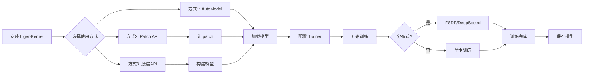

# Liger-Kernel 快速入门指南

## 一句话总结

Liger-Kernel 是一个基于 Triton 的 LLM 训练优化库，**一行代码**即可提升 20% 训练速度，减少 60% 内存占用。

## 快速开始

### 1. 安装

```bash
# 稳定版
pip install liger-kernel

# 或者从源码安装
git clone https://github.com/linkedin/Liger-Kernel.git
cd Liger-Kernel
pip install -e .
```

### 2. 三种使用方式

#### 方式 1：自动优化（最简单）⭐

```python
from liger_kernel.transformers import AutoLigerKernelForCausalLM

# 一行代码，自动优化
model = AutoLigerKernelForCausalLM.from_pretrained("meta-llama/Llama-2-7b-hf")
```

#### 方式 2：手动 Patch（推荐）

```python
from liger_kernel.transformers import apply_liger_kernel_to_llama
import transformers

# 在加载模型前应用优化
apply_liger_kernel_to_llama()

# 正常加载模型
model = transformers.AutoModelForCausalLM.from_pretrained("meta-llama/Llama-2-7b-hf")
```

#### 方式 3：底层 API（最灵活）

```python
from liger_kernel.transformers import (
    LigerRMSNorm,
    LigerSwiGLUMLP,
    LigerFusedLinearCrossEntropyLoss,
)

# 直接使用各个算子构建模型
```

### 3. 完整训练示例

```python
from liger_kernel.transformers import AutoLigerKernelForCausalLM
from transformers import AutoTokenizer, TrainingArguments
from trl import SFTTrainer
from datasets import load_dataset

# 1. 加载数据
dataset = load_dataset("tatsu-lab/alpaca")["train"]
tokenizer = AutoTokenizer.from_pretrained("meta-llama/Llama-2-7b-hf")

# 2. 加载模型（自动应用 Liger 优化）
model = AutoLigerKernelForCausalLM.from_pretrained(
    "meta-llama/Llama-2-7b-hf",
    torch_dtype="auto",
    use_cache=False,  # 训练时必须设置
)

# 3. 训练
trainer = SFTTrainer(
    model=model,
    train_dataset=dataset,
    tokenizer=tokenizer,
    args=TrainingArguments(
        output_dir="./output",
        num_train_epochs=3,
        per_device_train_batch_size=4,
        bf16=True,
    ),
)

trainer.train()
```

## 核心问答

### Q1: 项目解决什么问题？

**A**: 解决 LLM 训练的三大痛点：
- 🚀 **训练慢**：提升 20% 训练吞吐量
- 💾 **内存不够**：减少 60% 内存占用，支持更长上下文（4K → 16K）
- 🔧 **集成复杂**：一行代码即可使用

### Q2: 是 Torch 注册的算子吗？

**A**: **不是**。Liger-Kernel 使用以下技术栈：

1. **Triton JIT** 编写内核（`@triton.jit`）
2. **PyTorch Autograd Function** 实现自动微分
3. **Monkey Patching** 替换 HuggingFace 实现

```python
# 核心技术栈
@triton.jit                           # 1. Triton 内核
def my_kernel(...): pass

class MyFunction(torch.autograd.Function):  # 2. Autograd
    def forward(ctx, x):
        my_kernel[grid](...)

class MyModule(nn.Module):            # 3. Module
    def forward(self, x):
        return MyFunction.apply(x)

# 4. Monkey Patch
transformers.models.llama.LlamaRMSNorm = MyModule
```

### Q3: 如何添加 Monkey Patch？

**A**: 三步实现：

```python
# 步骤 1：创建 patch 函数
def apply_liger_kernel_to_mymodel(
    rms_norm: bool = True,
    swiglu: bool = True,
    model: PreTrainedModel = None,
):
    from transformers.models.mymodel import modeling_mymodel
    
    # 替换类
    if rms_norm:
        modeling_mymodel.MyModelRMSNorm = LigerRMSNorm
    if swiglu:
        modeling_mymodel.MyModelMLP = LigerSwiGLUMLP
    
    # 如果是已实例化的模型，还需替换实例
    if model is not None:
        for layer in model.layers:
            if rms_norm:
                _patch_rms_norm_module(layer.norm)
            if swiglu:
                _patch_swiglu_module(layer.mlp, LigerSwiGLUMLP)

# 步骤 2：注册到映射表
MODEL_TYPE_TO_APPLY_LIGER_FN["mymodel"] = apply_liger_kernel_to_mymodel

# 步骤 3：导出 API
# 在 __init__.py 中添加
__all__.append("apply_liger_kernel_to_mymodel")
```

**关键点**：
- ✅ 模型初始化**前** patch：性能更好（推荐）
- ✅ 模型初始化**后** patch：需要传入 `model` 参数，处理实例变量

### Q4: 整个项目使用流程？

**A**: 



**详细流程**：

```python
# 1. 安装
pip install liger-kernel

# 2. 导入并 patch（在模型加载前）
from liger_kernel.transformers import apply_liger_kernel_to_llama
apply_liger_kernel_to_llama()

# 3. 加载模型（已自动优化）
model = AutoModelForCausalLM.from_pretrained("meta-llama/Llama-2-7b-hf")

# 4. 正常训练
trainer = Trainer(model=model, ...)
trainer.train()
```

### Q5: 可以迁移到其他 NPU 吗？

**A**: **理论可行，但工作量大**。

#### ✅ 可迁移的部分

- **Monkey Patch 机制**：纯 Python 操作，NPU 无关
- **项目架构**：模块化设计可以复用

#### ❌ 需要重写的部分

- **所有 Triton 内核**：约 20+ 个算子
- **前向和反向传播**：每个算子都需要
- **性能优化**：针对 NPU 的特性调优

#### 📊 迁移工作量估算

| NPU 平台 | 预计时间 | 难度 | 可行性 |
|---------|---------|------|--------|
| 华为昇腾 | 3-6 个月 | ⭐⭐⭐⭐ | 可行 |
| 寒武纪 | 3-6 个月 | ⭐⭐⭐⭐ | 可行 |
| 燧原 | 3-6 个月 | ⭐⭐⭐⭐ | 可行 |

#### 🛤️ 推荐迁移路径

1. **阶段 1**（1 个月）：验证 PyTorch 在 NPU 上的可用性
2. **阶段 2**（2 个月）：移植核心算子（RMSNorm、CrossEntropy）
3. **阶段 3**（3 个月）：移植全部算子并优化性能

#### 核心挑战

```python
# ❌ Triton 代码无法直接在 NPU 上运行
@triton.jit
def my_kernel(...):
    # Triton DSL 代码
    pass

# ✅ 需要为 NPU 重写
def my_kernel_npu(...):
    # 使用 NPU 的编程接口（如 CANN、BANG）
    pass
```

### Q6: 如何使用 unittest？

**A**: 使用 pytest 框架。

#### 基本命令

```bash
# 运行所有测试
pytest test/

# 运行特定文件
pytest test/transformers/test_rms_norm.py

# 运行特定测试
pytest test/transformers/test_rms_norm.py::test_rms_norm_correctness

# 并行测试（加速）
pytest test/ -n auto

# 生成覆盖率报告
pytest test/ --cov=src/liger_kernel --cov-report=html
```

#### 测试类型

1. **正确性测试**：验证算子输出与参考实现一致

```python
def test_correctness():
    # 参考实现
    ref_output = reference_implementation(input)
    
    # Liger 实现
    liger_output = liger_implementation(input)
    
    # 验证
    assert torch.allclose(liger_output, ref_output, atol=1e-5)
```

2. **性能测试**：测量加速比

```python
@triton.testing.perf_report(...)
def benchmark():
    # 测量 PyTorch vs Liger
    pass
```

3. **收敛性测试**：验证训练收敛不受影响

```python
def test_convergence():
    torch_losses = train_without_liger()
    liger_losses = train_with_liger()
    
    # 验证损失曲线相似
    assert correlation(torch_losses, liger_losses) > 0.95
```

## 支持的模型

| 模型系列 | Patch API | 支持的算子 |
|---------|----------|-----------|
| LLaMA 2/3/4 | `apply_liger_kernel_to_llama` | RoPE, RMSNorm, SwiGLU, CE, FusedLinearCE |
| Mistral | `apply_liger_kernel_to_mistral` | RoPE, RMSNorm, SwiGLU, CE, FusedLinearCE |
| Gemma 1/2/3 | `apply_liger_kernel_to_gemma` | RoPE, RMSNorm, GeGLU, CE, FusedLinearCE |
| Qwen 2/3 | `apply_liger_kernel_to_qwen2` | RoPE, RMSNorm, SwiGLU, CE, FusedLinearCE |
| Phi3 | `apply_liger_kernel_to_phi3` | RoPE, RMSNorm, SwiGLU, CE, FusedLinearCE |

完整列表见：https://github.com/linkedin/Liger-Kernel#patching

## 核心算子

### 模型算子

| 算子 | API | 用途 |
|------|-----|------|
| RMSNorm | `LigerRMSNorm` | 归一化层 |
| LayerNorm | `LigerLayerNorm` | 归一化层 |
| RoPE | `liger_rotary_pos_emb` | 位置编码 |
| SwiGLU | `LigerSwiGLUMLP` | 激活函数 |
| GeGLU | `LigerGEGLUMLP` | 激活函数 |
| CrossEntropy | `LigerCrossEntropyLoss` | 损失函数 |
| FusedLinearCE | `LigerFusedLinearCrossEntropyLoss` | 融合损失（节省 80% 内存） |

### 对齐算子（后训练）

| 算子 | API | 用途 |
|------|-----|------|
| DPO | `LigerFusedLinearDPOLoss` | Direct Preference Optimization |
| ORPO | `LigerFusedLinearORPOLoss` | Odds Ratio Preference Optimization |
| CPO | `LigerFusedLinearCPOLoss` | Contrastive Preference Optimization |
| SimPO | `LigerFusedLinearSimPOLoss` | Simple Preference Optimization |
| KTO | `LigerFusedLinearKTOLoss` | Kahneman-Tversky Optimization |

## 性能数据

### 训练速度

| 模型 | Batch Size | Seq Length | HF (tokens/s) | Liger (tokens/s) | 提升 |
|------|-----------|-----------|---------------|------------------|------|
| LLaMA 3-8B | 8 | 4K | 2000 | 2400 | +20% |
| LLaMA 3-8B | 8 | 8K | 1200 | 1600 | +33% |
| LLaMA 3-8B | 8 | 16K | OOM | 800 | ✅ 可用 |

### 内存占用

| 模型 | Context Length | HF Memory | Liger Memory | 节省 |
|------|---------------|-----------|--------------|------|
| LLaMA 3-8B | 4K | 40 GB | 16 GB | -60% |
| LLaMA 3-8B | 8K | OOM | 28 GB | ✅ 可用 |

### 后训练内存

| 任务 | HF Memory | Liger Memory | 节省 |
|-----|-----------|--------------|------|
| DPO | 80 GB | 16 GB | -80% |
| ORPO | 80 GB | 16 GB | -80% |

## 常见问题

### Q: 会影响模型精度吗？

**A**: 不会。所有算子都经过严格测试，计算完全精确，不使用任何近似。

### Q: 兼容 Flash Attention 吗？

**A**: 完全兼容。Liger-Kernel 与 Flash Attention 互补，可以同时使用：

```python
model = AutoLigerKernelForCausalLM.from_pretrained(
    "meta-llama/Llama-2-7b-hf",
    attn_implementation="flash_attention_2",  # 使用 Flash Attention
)
```

### Q: 支持量化吗？

**A**: 支持。可以与 bitsandbytes、GPTQ 等量化方法配合使用：

```python
model = AutoLigerKernelForCausalLM.from_pretrained(
    "meta-llama/Llama-2-7b-hf",
    load_in_4bit=True,  # 4-bit 量化
)
```

### Q: 推理阶段可以用吗？

**A**: 可以，但收益有限。Liger-Kernel 主要优化训练阶段，推理阶段建议使用 vLLM、TGI 等推理框架。

### Q: 如何调试？

**A**: 

```python
# 1. 单独禁用某个优化
apply_liger_kernel_to_llama(
    rope=False,  # 禁用 RoPE 优化
    rms_norm=True,
    swiglu=True,
)

# 2. 对比测试
# 先训练不带 Liger 的模型
model_vanilla = AutoModelForCausalLM.from_pretrained(...)

# 再训练带 Liger 的模型
apply_liger_kernel_to_llama()
model_liger = AutoModelForCausalLM.from_pretrained(...)

# 比较损失曲线
```

## 最佳实践

### ✅ 推荐

1. **使用 AutoModel**：最简单，自动优化
2. **训练时禁用 KV cache**：`use_cache=False`
3. **使用 bfloat16**：在 Ampere+ GPU 上
4. **启用梯度检查点**：节省更多内存
5. **使用 FusedLinearCrossEntropy**：默认启用，节省 80% 内存

```python
model = AutoLigerKernelForCausalLM.from_pretrained(
    "meta-llama/Llama-2-7b-hf",
    torch_dtype=torch.bfloat16,  # ✅ 使用 bfloat16
    use_cache=False,              # ✅ 禁用 cache
)

training_args = TrainingArguments(
    ...,
    gradient_checkpointing=True,  # ✅ 梯度检查点
    bf16=True,                    # ✅ bfloat16 训练
)
```

### ❌ 避免

1. **推理时禁用 cache**：推理需要 KV cache
2. **混合使用 FusedLinearCE 和普通 CE**：选一个
3. **在 Volta GPU 上用 bfloat16**：不支持

## 更多资源

- 📖 **完整文档**：[Liger-Kernel项目深度分析.md](./Liger-Kernel项目深度分析.md)
- 🌐 **官方文档**：https://linkedin.github.io/Liger-Kernel/
- 💻 **GitHub**：https://github.com/linkedin/Liger-Kernel
- 📄 **技术论文**：https://arxiv.org/pdf/2410.10989
- 💬 **Discord**：https://discord.gg/gpumode
- 📝 **博客**：https://www.linkedin.com/blog/engineering/open-source/liger-kernel-open-source-ecosystem-for-efficient-llm-training


