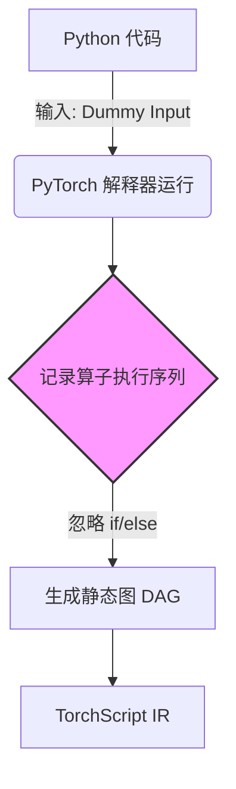
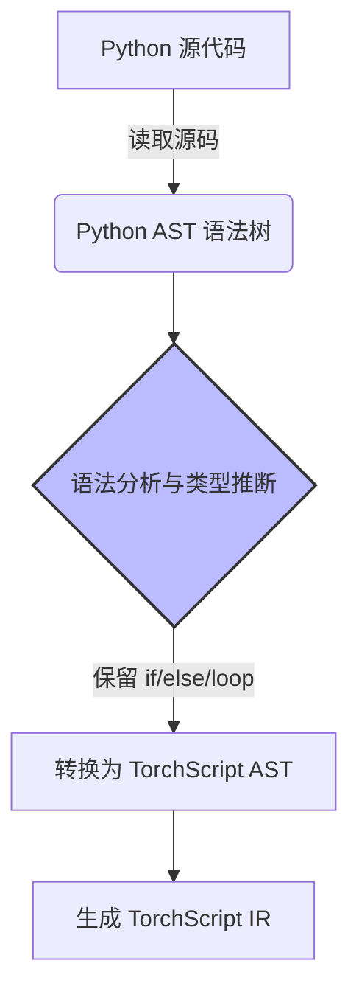

# 第二章：TorchScript 详解 —— 原理、优化与部署

## 本章目标

- **深度理解**：TorchScript 如何将动态 Python 代码转换为静态图（IR）。
- **底层探秘**：JIT 编译器是如何通过算子融合等技术优化性能的。
- **全流程掌握**：从模型转换（Trace/Script）到 C++ 生产环境部署。
- **技术定位**：认清 PyTorch 2.0 时代 TorchScript 的独特价值。

---

## 1. 为什么需要 TorchScript？

在 PyTorch 的世界里，我们习惯了 Python 的动态与灵活（Eager Mode）。你可以随时打印变量、使用 Python 的 `if-else` 控制流。但当你试图将模型**落地到生产环境**时，这种灵活性变成了阻碍：

1.  **Python 依赖**：生产服务器（如 C++ 后端）、移动端（iOS/Android）、嵌入式设备通常没有 Python 环境，或者 Python 解释器太重。
2.  **性能瓶颈**：Python 的全局解释器锁（GIL）和解释执行机制限制了多线程性能；逐个算子下发（Kernel Launch）带来了巨大的开销。
3.  **优化困难**：动态图难以进行全局优化（如算子融合），因为编译器不知道下一行代码会发生什么。

**TorchScript 的使命**：它是 PyTorch 模型的一种**中间表示（Intermediate Representation, IR）**。它保留了模型的逻辑结构，但**脱离了 Python 的依赖**，可以被序列化、优化，并在 C++ 运行时中高效执行。

---

## 2. 核心原理：从 Python 到 IR 的转换之旅

TorchScript 提供了两种机制将 Python 代码“固化”为静态图：**Tracing（追踪）** 和 **Scripting（脚本）**。

### 2.1 Tracing（追踪模式）：像“录像机”一样工作

**原理：**
Tracing 并不看你的代码逻辑，它通过**运行一次**代码来记录发生的运算。它就像一个录像机，只记录“发生了什么”，而不关心“为什么发生”。

**过程详解：**
1.  **准备**：你需要提供一个示例输入（dummy input）。
2.  **执行**：PyTorch 运行模型的前向传播（Forward）。
3.  **记录**：在 C++ 底层，每当执行一个算子（如 `aten::add`, `aten::conv2d`），Tracer 就在当前的图（Graph）中添加一个节点。
4.  **生成**：最终生成一个包含所有执行算子的静态有向无环图（DAG）。

**局限性（非常重要）：**
因为是“录像”，它**记录不到控制流**。

```python
def my_func(x):
    if x.sum() > 0:       # 逻辑分支
        return x + 1
    else:
        return x - 1

# 假设输入是全 1 张量，x.sum() > 0 为真
# Tracing 记录的图里只有：return x + 1
# "else" 分支完全消失了！
```

### 2.2 Scripting（脚本模式）：像“翻译官”一样工作

**原理：**
Scripting 直接分析 Python 源代码，将其**编译**成 TorchScript IR。它不运行代码，而是理解代码。

**过程详解：**
1.  **获取源码**：通过 Python 的 `inspect` 模块获取函数的源代码。
2.  **语法分析**：将源码解析为 Python 抽象语法树（AST）。
3.  **编译转换**：将 Python AST 转换为 TorchScript 的 AST，最后生成 IR Graph。
    *   `if` 语句 -> `prim::If` 节点
    *   `for` 循环 -> `prim::Loop` 节点
4.  **类型检查**：TorchScript 是静态类型的，它会推断或要求你标注变量类型。

**优势：**
完整保留了控制流（if-else, loops），是真正的“模型编译”。

### 2.3 图示对比

为了更直观地理解，我们来看一下这两种模式的工作流程图：

**Tracing (追踪模式) 流程：**

*特点：只有一条路走到黑，看不到分叉路口。*

**Scripting (脚本模式) 流程：**

*特点：拥有上帝视角，看清代码全貌。*

---

## 3. 深入底层：TorchScript IR 与 JIT 优化

一旦模型转换为 TorchScript IR，JIT（Just-In-Time）编译器就开始工作了。这是性能提升的关键。

### 3.1 什么是 IR（中间表示）？

IR 是一种介于源代码和机器码之间的代码格式。TorchScript IR 使用 **SSA（静态单赋值）** 形式的图结构。

**示例 IR：**
```python
# 原始 Python
def func(x, y):
    return x * y + 1

# 对应的 IR Graph
graph(%x : Tensor, %y : Tensor):
  %1 : int = prim::Constant[value=1]()
  %2 : Tensor = aten::mul(%x, %y)  # 乘法
  %3 : Tensor = aten::add(%2, %1, %1) # 加法
  return (%3)
```

### 3.2 编译器优化 Pass

JIT 编译器通过一系列 **Pass（优化遍）** 来处理这个图。每个 Pass 都会遍历图，修改它以提高效率。

#### (1) 死代码消除 (Dead Code Elimination, DCE)
删除那些计算了但从未被使用的节点。
```python
# 优化前
a = x + 1  # 没人用 a
return x * 2

# 优化后
return x * 2
```

#### (2) 常量折叠 (Constant Folding)
预先计算出常量表达式的结果。
```python
# 优化前
return x + (2 * 3)

# 优化后
return x + 6
```

#### (3) 算子融合 (Operator Fusion) —— **最核心的优化**
这是 GPU 加速的关键。

**问题**：执行 `x * 2 + 1`
1.  Kernel 1 (乘法): 从显存读 x -> 计算 -> 结果写入显存
2.  Kernel 2 (加法): 从显存读结果 -> 计算 -> 最终结果写入显存

**瓶颈**：显存带宽（Memory Bandwidth）。计算通常很快，但读写显存很慢。

**优化（融合）**：
编译器发现这两个算子可以合并，生成一个新的 **Fused Kernel**：
1.  Kernel (融合): 从显存读 x -> 寄存器计算 `x*2 + 1` -> 写入显存

**效果**：减少了 50% 的显存读写！

**常见的融合类型：**
*   **Pointwise Fusion**：加减乘除、ReLU、Sigmoid 等逐元素操作可以无限融合。
*   **Conv-BN Fusion**：推理时，BatchNorm 的参数可以“吸”进卷积层的权重中，完全消除 BN 层。

### 3.3 优化可视化

```
[ 原始图 ]
  Node: Conv2d
    |
  Node: BatchNorm
    |
  Node: ReLU

      ||
      \/  (JIT 优化 Pass)

[ 优化后的图 ]
  Node: Conv2d_ReLU (融合算子)
  (BN 被吃掉了，ReLU 被合体了)
```

---

## 4. 实战：从转换到 C++ 部署

我们来模拟一个真实的工业级流程：Python 训练 -> 模型转换 -> C++ 部署。

### 4.1 第一步：准备与转换 (Python)

```python
import torch
import torch.nn as nn

# 1. 定义模型
class ResBlock(nn.Module):
    def __init__(self):
        super().__init__()
        self.conv = nn.Conv2d(3, 3, 3, padding=1)
        self.bn = nn.BatchNorm2d(3)
    
    def forward(self, x):
        return torch.relu(self.bn(self.conv(x)))

# 2. 实例化
model = ResBlock()
model.eval()  # 必须切到 eval 模式！否则 BN 层行为不确定

# 3. 转换为 TorchScript
# 方式 A: Tracing (推荐用于固定结构的 CNN)
example_input = torch.randn(1, 3, 224, 224)
traced_model = torch.jit.trace(model, example_input)

# 方式 B: Scripting (用于带复杂控制流的模型)
# scripted_model = torch.jit.script(model)

# 4. 优化与保存
# 此时 JIT 会自动执行部分优化（如 Conv-BN 融合）
# 如果是移动端，还可以调用 optimize_for_mobile
from torch.utils.mobile_optimizer import optimize_for_mobile
optimized_model = optimize_for_mobile(traced_model)

traced_model.save("model.pt")
print("模型已保存为 model.pt")
```

### 4.2 第二步：C++ 加载与推理

创建一个 `main.cpp` 文件。注意，这里**完全不需要安装 Python**，只需要 LibTorch（PyTorch 的 C++ 库）。

```cpp
#include <torch/script.h> // LibTorch 头文件
#include <iostream>
#include <memory>

int main() {
    // 1. 加载模型
    torch::jit::script::Module module;
    try {
        // 反序列化：将 model.pt 恢复为 C++ 对象
        module = torch::jit::load("model.pt");
    }
    catch (const c10::Error& e) {
        std::cerr << "无法加载模型\n";
        return -1;
    }

    std::cout << "模型加载成功！\n";

    // 2. 准备输入 (Tensor)
    // 创建一个 [1, 3, 224, 224] 的张量
    std::vector<torch::jit::IValue> inputs;
    inputs.push_back(torch::ones({1, 3, 224, 224}));

    // 3. 执行推理
    // forward() 返回的是 IValue (Generic 类型)，需要转回 Tensor
    at::Tensor output = module.forward(inputs).toTensor();

    std::cout << "输出尺寸: " << output.sizes() << std::endl;
    std::cout << "前5个值: " << output.slice(1, 0, 5) << std::endl;

    return 0;
}
```

### 4.3 编译与运行

你需要下载 **LibTorch** (PyTorch 官网下载 C++ 版)。

`CMakeLists.txt`:
```cmake
cmake_minimum_required(VERSION 3.0)
project(demo)

find_package(Torch REQUIRED)
add_executable(demo main.cpp)
target_link_libraries(demo "${TORCH_LIBRARIES}")
set_property(TARGET demo PROPERTY CXX_STANDARD 14)
```

---

## 5. 常见陷阱与局限性

虽然 TorchScript 很强大，但它不是万能的。

### 5.1 动态类型与多态
Python 中变量类型可以变，TorchScript 必须是静态的。

```python
# 错误示范
def bad(x):
    if x.sum() > 0:
        return x          # 返回 Tensor
    else:
        return "failed"   # 返回 String -> 报错！类型不统一
```

### 5.2 第三方库
TorchScript 编译器**看不懂** numpy, pandas, scipy, cv2 等第三方库的代码。
*   **解决**：只能使用 `torch.*` 的原生操作。如果是预处理代码，建议用 C++ 重写或在 Python 端处理完再传给模型。

### 5.3 Trace 的坑
再次强调，不要用 Trace 处理动态逻辑。

```python
def dangerous(x):
    # 这个循环次数由输入 x 决定
    for i in range(x.item()): 
        x = x + 1
    return x

# Trace 时，如果 input 是 3，图里就会固定写死 3 个加法节点！
# 之后如果输入 5，它还是只加 3 次！
```

---

## 6. TorchScript vs PyTorch 2.0 (torch.compile)

这是一个经常让人困惑的问题：**有了 PyTorch 2.0，还需要 TorchScript 吗？**

| 维度 | TorchScript | torch.compile (PyTorch 2.0) |
| :--- | :--- | :--- |
| **核心目的** | **脱离 Python 运行** (部署) | **在 Python 中加速** (训练/推理) |
| **运行环境** | C++, 移动端, 嵌入式 | 必须有 Python 环境 |
| **易用性** | 较难 (需要处理类型、重写代码) | 极简 (一行代码) |
| **底层技术** | TS IR, JIT Compiler | Dynamo, Inductor, Triton |
| **未来趋势** | 逐渐成为纯导出格式 | 主流训练加速方案 |

**结论**：
*   如果你要**训练**模型：用 `torch.compile`。
*   如果你要**部署**到服务器(C++)或手机：**必须**用 TorchScript (或者导出为 ONNX/EdgeExecutor)。

---

## 7. 源码导读

如果你想深入阅读 PyTorch 源码，关注以下目录：

*   `torch/csrc/jit/` : TorchScript 的 C++ 核心实现。
    *   `frontend/` : 将 Python 源码转换为 IR 的前端。
    *   `ir/` : IR 图结构定义 (Graph, Node, Value)。
    *   `passes/` : **宝藏目录**！包含了所有的优化 Pass（融合、DCE 等）的实现。
    *   `runtime/` : 解释器和执行器，负责运行 IR。

---

## 8. 附录：TorchScript 的运行时执行机制

当你调用 `loaded_model.forward(inputs)` 时，底层到底发生了什么？这是一个从 IR 到机器码的复杂过程。

### 8.1 虚拟机的角色
TorchScript 并没有直接把 IR 编译成二进制机器码（除非使用了 NNC 或 TensorRT 等后端），而是运行在一个**轻量级的虚拟机（Interpreter）** 上。

1.  **指令生成**：模型加载时，IR Graph 会被转换成一系列线性的指令（Code Object）。这有点像 Python 的字节码，但更贴近张量运算。
2.  **栈式虚拟机**：
    *   Interpreter 维护一个**栈（Stack）**。
    *   运算时，操作数从栈中弹出（Pop）。
    *   运算结果压入栈中（Push）。

### 8.2 执行流程示例
假设代码是 `y = x + 1`，底层的执行步骤如下：

```
[栈状态]          [指令]                [动作]
[]               LOAD x               # 将输入 x 压入栈
[x]              LOAD 1               # 将常量 1 压入栈
[x, 1]           CALL aten::add       # 调用加法算子
                                      # 1. 弹出 1 和 x
                                      # 2. 调用 C++ 的 at::add(x, 1)
                                      # 3. 得到结果 y
[y]              RET                  # 返回栈顶元素 y
```

### 8.3 为什么比 Python 快？
虽然也是虚拟机解释执行，但 TorchScript 快在：
1.  **没有 GIL**：纯 C++ 实现，可以多线程并行。
2.  **类型特化**：指令中包含了具体的类型信息，不需要像 Python 那样在运行时动态检查类型。
3.  **算子融合**：如前所述，多个指令可能被合并成一个高效的融合算子指令，减少了进出栈和内存读写的开销。

---

**下一章预告**：
既然 TorchScript 已经能构建图了，为什么还需要 **TorchFX**？TorchFX 如何提供更灵活的 Python 层面的图编辑能力？请看 [第三章：TorchFX 图捕获技术](./03_TorchFX图捕获技术.md)。
