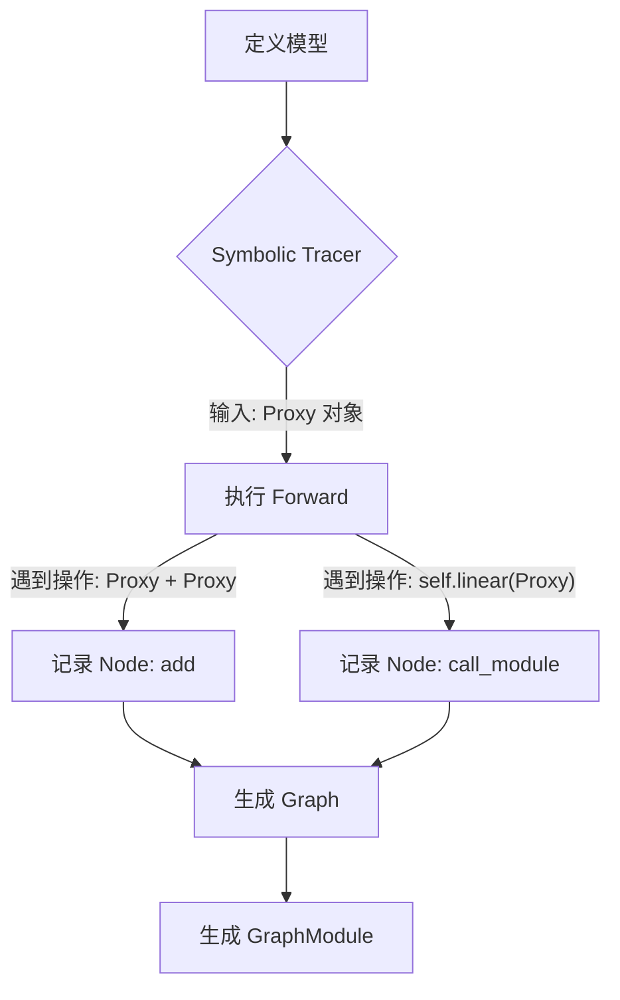

# 第三章：TorchFX 图捕获技术 —— 可编程的计算图

## 本章目标

- **核心概念**：理解 TorchFX 如何将 PyTorch 模型转化为可编辑的 Python 数据结构。
- **实战技能**：掌握符号追踪（Symbolic Tracing）和图变换（Graph Transformation）技术。
- **底层原理**：深入了解 IR 结构、Proxy 机制以及 Interpreter 模式。
- **应用场景**：学会利用 TorchFX 进行算子融合、量化、分析和自定义优化。

---

## 1. 为什么需要 TorchFX？

在 TorchScript 时代，一旦模型被 trace 或 script，它就变成了一个难以修改的“黑盒” C++ 对象。如果你想把模型里的 `ReLU` 全部换成 `GELU`，或者在每个 `Conv2d` 后插入一个 Observer（用于量化），这在 TorchScript 中非常痛苦。

**TorchFX 的使命**：提供一个**Python-First** 的图表示。
*   **透明**：生成的图代码是纯 Python 代码，看得见摸得着。
*   **可编辑**：就像操作 Python 列表一样增删改查网络层。
*   **生态兼容**：无缝对接 Python 生态工具。

**形象比喻**：
*   **TorchScript** 是一份 **PDF 文档**（格式固定，适合打印/部署，难修改）。
*   **TorchFX** 是一份 **Word 文档**（结构清晰，随时可以打开编辑、替换内容）。

---

## 2. 核心机制：符号追踪 (Symbolic Tracing)

TorchFX 不执行真正的计算，而是通过一种特殊的“假数据”在模型中跑一遍，记录下数据流向。

### 2.1 Proxy (代理) 机制

**原理**：
TorchFX 创建一种叫做 `Proxy` 的特殊对象。当 `Proxy` 对象参与运算时（如 `x + y`），它不会算出结果，而是**记录下“执行了加法”这个操作**。

**流程图解：**



### 2.2 基本用法

```python
import torch
import torch.nn as nn
import torch.fx as fx

# 1. 定义一个普通模型
class SimpleModel(nn.Module):
    def __init__(self):
        super().__init__()
        self.linear = nn.Linear(10, 5)
    
    def forward(self, x):
        # x 是一个 Proxy 对象
        y = self.linear(x)  # 记录 call_module
        z = torch.relu(y)   # 记录 call_function
        return z            # 记录 output

# 2. 符号追踪
model = SimpleModel()
traced_graph = fx.symbolic_trace(model)

# 3. 查看生成的 Python 代码
print("=== 生成的代码 ===")
print(traced_graph.code)
# 输出:
# def forward(self, x):
#     linear = self.linear(x);  x = None
#     relu = torch.relu(linear);  linear = None
#     return relu
```

---

## 3. 深入底层：TorchFX IR (中间表示)

TorchFX 的图（Graph）是一个双向链表，由一系列节点（Node）组成。理解 6 种节点类型是精通 TorchFX 的关键。

### 3.1 六大节点类型 (Node Op)

| Op 类型 | 含义 | 示例代码 | 解释 |
| :--- | :--- | :--- | :--- |
| **`placeholder`** | 输入占位符 | `def forward(self, x):` | 函数的参数（输入） |
| **`call_module`** | 调用子模块 | `self.linear(x)` | 调用 `nn.Module` (如 Conv2d, Linear) |
| **`call_function`** | 调用函数 | `torch.relu(x)` | 调用 PyTorch 函数 (如 torch.add, torch.nn.functional.*) |
| **`call_method`** | 调用方法 | `x.view(-1)` | 调用 Tensor 的成员方法 |
| **`get_attr`** | 获取属性 | `self.weight` | 获取参数或缓冲区 (Parameter/Buffer) |
| **`output`** | 输出结果 | `return x` | 函数的返回值 |

### 3.2 遍历与检视图结构

```python
traced = fx.symbolic_trace(model)

print(f"{'Node Name':<15} {'Op Type':<15} {'Target':<20} {'Args'}")
for node in traced.graph.nodes:
    print(f"{node.name:<15} {node.op:<15} {str(node.target):<20} {node.args}")
```

**输出示例：**
```
Node Name       Op Type         Target               Args
x               placeholder     x                    ()
linear          call_module     linear               (x,)
relu            call_function   <built-in relu>      (linear,)
output          output          output               (relu,)
```

---

## 4. 实战：图变换 (Graph Transformation)

TorchFX 最强大的功能是修改图。我们可以像做手术一样精确地替换、删除或插入节点。

### 4.1 场景一：算子替换 (ReLU -> GELU)

```python
import torch.nn.functional as F

def replace_relu_with_gelu(traced_model):
    graph = traced_model.graph
    
    for node in graph.nodes:
        # 匹配目标：是函数调用 且 目标是 torch.relu
        if node.op == 'call_function' and node.target == torch.relu:
            # 修改目标
            node.target = F.gelu
            print(f"已替换: {node.name}")
            
    # 修改图后必须重新编译
    traced_model.recompile()
    return traced_model
```

### 4.2 场景二：插入调试代码

在每个 linear 层后面插入一个 `print` 语句，查看输出形状。

```python
def insert_debug_print(traced_model):
    graph = traced_model.graph
    
    for node in graph.nodes:
        if node.op == 'call_module':
            # 在当前节点之后插入上下文
            with graph.inserting_after(node):
                # 插入一个 print 函数调用
                # 相当于: print(f"Node {node.name} shape:", node.shape)
                graph.call_function(
                    print, 
                    args=(f"Layer {node.name} output:", node)
                )
    
    traced_model.recompile()
```

### 4.3 场景三：自动化算子融合 (Conv-BN Fusion)

这是工业界最常用的优化之一。将 `Conv2d` 和 `BatchNorm` 合并，提升推理速度。

**原理**：
BN 的计算公式是线性的：$y = \frac{x - \mu}{\sigma} \cdot \gamma + \beta$。
卷积也是线性的：$y = w \cdot x + b$。
两者可以合并成一个新的卷积：$W_{new}, b_{new}$。

**实现步骤**：
1.  遍历图，找到 `Conv2d` -> `BatchNorm` 的模式。
2.  计算融合后的权重和偏置。
3.  创建一个新的 `Conv2d` 模块替换旧的 Conv。
4.  删除 BN 节点，将原来的 BN 输出连接到新 Conv 的输出。

*(代码较长，完整实现参考 PyTorch 官方 `torch.fx.experimental.optimization.fuse`)*

```python
def fuse(model: torch.nn.Module, inplace=False, no_trace=False) -> torch.nn.Module:
    """
    Fuses convolution/BN and linear/BN layers for inference purposes.
    Will deepcopy your model by default, but can modify the model inplace as well.
    """
    patterns = [
        (nn.Conv1d, nn.BatchNorm1d),
        (nn.Conv2d, nn.BatchNorm2d),
        (nn.Conv3d, nn.BatchNorm3d),
        (nn.Linear, nn.BatchNorm1d),
    ]
    if not inplace:
        model = copy.deepcopy(model)
    if not no_trace or not isinstance(model, torch.fx.GraphModule):
        fx_model = fx.symbolic_trace(model)
    else:
        fx_model = model
    modules = dict(fx_model.named_modules())
    new_graph = copy.deepcopy(fx_model.graph)

    for pattern in patterns:
        for node in new_graph.nodes:
            if matches_module_pattern(pattern, node, modules):
                if len(node.args[0].users) > 1:
                    # Output of conv/linear is used by other nodes
                    continue
                first_layer = modules[node.args[0].target]
                bn = modules[node.target]
                if not bn.track_running_stats:
                    continue
                if pattern[0] in [nn.Conv1d, nn.Conv2d, nn.Conv3d]:
                    fused_layer = fuse_conv_bn_eval(first_layer, bn)
                else:  # nn.Linear
                    fused_layer = fuse_linear_bn_eval(first_layer, bn)
                replace_node_module(node.args[0], modules, fused_layer)
                node.replace_all_uses_with(node.args[0])
                new_graph.erase_node(node)
    return fx.GraphModule(fx_model, new_graph)
```

---

## 5. 高级应用：Interpreter (解释器)

除了修改图，TorchFX 还允许我们**自定义图的执行过程**。这通过 `Interpreter` 类实现。

**应用场景**：
*   **性能分析**：记录每个算子的运行时间。
*   **量化模拟**：在执行每个算子时模拟低精度计算。
*   **可视化**：在执行时收集中间特征图。

```python
class ProfilingInterpreter(fx.Interpreter):
    def run_node(self, n):
        # 记录开始时间
        start = time.time()
        
        # 执行原有的节点逻辑
        result = super().run_node(n)
        
        # 记录结束时间
        end = time.time()
        print(f"Node {n.name} ({n.op}) took {(end-start)*1000:.4f} ms")
        
        return result

# 使用解释器运行模型
interpreter = ProfilingInterpreter(traced_model)
output = interpreter.run(input_data)
```

---

## 6. TorchFX 与 PyTorch 2.0 的关系

在 PyTorch 2.0 的 `torch.compile` 技术栈中，TorchFX 扮演了 **IR (中间表示)** 的角色。


*   **Dynamo** 负责把 Python 代码变成 TorchFX 图。
*   **Inductor** (后端) 负责把 TorchFX 图编译成高效的 GPU 代码。
*   **TorchFX** 是连接前端捕获和后端编译的通用桥梁。

---

## 7. 局限性

虽然 TorchFX 很强大，但它的 **Symbolic Tracing** 也有局限：
1.  **动态控制流丢失**：和 `jit.trace` 一样，它默认无法捕获 `if/else` 或 `for` 循环中的动态逻辑（除非使用 `torch.fx.proxy.GraphAppendMode` 或 Dynamo）。
2.  **非 PyTorch 代码**：如果函数里混杂了 numpy 操作，可能会导致 Trace 失败。

**解决方法**：在 PyTorch 2.0 中，通常使用 **Dynamo** 来捕获图（它可以处理动态控制流），生成的图仍然是 TorchFX 格式，从而完美解决了这个问题。

---

## 8. 总结

TorchFX 是 PyTorch 迈向“编译器时代”的基石工具。它打破了模型修改的壁垒，让开发者能够用 Python 轻松地分析、变换和优化深度学习模型。

**核心要点：**
*   **Symbolic Trace**：记录数据流生成图。
*   **Graph & Node**：图由 6 种节点构成，结构清晰。
*   **Graph Transformation**：修改图结构实现优化（如融合）。
*   **Interpreter**：自定义执行逻辑。

