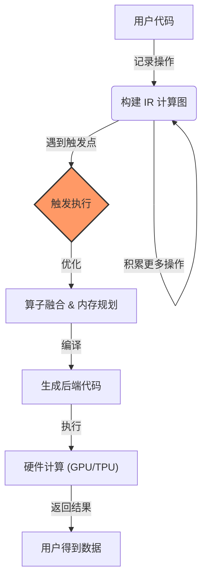

# 第四章：Lazy Tensor 延迟执行机制 —— 不到最后一刻绝不计算

## 本章目标

- **核心概念**：理解 Eager（立即执行）与 Lazy（延迟执行）的本质区别。
- **工作机制**：掌握计算图的动态构建与触发执行时机。
- **应用场景**：深入了解 Lazy Tensor 在 PyTorch/XLA (TPU) 和模型初始化中的应用。
- **底层原理**：探究 LTC (Lazy Tensor Core) 架构与算子融合优势。

---

## 1. 什么是 Lazy Tensor？

在 PyTorch 的默认模式（Eager Mode）下，每行代码就像“命令与征服”：你说走一步，它就走一步。而 Lazy Tensor 模式更像“战略游戏”：你下达一系列指令，它先记在小本本上，等你需要结果时，它再统筹规划，一次性执行。

### 1.1 Eager vs Lazy：一场赛跑

**Eager 模式（短跑选手）：**
```python
import torch

# 每一行都会启动一个 GPU Kernel
x = torch.tensor([1., 2., 3.], device='cuda') 
y = x + 1      # Kernel 1: Add
z = y * 2      # Kernel 2: Mul
w = torch.relu(z) # Kernel 3: Relu
# 缺点：频繁启动 Kernel，显存读写频繁，无法全局优化
```

**Lazy 模式（马拉松战略家）：**
```python
# 伪代码
x = lazy_tensor([1., 2., 3.])
y = x + 1      # 记录: "我要做加法"
z = y * 2      # 记录: "我要做乘法"
w = z.relu()   # 记录: "我要做ReLU"

print(w)       # 触发！编译器发现可以合并：
               # 启动 Kernel: relu((x + 1) * 2)
# 优点：算子融合，减少显存带宽占用
```

**形象比喻：**
*   **Eager**：去超市，买一瓶水结一次账，买个面包又结一次账。
*   **Lazy**：把所有东西放购物车，最后一次性结账。

---

## 2. 核心机制：延迟执行的工作流

Lazy Tensor 的魔法在于“构建图”与“执行图”的分离。

### 2.1 流程图解



### 2.2 触发时机 (Sync Points)

系统不能永远延迟下去，必须在某些时刻“交货”。这些时刻称为 **Sync Points**：

1.  **打印结果**：`print(tensor)` —— 你要看结果，我必须算出来。
2.  **转为 Python 标量**：`tensor.item()` —— Python 需要具体数值。
3.  **设备转移**：`tensor.to('cpu')` —— 离开 Lazy 设备。
4.  **控制流依赖**：`if tensor.sum() > 0:` —— `if` 需要知道真假。

---

## 3. 实战应用一：PyTorch/XLA (TPU 训练)

Lazy Tensor 最著名的应用就是 **PyTorch/XLA**。TPU（张量处理单元）非常强大，但启动开销大，必须依赖 XLA 编译器生成的大图（Graph）才能发挥性能。

### 3.1 TPU 训练代码示例

```python
import torch
import torch_xla.core.xla_model as xm

# 1. 获取 XLA 设备 (TPU)
device = xm.xla_device()

# 2. 定义模型并移动到 TPU
model = MyModel().to(device)

# 3. 训练循环
for data, target in loader:
    data, target = data.to(device), target.to(device)
    
    # 前向 + 反向
    # 注意：此时并没有真正计算，只是在 TPU 上构建了一个巨大的图
    output = model(data)
    loss = criterion(output, target)
    loss.backward()
    
    # 更新参数
    optimizer.step()
    optimizer.zero_grad()
    
    # 4. 关键点：显式触发执行
    # 告诉 XLA："这一步走完了，开始优化并执行吧！"
    xm.mark_step()
```

**为什么需要 `xm.mark_step()`？**
如果不加这行，Lazy 图会无限增长，直到内存爆炸。`mark_step()` 就像一个“逗号”，告诉编译器处理当前的图。

---

## 4. 实战应用二：Lazy Module (延迟初始化)

除了性能优化，Lazy 机制还带来了编程上的便利——**不需要提前计算输入形状**。

### 4.1 传统 vs Lazy 写法

**传统写法（心智负担）：**
```python
class OldModel(nn.Module):
    def __init__(self):
        super().__init__()
        # 痛苦：必须手动算上一层的输出是 32 * 7 * 7 = 1568
        self.fc = nn.Linear(1568, 10)
```

**Lazy 写法（优雅）：**
```python
import torch.nn as nn

class LazyModel(nn.Module):
    def __init__(self):
        super().__init__()
        # 优雅：我不关心输入是多少，LazyLinear 会自动推断
        self.fc = nn.LazyLinear(10)

model = LazyModel()
# 此时 model.fc.weight 是未初始化的 (UninitializedParameter)

# 第一次 Forward 时，自动推断输入维度并初始化权重
input = torch.randn(1, 32, 7, 7)
_ = model(input) 
print(model.fc.in_features) # 自动变成了 1568
```

---

## 5. 深入底层：LTC (Lazy Tensor Core)

LTC 是 PyTorch 为了支持 Lazy Tensor 而构建的通用基础设施。它位于 PyTorch 前端和特定后端（如 XLA, TS）之间。

### 5.1 架构层次

| 层次 | 组件 | 职责 |
| :--- | :--- | :--- |
| **User API** | `torch.add(x, y)` | 用户调用的 PyTorch 函数 |
| **Dispatcher** | `VariableType` | 将调用路由到 LTC 实现 |
| **LTC Frontend** | `LazyTensor` | 记录操作，构建 IR 图（双向链表结构） |
| **LTC Backend** | `XLA / TS` | 将 IR 图编译为特定硬件的可执行代码 |
| **Hardware** | `TPU / GPU` | 实际跑代码的地方 |

### 5.2 算子融合原理

举个具体的例子，看 LTC 如何通过融合节省内存带宽。

**原始操作序列：**
```python
t0 = input        # Read: 100MB
t1 = t0 * 2       # Read: 100MB, Write: 100MB
t2 = t1 + t0      # Read: 200MB, Write: 100MB
# 总带宽：500MB
```

**LTC 优化后 (Kernel Fusion)：**
生成一个 C++ 伪代码 Kernel：
```cpp
void fused_kernel(float* input, float* output, int n) {
    for(int i=0; i<n; i++) {
        float val = input[i];  // 只读一次！
        // 寄存器内计算，无需中间显存读写
        float temp = val * 2;
        output[i] = temp + val;
    }
}
// 总带宽：200MB (读100 + 写100) -> 节省 60%！
```

---

## 6. 局限性与挑战

Lazy Tensor 并非银弹，它也有自己的阿喀琉斯之踵。

1.  **调试地狱**：
    *   在 Eager 模式下，报错会精确指向某一行。
    *   在 Lazy 模式下，报错通常发生在 `mark_step()` 或打印时，堆栈追踪往往指向编译器内部，难以定位原始 Python 代码。

2.  **动态性受限**：
    *   如果计算图中存在依赖数据的控制流（Data-Dependent Control Flow），如图结构随数据变化，会导致编译器频繁重新编译（Re-compilation），性能不仅不升，反而暴跌。

3.  **首次启动慢**：
    *   第一次运行需要 JIT 编译，会有明显的延迟（Warm-up cost）。

---

## 7. 总结

Lazy Tensor 是 PyTorch 即使在动态图时代也能获得静态图性能的关键技术之一，特别是在 TPU 等 AI 加速器上。

**核心要点：**
*   **延迟执行**：通过记录操作图，实现算子融合，最大化硬件效率。
*   **Sync Points**：理解何时触发计算至关重要。
*   **LTC**：PyTorch 的通用延迟执行框架。
*   **LazyModule**：利用延迟机制简化模型定义。

**下一章预告**：
我们已经学习了 TorchScript、TorchFX 和 Lazy Tensor。那么 PyTorch 2.0 的“亲儿子”——**TorchDynamo** 又是如何通过 Python 字节码捕获来实现“几乎零修改”的加速的？请看 [第五章：TorchDynamo 动态图编译](./05_torch_dynamo.md)。
