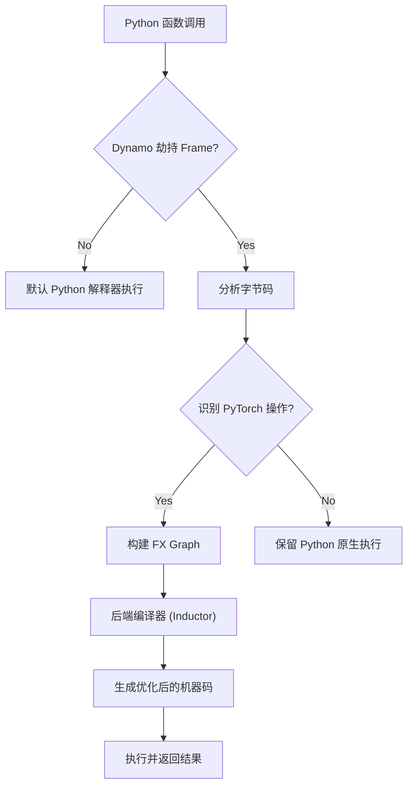

# 第五章：Torch Dynamo 动态图编译 —— 字节码捕获的魔法

## 本章目标

- **核心概念**：深入理解 Dynamo 如何在保持 Python 灵活性的同时捕获计算图。
- **技术原理**：掌握字节码拦截（Bytecode Analysis）与 Guard 机制。
- **实战调试**：学会识别并解决 Graph Break，优化编译效率。
- **源码剖析**：探究 Python Frame Evaluation 钩子的底层实现。

---

## 1. 为什么需要 TorchDynamo？

在 PyTorch 2.0 之前，我们面临着“鱼和熊掌不可兼得”的困境：
*   **Eager Mode**：灵活、好调试，但慢。
*   **TorchScript**：快、可部署，但限制多（不支持动态特性）。
*   **TorchFX**：图编辑方便，但无法捕获动态控制流（默认 Trace 模式）。

**Dynamo 的使命**：不用修改任何代码，就能获得静态图的性能优化，同时完全保留 Python 的动态特性。

**形象比喻：**
*   **TorchScript** 像一个**翻译官**，要求你只能说标准普通话（静态类型、受限语法）。
*   **Dynamo** 像一个**速记员**，你随便说方言（Python 动态语法），它都能通过上下文（Guard）猜出你的意思并记录下来。

---

## 2. 核心原理：字节码拦截 (Bytecode Analysis)

Dynamo 并不像 TorchScript 那样去解析源代码（AST），而是直接拦截 Python 虚拟机执行的**字节码（Bytecode）**。

### 2.1 什么是字节码？

Python 代码在运行前会被编译成 `.pyc` 文件中的字节码。

```python
import dis

def add(a, b):
    return a + b

dis.dis(add)
```

**输出的字节码：**
```
  2           0 LOAD_FAST                0 (a)
              2 LOAD_FAST                1 (b)
              4 BINARY_ADD
              6 RETURN_VALUE
```

### 2.2 Dynamo 的工作流

Dynamo 利用 PEP 523 提供的 **Frame Evaluation API**，在 Python 解释器执行函数之前“劫持”了控制权。



### 2.3 深入幕后：PEP 523 与 Frame Evaluation API

你可能会好奇，**Dynamo 是如何做到“劫持”Python 执行的？** 这得益于 Python 3.6 引入的 **PEP 523**。

1.  **标准 Python 执行流程**：
    默认情况下，Python 解释器使用一个 C 函数 `_PyEval_EvalFrameDefault` 来执行函数帧（Frame）。这本质上是一个巨大的 `switch-case` 循环，逐条执行字节码指令。

2.  **Dynamo 的介入**：
    PEP 523 允许 C 扩展通过 `_PyInterpreterState_SetEvalFrameFunc` API，将这个默认执行函数**替换**为自定义函数。

3.  **伪代码逻辑**：
    Dynamo 注册的自定义执行函数大致逻辑如下：

    ```python
    # C++ 层的伪代码实现逻辑
    def dynamo_eval_frame(frame, throw_flag):
        # 1. 检查上下文，看这个函数之前有没有编译过
        #    缓存查找：Cache lookup
        if has_cached_code(frame):
             return execute_cached_code(frame)

        # 2. 如果没有缓存，或者 Guard 失败
        if should_compile(frame):
            try:
                # 3. 将字节码交给 Dynamo Tracer
                #    转换、优化、生成新的 Python Code Object
                compiled_code = dynamo.compile(frame.f_code)
                
                # 4. 执行优化后的新代码
                return eval(compiled_code)
            except UnsupportedError:
                # 编译失败则回退
                pass
        
        # 5. 如果不编译，回退到 Python 默认解释器执行
        return _PyEval_EvalFrameDefault(frame, throw_flag)
    ```

正是这种**“能行就行，不行就退”**的机制，让 Dynamo 拥有了极高的兼容性。

---

## 3. 关键机制：Guard (守卫)

Dynamo 允许动态性的秘密在于它**只针对当前特定的上下文**进行优化。为了保证优化的安全性，它会生成一系列 **Guard**。

### 3.1 什么是 Guard？

Guard 就像是编译结果的“有效期标签”。当你再次运行该函数时，Dynamo 会先检查 Guard：
*   **Guard 通过**：直接使用缓存的优化代码（极快）。
*   **Guard 失败**：上下文变了（比如 Tensor 形状变了），触发**重新编译 (Recompile)**。

### 3.2 示例解析

```python
def foo(x):
    if x.sum() > 0:
        return x * 2
    else:
        return x + 1
```

**第一次运行（x.sum() > 0）：**
Dynamo 发现走了 `if` 分支。它会生成：
1.  **优化代码**：`return x * 2`
2.  **Guard**：`x.sum() > 0` 必须为真。

**第二次运行（x.sum() < 0）：**
1.  检查 Guard：`x.sum() > 0` 吗？ -> **False**！
2.  **Guard 失败** -> 重新编译 `else` 分支。
3.  生成新的优化代码：`return x + 1`。

---

## 4. Graph Break (图断裂)

Dynamo 并不强求捕获整个程序。遇到它看不懂的代码（如调用第三方不支持的库），它会优雅地“断开”图，退回到 Python 解释器执行，然后再尝试捕获下一段。

### 4.1 什么是 Graph Break？

```python
def mixed_func(x):
    x = x * 2             # [图 1] PyTorch 操作
    print("Debug:", x)    # <Graph Break> print 是 Python 副作用
    x = torch.relu(x)     # [图 2] PyTorch 操作
    return x
```

**结果**：Dynamo 会生成两个子图，中间插入一段 Python 的 `print` 调用。这保证了代码永远能运行，但过多的 Graph Break 会严重影响性能（因为切断了融合机会，且增加了 Python 切换开销）。

### 4.2 常见的 Graph Break 原因

1.  **打印/副作用**：`print()`, `logging`, `pdb.set_trace()`
2.  **不支持的库**：`numpy`, `pandas`, `scipy` (除非转为 Tensor)
3.  **数据依赖的控制流**：`if x.item() > 0:` (需要立即知道 Tensor 的值)
4.  **动态属性**：`model.__dict__[name]`

### 4.3 调试工具

使用 `torch._dynamo.explain` 可以看到为什么发生了 Graph Break。

```python
import torch._dynamo as dynamo

def func(x):
    x = x + 1
    print(x)  # Break
    return x * 2

explanation = dynamo.explain(func)(torch.randn(10))
print(explanation)
```

---

## 5. 实战：调试与优化

### 5.1 识别性能瓶颈

如果你发现 `torch.compile` 后反而变慢了，通常有两个原因：
1.  **Graph Break 太多**：图被打得太碎。
2.  **频繁 Recompile**：Guard 设置得太严苛（如动态 Shape），导致每次都重编译。

**解决方法**：
*   **移除不必要的 print**：改用 `torch._dynamo.callback`。
*   **固定 Shape**：尽可能使用固定的 Batch Size。
*   **使用 `torch.compile(mode="reduce-overhead")`**：使用 CUDAGraphs 减少启动开销。

### 5.2 查看生成的代码

你可以偷看 Dynamo 到底生成了什么 Python 代码：

```python
torch._dynamo.config.verbose = True
model = torch.compile(model)
model(input) # 此时控制台会打印出生成的 Guard 和优化后的代码
```

---

## 6. 深入底层：源码导读

*   `torch/_dynamo/`：
    *   `eval_frame.py`：**核心入口**，实现了 Python Frame 的劫持逻辑。
    *   `symbolic_convert.py`：**字节码翻译器**，将 Python Bytecode 翻译成 FX Node。
    *   `guards.py`：Guard 的生成与检查逻辑。
    *   `output_graph.py`：管理输出的 FX Graph 和副作用。

---

## 7. 总结

TorchDynamo 是 PyTorch 2.0 的“大脑”，它解决了深度学习编译器领域最难的问题——如何在保留 Python 动态性的前提下获取静态图。

**核心要点：**
*   **Bytecode Hook**：在字节码层面拦截执行。
*   **Guard**：通过条件检查保证优化的正确性。
*   **Graph Break**：遇到不支持的操作就断开，保证可用性。
*   **Just-In-Time**：边运行，边编译，边优化。

**下一章预告**：
Dynamo 捕获到了前向图（FX Graph），但深度学习还需要反向传播。**AOTAutograd** 是如何自动为捕获的图生成反向传播代码的？请看 [第六章：AOTAutograd 自动微分](./06_AOTAutograd自动微分.md)。
