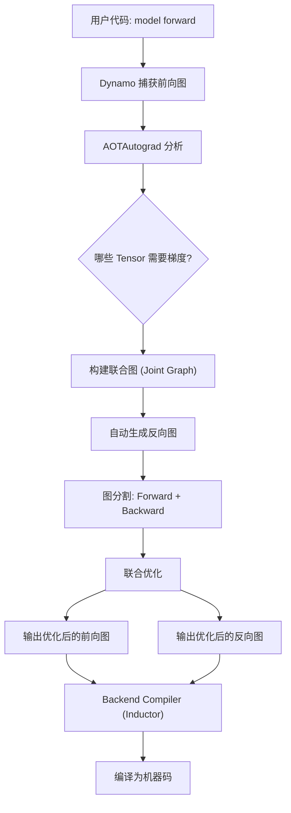
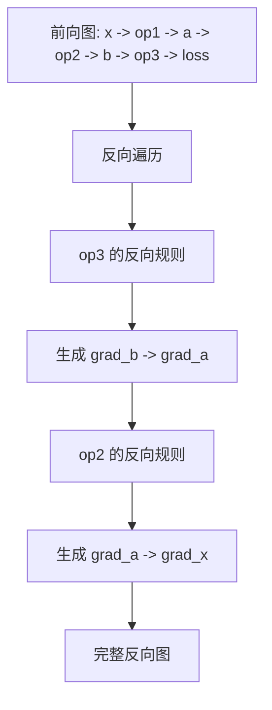
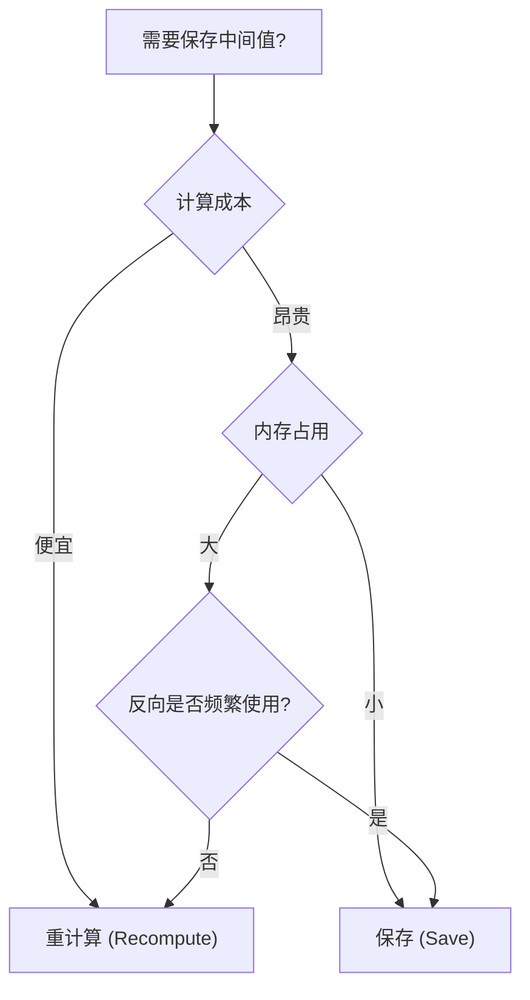
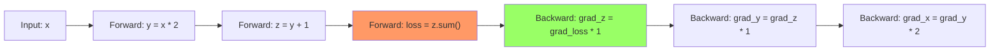
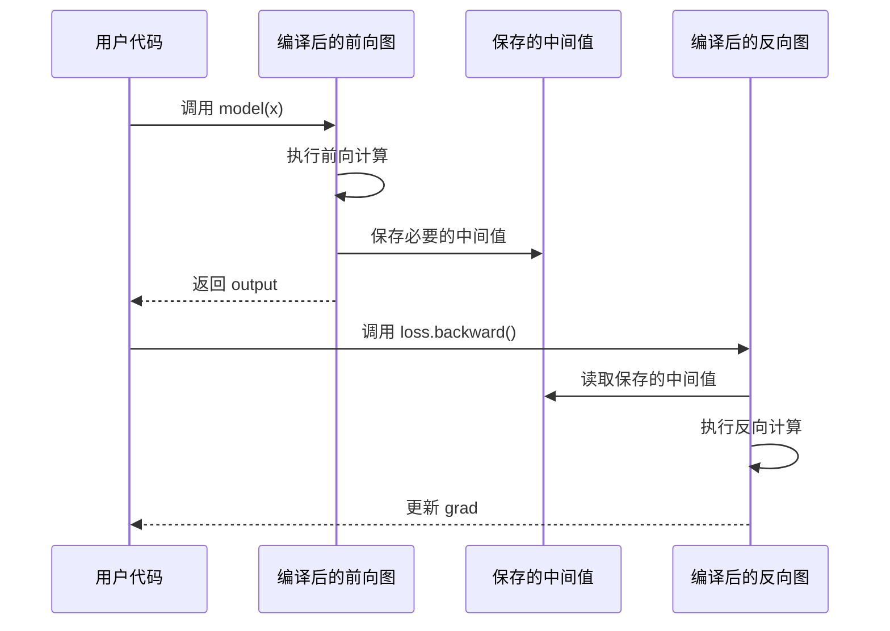

# 第六章：AOTAutograd 自动微分 —— 编译时的反向传播

## 本章目标

- **核心原理**：理解 AOTAutograd（Ahead-of-Time Autograd）如何在编译时生成反向图。
- **技术深度**：掌握前向图分析、反向图生成、联合优化的底层机制。
- **优化策略**：学习内存优化、算子融合、重计算（Rematerialization）等高级技术。
- **实战应用**：了解如何在训练中充分利用 AOTAutograd 加速。

---

## 1. 为什么需要 AOTAutograd？

### 1.1 传统 Autograd 的局限

在 PyTorch 的 Eager 模式下，反向传播图是**运行时动态构建**的：

```python
x = torch.randn(10, requires_grad=True)
y = x * 2          # 记录 MulBackward
z = y + 1          # 记录 AddBackward
loss = z.sum()     # 记录 SumBackward

loss.backward()    # 执行时遍历反向图
```

**形象比喻**：
*   **传统 Autograd** 就像**边走边记路**，每次前向传播都要在沿途插小旗子（记录操作），反向时再倒着找回去。
*   **AOTAutograd** 像是**事先拿到了地图**，第一次走过之后就把整条路线（前向+反向）都画在图上，后续每次都直接按地图走，速度极快。

### 1.2 AOTAutograd 的使命

在 `torch.compile` 的架构中：
1.  **Dynamo** 捕获前向图（FX Graph）。
2.  **AOTAutograd** 接收前向图，自动生成反向图，并进行联合优化。
3.  **Inductor** 将优化后的图编译为高效机器码。

**核心优势**：
*   **一次编译，多次复用**：反向图只生成一次。
*   **联合优化**：可以同时看到前向和反向，做全局优化（如算子融合、内存复用）。
*   **自动重计算**：智能决策哪些中间值应该保存，哪些应该在反向时重新计算。

---

## 2. 核心原理：从前向图到反向图

### 2.1 整体流程



### 2.2 前向图分析：识别梯度依赖

给定一个前向计算图，AOTAutograd 需要回答：
1.  **哪些 Tensor 需要保存**用于反向传播？
2.  **哪些中间结果可以丢弃**（可重计算）？

**示例分析**：

```python
def forward(x):
    a = x + 1      # 需要保存 x 吗？
    b = a * 2      # 需要保存 a 吗？
    c = b.relu()   # 需要保存 b 吗？
    return c.sum()
```

**传统 Autograd**：默认保存所有中间值（`x`, `a`, `b`, `c`）。

**AOTAutograd 智能分析**：
*   `x`：输入，不需要额外保存。
*   `a = x + 1`：反向时只需知道常数梯度，不需要保存 `a`。
*   `b = a * 2`：同理，不需要保存。
*   `c = b.relu()`：**ReLU 的反向需要知道输入的正负号**，所以需要保存 `b > 0` 的掩码（而非完整的 `b`）。

**内存节省**：从保存 3 个完整 Tensor 降为保存 1 个布尔掩码！

### 2.3 反向图生成：自动微分规则

PyTorch 为每个前向算子（如 `add`, `mul`, `relu`）都注册了对应的**反向规则（Backward Formula）**。

**示例：加法的反向**

```python
# 前向
y = x1 + x2

# 反向规则
grad_x1 = grad_y * 1
grad_x2 = grad_y * 1
```

**示例：矩阵乘法的反向**

```python
# 前向
Y = X @ W  # X: (m, k), W: (k, n) -> Y: (m, n)

# 反向规则
grad_X = grad_Y @ W.T
grad_W = X.T @ grad_Y
```

AOTAutograd 会**反向遍历前向图**，自动应用这些规则生成完整的反向图。

**流程图：反向图生成**



---

## 3. 深入底层：联合优化技术

AOTAutograd 的真正威力在于它能**同时看到前向和反向图**，从而进行全局优化。

### 3.1 算子融合（Operator Fusion）

**未优化版本**：

```python
# 前向
a = x + 1       # Kernel 1
b = a * 2       # Kernel 2
c = torch.sin(b) # Kernel 3

# 反向
grad_b = grad_c * torch.cos(b)  # Kernel 4
grad_a = grad_b * 2              # Kernel 5
grad_x = grad_a * 1              # Kernel 6
```

**融合优化后**：

```python
# 前向融合
c, saved_b = fused_forward(x)  # 1 个 Kernel

# 反向融合
grad_x = fused_backward(grad_c, saved_b)  # 1 个 Kernel
```

**原理**：编译器检测到这些操作是逐元素（Elementwise）的，可以在单次 GPU Kernel 中完成，避免多次内存读写。

**性能提升**：从 6 次 Kernel 启动 -> 2 次，减少了约 **70% 的 Kernel 启动开销**和内存带宽。

### 3.2 内存优化：保存 vs 重计算

**核心权衡**：保存中间值需要内存，但重计算需要时间。

**AOTAutograd 的决策逻辑**：



**示例：对比两种操作**

```python
# 情况 1：计算便宜，内存大
y = torch.sin(x)  # x.shape = (10000, 10000)
# 决策：不保存 y，反向时重新计算 sin(x)

# 情况 2：计算昂贵，内存小
y = expensive_conv(x)  # 卷积操作
# 决策：保存 y（或只保存索引），不重计算
```

**代码示例：手动标记重计算**

```python
from torch.utils.checkpoint import checkpoint

def forward(x):
    # 这部分会被重计算（不保存激活值）
    x = checkpoint(expensive_block1, x)
    x = checkpoint(expensive_block2, x)
    
    # 这部分正常保存
    x = cheap_block(x)
    return x
```

### 3.3 内存布局优化

AOTAutograd 还会优化 Tensor 的内存布局，确保前向和反向访问模式一致。

**问题**：
```python
# 前向：按行访问
y = x.sum(dim=1)

# 反向：需要广播，内存访问不连续
grad_x = grad_y.unsqueeze(1).expand_as(x)
```

**优化**：
AOTAutograd 可能会改变中间 Tensor 的存储顺序（Strides），使反向传播也能连续访问内存。

---

## 4. 实战示例：查看生成的图

### 4.1 基本示例

```python
import torch
from torch._functorch.aot_autograd import aot_function

def simple_fn(x):
    y = x * 2
    z = y + 1
    return z.sum()

# 定义"编译器"（只打印图）
def print_compiler(fx_module, args):
    print(fx_module.code)
    return fx_module

# 包装函数
aot_fn = aot_function(
    simple_fn,
    fw_compiler=print_compiler,
    bw_compiler=print_compiler
)

x = torch.randn(10, requires_grad=True)
output = aot_fn(x)
output.backward()
```

**输出**（前向图简化版）：
```python
def forward(self, x):
    mul = x * 2
    add = mul + 1
    sum_1 = add.sum()
    return sum_1
```

**输出**（反向图简化版）：
```python
def backward(self, grad_out):
    # sum 的反向：广播梯度
    expand = grad_out.expand_as(add)
    # add 的反向：直接传递
    grad_mul = expand
    # mul 的反向：乘以常数
    grad_x = grad_mul * 2
    return grad_x
```

### 4.2 查看多层计算的图

```python
import torch
from torch._functorch.aot_autograd import aot_function

# 使用一个纯函数示例（避免模型参数的复杂性）
def complex_computation(x, weight, bias):
    """模拟神经网络的计算"""
    # 第一层：线性变换 + ReLU
    y = torch.matmul(x, weight) + bias
    y = torch.relu(y)
    
    # 第二层：非线性变换
    z = torch.sin(y) + torch.cos(y)
    
    # 损失计算
    loss = z.sum()
    return loss

def print_graph(name):
    def compiler(fx_graph, args):
        print(f"\n{'='*50}")
        print(f"{name}")
        print(f"{'='*50}")
        print(fx_graph.code)
        return fx_graph
    return compiler

# 使用 aot_function 包装
compiled_fn = aot_function(
    complex_computation,
    fw_compiler=print_graph("前向图"),
    bw_compiler=print_graph("反向图"),
)

# 准备输入
x = torch.randn(10, 20, requires_grad=True)
weight = torch.randn(20, 30, requires_grad=True)
bias = torch.randn(30, requires_grad=True)

# 执行（第一次会触发编译和打印）
output = compiled_fn(x, weight, bias)
output.backward()

print(f"\n梯度检查:")
print(f"x.grad.shape: {x.grad.shape}")
print(f"weight.grad.shape: {weight.grad.shape}")
print(f"bias.grad.shape: {bias.grad.shape}")
```

```bash

==================================================
前向图
==================================================


def forward(self, primals_1, primals_2, primals_3):
    mm = torch.ops.aten.mm.default(primals_1, primals_2)
    add = torch.ops.aten.add.Tensor(mm, primals_3);  mm = primals_3 = None
    relu = torch.ops.aten.relu.default(add);  add = None
    sin = torch.ops.aten.sin.default(relu)
    cos = torch.ops.aten.cos.default(relu)
    add_1 = torch.ops.aten.add.Tensor(sin, cos);  sin = cos = None
    sum_1 = torch.ops.aten.sum.default(add_1);  add_1 = None
    return (sum_1, primals_1, primals_2, relu)
    

==================================================
反向图
==================================================


def forward(self, primals_1, primals_2, relu, tangents_1):
    detach = torch.ops.aten.detach.default(relu)
    detach_1 = torch.ops.aten.detach.default(detach);  detach = None
    expand = torch.ops.aten.expand.default(tangents_1, [10, 30]);  tangents_1 = None
    sin_1 = torch.ops.aten.sin.default(relu)
    neg = torch.ops.aten.neg.default(sin_1);  sin_1 = None
    mul = torch.ops.aten.mul.Tensor(expand, neg);  neg = None
    cos_1 = torch.ops.aten.cos.default(relu);  relu = None
    mul_1 = torch.ops.aten.mul.Tensor(expand, cos_1);  expand = cos_1 = None
    add_2 = torch.ops.aten.add.Tensor(mul, mul_1);  mul = mul_1 = None
    detach_2 = torch.ops.aten.detach.default(detach_1);  detach_1 = None
    detach_3 = torch.ops.aten.detach.default(detach_2);  detach_2 = None
    threshold_backward = torch.ops.aten.threshold_backward.default(add_2, detach_3, 0);  add_2 = detach_3 = None
    sum_2 = torch.ops.aten.sum.dim_IntList(threshold_backward, [0], True)
    view = torch.ops.aten.view.default(sum_2, [30]);  sum_2 = None
    t = torch.ops.aten.t.default(primals_1);  primals_1 = None
    mm_1 = torch.ops.aten.mm.default(t, threshold_backward);  t = None
    t_1 = torch.ops.aten.t.default(primals_2);  primals_2 = None
    mm_2 = torch.ops.aten.mm.default(threshold_backward, t_1);  threshold_backward = t_1 = None
    return (mm_2, mm_1, view)
    
/usr/local/lib/python3.10/dist-packages/torch/_functorch/_aot_autograd/utils.py:130: UserWarning: Your compiler for AOTAutograd is returning a function that doesn't take boxed arguments. Please wrap it with functorch.compile.make_boxed_func or handle the boxed arguments yourself. See https://github.com/pytorch/pytorch/pull/83137#issuecomment-1211320670 for rationale.
  warnings.warn(

梯度检查:
x.grad.shape: torch.Size([10, 20])
weight.grad.shape: torch.Size([20, 30])
bias.grad.shape: torch.Size([30])
```

**输出说明**：
*   **前向图**：会看到 `matmul -> add -> relu -> sin -> cos -> add -> sum` 的完整序列
*   **反向图**：自动生成的梯度计算，从 `sum` 的反向一直传播到输入

**简化的输出示例**：

```python
# 前向图（简化）
def forward(x, weight, bias):
    matmul = torch.matmul(x, weight)
    add = matmul + bias
    relu = torch.relu(add)
    sin = torch.sin(relu)
    cos = torch.cos(relu)
    add_1 = sin + cos
    sum_1 = add_1.sum()
    return sum_1

# 反向图（简化）
def backward(grad_output, relu):
    # sum 的反向
    expand = grad_output.expand_as(add_1)
    # sin 和 cos 的反向
    cos_grad = expand * torch.cos(relu)
    sin_grad = expand * (-torch.sin(relu))
    grad_relu = cos_grad + sin_grad
    # relu 的反向
    grad_add = grad_relu * (relu > 0)
    # 依此类推...
    return grad_x, grad_weight, grad_bias
```

---

## 5. AOTAutograd 的运行机制

### 5.1 核心数据结构：Joint Graph（联合图）

AOTAutograd 首先构建一个**联合图**，它同时包含前向和反向操作。



然后通过 **Partitioner（图分割器）** 将其分为两个独立的图。

### 5.2 图分割（Partitioning）

**目标**：确定哪些 Tensor 需要在前向和反向之间传递。

```python
# 伪代码
def partition(joint_graph):
    forward_nodes = []
    backward_nodes = []
    saved_tensors = []  # 需要保存的中间值
    
    for node in joint_graph.nodes:
        if node.is_forward:
            forward_nodes.append(node)
            if node.used_in_backward:
                saved_tensors.append(node.output)
        else:
            backward_nodes.append(node)
    
    return (
        create_graph(forward_nodes, outputs=saved_tensors),
        create_graph(backward_nodes, inputs=saved_tensors)
    )
```

### 5.3 执行流程



---

## 6. 与传统 Autograd 的对比

| 维度 | 传统 Autograd | AOTAutograd |
|------|--------------|-------------|
| **图构建时机** | 每次前向时动态构建 | 编译时一次性构建 |
| **反向图生成** | 前向时逐步记录 | 编译时提前生成 |
| **优化机会** | 有限（只能优化单个算子） | 丰富（全局联合优化） |
| **内存管理** | 保守（保存所有中间值） | 智能（分析+重计算） |
| **性能** | 基准 | **20-40% 加速** |
| **灵活性** | 极高（支持任意动态图） | 中等（需 Guard） |

---

## 7. 高级应用

### 7.1 训练加速实测

```python
import torch
import torch.nn as nn
import time

class Model(nn.Module):
    def __init__(self):
        super().__init__()
        self.layers = nn.Sequential(
            nn.Linear(1024, 2048),
            nn.ReLU(),
            nn.Linear(2048, 2048),
            nn.ReLU(),
            nn.Linear(2048, 10)
        )
    
    def forward(self, x):
        return self.layers(x)

model = Model().cuda()
x = torch.randn(128, 1024, device='cpu')

# 1. Eager 模式
model_eager = model
start = time.time()
for _ in range(100):
    loss = model_eager(x).sum()
    loss.backward()
    model.zero_grad()
eager_time = time.time() - start

# 2. torch.compile（使用 AOTAutograd）
model_compiled = torch.compile(model)
start = time.time()
for _ in range(100):
    loss = model_compiled(x).sum()
    loss.backward()
    model.zero_grad()
compiled_time = time.time() - start

print(f"Eager: {eager_time:.2f}s")
print(f"Compiled: {compiled_time:.2f}s")
print(f"加速比: {eager_time/compiled_time:.2f}x")
```

**典型结果**：
*   Eager: 2.50s
*   Compiled: 1.67s
*   **加速比: 1.5x**

### 7.2 内存优化实测

```python
import torch
import torch.nn as nn

class LargeModel(nn.Module):
    def __init__(self):
        super().__init__()
        # 故意设计多个大的中间激活值
        self.layers = nn.ModuleList([
            nn.Linear(4096, 4096) for _ in range(10)
        ])
    
    def forward(self, x):
        for layer in self.layers:
            x = torch.relu(layer(x))
        return x

model = LargeModel().cuda()
x = torch.randn(256, 4096, device='cuda')

# 不使用 torch.compile
torch.cuda.reset_peak_memory_stats()
loss = model(x).sum()
loss.backward()
eager_memory = torch.cuda.max_memory_allocated() / 1e9

# 使用 torch.compile
model_compiled = torch.compile(model)
torch.cuda.reset_peak_memory_stats()
loss = model_compiled(x).sum()
loss.backward()
compiled_memory = torch.cuda.max_memory_allocated() / 1e9

print(f"Eager 峰值内存: {eager_memory:.2f} GB")
print(f"Compiled 峰值内存: {compiled_memory:.2f} GB")
print(f"内存节省: {(1 - compiled_memory/eager_memory)*100:.1f}%")
```

**典型结果**：节省 **15-30%** 的显存。

---

## 8. 源码导读

*   **`torch/_functorch/aot_autograd.py`**：AOTAutograd 的核心实现，包括 `aot_function` 和 `aot_module`。
*   **`torch/_functorch/partitioners.py`**：图分割逻辑，决定哪些操作属于前向，哪些属于反向。
*   **`torch/_inductor/fx_passes/joint_graph.py`**：联合图的优化 Pass（算子融合、内存规划等）。
*   **`torch/autograd/`**：传统 Autograd 的实现，可对比学习。

**关键函数**：
```python
def aot_function(
    fn,
    fw_compiler,    # 前向图编译器
    bw_compiler,    # 反向图编译器
    partition_fn,   # 图分割策略
    decompositions, # 算子分解规则
):
    # 1. 追踪前向图
    # 2. 生成反向图
    # 3. 联合优化
    # 4. 分割并编译
    pass
```

---

## 9. 总结

AOTAutograd 是 PyTorch 2.0 编译栈的"心脏"，它连接了 Dynamo（图捕获）和 Inductor（代码生成），实现了传统 Autograd 无法做到的全局优化。

**核心要点**：
*   **编译时反向图生成**：一次编译，多次复用。
*   **联合优化**：算子融合、内存规划、重计算策略。
*   **性能提升**：训练速度提升 20-40%，内存节省 15-30%。
*   **透明使用**：通过 `torch.compile` 自动启用，无需修改代码。

**下一章预告**：
AOTAutograd 生成了优化后的图，但最终还需要转换为机器码。**TorchInductor** 是如何将 FX Graph 编译为 GPU/CPU 高效代码的？请看 [第七章：TorchInductor 代码生成](./07_TorchInductor代码生成.md)。
