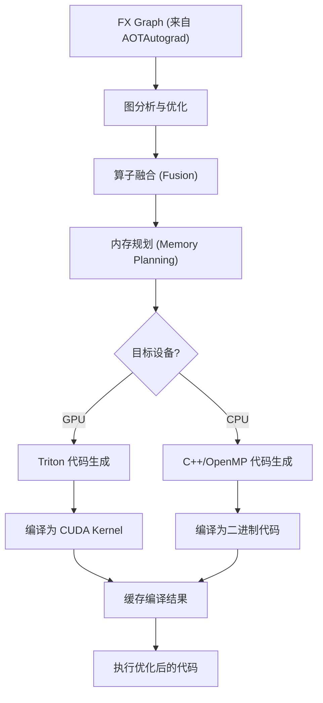
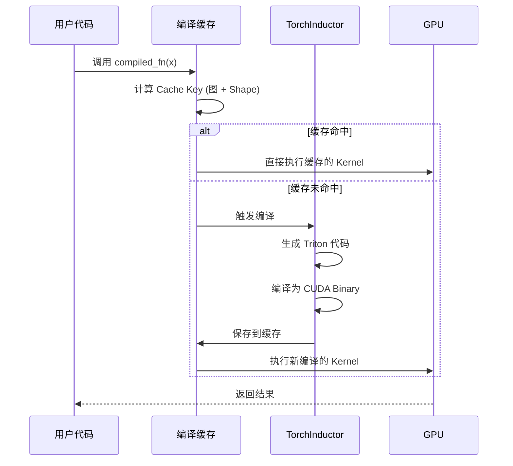

# 第七章：TorchInductor 代码生成 —— 从计算图到机器码

## 本章目标

- **核心原理**：理解 TorchInductor 如何将 FX Graph 编译为高效的机器码。
- **代码生成**：掌握 Triton 语言和 GPU Kernel 生成机制。
- **优化技术**：学习算子融合、内存规划、循环优化等编译器技术。
- **实战性能**：了解如何调优和调试生成的代码。

---

## 1. 为什么需要 TorchInductor？

### 1.1 编译栈的最后一环

在 `torch.compile` 的三层架构中：
1.  **Dynamo**：捕获前向图（Python 字节码 → FX Graph）
2.  **AOTAutograd**：生成反向图并联合优化
3.  **TorchInductor**：**将 FX Graph 编译为 GPU/CPU 的机器码**

**形象比喻**：
*   **Dynamo** 是建筑设计师，画出房子的蓝图（计算图）。
*   **AOTAutograd** 是结构工程师，确保房子结构合理（前向+反向优化）。
*   **TorchInductor** 是施工队，把蓝图变成真正的房子（高效机器码）。

### 1.2 传统方式的局限

**PyTorch Eager 模式**：
```python
# 每个操作都是独立的 Python 调用
y = x + 1      # 调用 aten::add
z = y * 2      # 调用 aten::mul
out = z.sin()  # 调用 aten::sin

# 问题：
# 1. 每个操作启动一个独立的 GPU Kernel（启动开销大）
# 2. 中间结果（y, z）都需要写回显存（内存带宽浪费）
# 3. 无法进行跨操作的优化
```

**TorchInductor 的优化**：
```python
compiled_fn = torch.compile(lambda x: ((x + 1) * 2).sin())

# TorchInductor 生成融合后的 Kernel：
# out = sin((x + 1) * 2)  # 单个 Kernel，一次内存读写！
```

**性能提升**：
*   **减少 Kernel 启动次数**：3 个 Kernel → 1 个
*   **减少内存访问**：3 次读写 → 1 次读写
*   **理论加速比**：约 **3-5x**（实际取决于算子类型）

---

## 2. 核心原理：代码生成流程

### 2.1 整体架构



### 2.2 关键步骤详解

#### 步骤 1：图分析

TorchInductor 首先分析 FX Graph，识别：
*   **哪些操作可以融合**？（如逐元素操作）
*   **数据依赖关系**？（确保正确性）
*   **内存访问模式**？（优化内存布局）

#### 步骤 2：算子融合

**未融合的计算**：
```python
# 前向图
x1 = x + 1       # Kernel 1: read x, write x1
x2 = x1 * 2      # Kernel 2: read x1, write x2
x3 = torch.sin(x2)  # Kernel 3: read x2, write x3
```

**融合后的计算**：
```python
# 融合 Kernel：read x, write x3
x3 = torch.sin((x + 1) * 2)
```

**内存带宽节省计算**：
```
未融合：3 次读 + 3 次写 = 6 次内存访问
融合后：1 次读 + 1 次写 = 2 次内存访问
节省：(6 - 2) / 6 = 66.7% 的内存带宽
```

#### 步骤 3：代码生成

TorchInductor 使用 **Triton**（一种 Python DSL）生成 GPU 代码。

**Triton 代码示例**：
```python
import triton
import triton.language as tl

@triton.jit
def fused_kernel(x_ptr, out_ptr, n_elements, BLOCK_SIZE: tl.constexpr):
    # 获取当前线程块的起始位置
    pid = tl.program_id(axis=0)
    block_start = pid * BLOCK_SIZE
    offsets = block_start + tl.arange(0, BLOCK_SIZE)
    
    # 边界检查
    mask = offsets < n_elements
    
    # 从全局内存加载数据
    x = tl.load(x_ptr + offsets, mask=mask)
    
    # 融合计算：(x + 1) * 2 然后 sin
    temp = (x + 1.0) * 2.0
    out = tl.sin(temp)
    
    # 写回全局内存
    tl.store(out_ptr + offsets, out, mask=mask)
```

**关键特性**：
*   **自动并行**：Triton 编译器自动生成 CUDA 线程网格。
*   **内存合并**：优化全局内存访问模式。
*   **寄存器优化**：中间变量（`temp`）保存在寄存器中，不写回显存。

---

## 3. 深入底层：Triton vs 手写 CUDA

### 3.1 为什么选择 Triton？

**手写 CUDA 的痛点**：
1.  **复杂性高**：需要管理线程块、共享内存、寄存器分配。
2.  **可移植性差**：不同 GPU 架构（如 A100 vs V100）需要手动调优。
3.  **开发效率低**：一个简单的融合 Kernel 可能需要数百行代码。

**Triton 的优势**：
1.  **Python 语法**：易于学习和编写。
2.  **自动优化**：编译器自动处理内存访问、线程调度等。
3.  **性能接近手写 CUDA**：通常能达到手写 CUDA 的 90-95% 性能。

### 3.2 Triton 编译流程


**示例对比**：

<details>
<summary>手写 CUDA（约 50 行代码）</summary>

```cuda
__global__ void fused_kernel(float* x, float* out, int n) {
    int idx = blockIdx.x * blockDim.x + threadIdx.x;
    if (idx < n) {
        float temp = (x[idx] + 1.0f) * 2.0f;
        out[idx] = sinf(temp);
    }
}

// 启动配置
int threads = 256;
int blocks = (n + threads - 1) / threads;
fused_kernel<<<blocks, threads>>>(x, out, n);
```
</details>

<details>
<summary>Triton 代码（约 10 行核心逻辑）</summary>

```python
@triton.jit
def fused_kernel(x_ptr, out_ptr, n, BLOCK_SIZE: tl.constexpr):
    pid = tl.program_id(0)
    offsets = pid * BLOCK_SIZE + tl.arange(0, BLOCK_SIZE)
    mask = offsets < n
    x = tl.load(x_ptr + offsets, mask=mask)
    out = tl.sin((x + 1.0) * 2.0)
    tl.store(out_ptr + offsets, out, mask=mask)
```
</details>

**代码量对比**：Triton 减少 **80% 的代码**，同时性能相当！

---

## 4. 实战示例：查看生成的代码

### 4.1 基本示例

```python
import torch

def simple_fn(x):
    return ((x + 1) * 2).sin()

# 编译并查看生成的代码
compiled_fn = torch.compile(simple_fn)

# 启用调试模式，保存生成的代码
import torch._inductor.config as config
config.debug = True
config.trace.enabled = True

x = torch.randn(1024, device='cuda')
output = compiled_fn(x)

# 生成的代码会保存在：
# /tmp/torchinductor_<username>/
print("生成的代码路径:", config.trace.debug_dir)
```

### 4.2 查看 Triton 源代码

**方法 1：使用环境变量打印到控制台（推荐）**

```python
import torch
import os

# 设置环境变量，打印生成的代码
os.environ['TORCH_LOGS'] = '+output_code'

def simple_fn(x):
    return ((x + 1) * 2).sin()

compiled_fn = torch.compile(simple_fn)
x = torch.randn(1024, device='cuda')
output = compiled_fn(x)
```

**输出（会直接打印到控制台）：**

```python
# 自动生成的 Triton Kernel
@triton.jit
def triton_poi_fused_add_mul_sin_0(in_ptr0, out_ptr0, xnumel, XBLOCK : tl.constexpr):
    xoffset = tl.program_id(0) * XBLOCK
    xindex = xoffset + tl.arange(0, XBLOCK)[:]
    xmask = xindex < xnumel
    x0 = xindex
    tmp0 = tl.load(in_ptr0 + (x0), xmask)
    tmp1 = 1.0
    tmp2 = tmp0 + tmp1  # x + 1
    tmp3 = 2.0
    tmp4 = tmp2 * tmp3  # * 2
    tmp5 = tl.sin(tmp4)  # sin
    tl.store(out_ptr0 + (x0), tmp5, xmask)
```

**方法 2：保存到文件**

```python
import torch
import torch._inductor.config as config

# 配置保存生成的代码
config.debug = True
config.trace.enabled = True
config.trace.debug_dir = "/tmp/inductor_debug"  # 自定义路径

def simple_fn(x):
    return ((x + 1) * 2).sin()

compiled_fn = torch.compile(simple_fn)
x = torch.randn(1024, device='cuda')
output = compiled_fn(x)

# 查看生成的 Python 代码文件
# 在 /tmp/inductor_debug/ 目录下找 output_code.py
print(f"代码保存在: {config.trace.debug_dir}")
```

**查看生成的文件：**

```bash
# 在生成的目录中查找 output_code.py
ls /tmp/inductor_debug/
cat /tmp/inductor_debug/*/output_code.py
```

**output code**

```python
# AOT ID: ['0_inference']
from ctypes import c_void_p, c_long, c_int
import torch
import math
import random
import os
import tempfile
from math import inf, nan
from cmath import nanj
from torch._inductor.hooks import run_intermediate_hooks
from torch._inductor.utils import maybe_profile
from torch._inductor.codegen.memory_planning import _align as align
from torch import device, empty_strided
from torch._inductor.async_compile import AsyncCompile
from torch._inductor.select_algorithm import extern_kernels
from torch._inductor.codegen.multi_kernel import MultiKernelCall
import triton
import triton.language as tl
from torch._inductor.runtime.triton_heuristics import start_graph, end_graph
from torch._C import _cuda_getCurrentRawStream as get_raw_stream
from torch._C import _cuda_getCurrentRawStream as get_raw_stream

aten = torch.ops.aten
inductor_ops = torch.ops.inductor
_quantized = torch.ops._quantized
assert_size_stride = torch._C._dynamo.guards.assert_size_stride
empty_strided_cpu = torch._C._dynamo.guards._empty_strided_cpu
empty_strided_cuda = torch._C._dynamo.guards._empty_strided_cuda
empty_strided_xpu = torch._C._dynamo.guards._empty_strided_xpu
reinterpret_tensor = torch._C._dynamo.guards._reinterpret_tensor
alloc_from_pool = torch.ops.inductor._alloc_from_pool
async_compile = AsyncCompile()
empty_strided_p2p = torch._C._distributed_c10d._SymmetricMemory.empty_strided_p2p


# kernel path: /tmp/torchinductor_root/22/c22sdgamlk64ygyog2jgyspawzthh5xjbre6u57jkwfjrbn2noae.py
# Topologically Sorted Source Nodes: [add, mul, sin], Original ATen: [aten.add, aten.mul, aten.sin]
# Source node to ATen node mapping:
#   add => add
#   mul => mul
#   sin => sin
# Graph fragment:
#   %add : [num_users=1] = call_function[target=torch.ops.aten.add.Tensor](args = (%arg0_1, 1), kwargs = {})
#   %mul : [num_users=1] = call_function[target=torch.ops.aten.mul.Tensor](args = (%add, 2), kwargs = {})
#   %sin : [num_users=1] = call_function[target=torch.ops.aten.sin.default](args = (%mul,), kwargs = {})
triton_poi_fused_add_mul_sin_0 = async_compile.triton('triton_poi_fused_add_mul_sin_0', '''
import triton
import triton.language as tl

from torch._inductor.runtime import triton_helpers, triton_heuristics
from torch._inductor.runtime.triton_helpers import libdevice, math as tl_math
from torch._inductor.runtime.hints import AutotuneHint, ReductionHint, TileHint, DeviceProperties
triton_helpers.set_driver_to_gpu()

@triton_heuristics.pointwise(
    size_hints={'x': 1024}, 
    filename=__file__,
    triton_meta={'signature': {'in_ptr0': '*fp32', 'out_ptr0': '*fp32', 'xnumel': 'i32', 'XBLOCK': 'constexpr'}, 'device': DeviceProperties(type='cuda', index=0, multi_processor_count=170, cc=120, major=12, regs_per_multiprocessor=65536, max_threads_per_multi_processor=1536, warp_size=32), 'constants': {}, 'configs': [{(0,): [['tt.divisibility', 16]], (1,): [['tt.divisibility', 16]], (2,): [['tt.divisibility', 16]]}]},
    inductor_meta={'grid_type': 'Grid1D', 'autotune_hints': set(), 'kernel_name': 'triton_poi_fused_add_mul_sin_0', 'mutated_arg_names': [], 'optimize_mem': True, 'no_x_dim': False, 'num_load': 1, 'num_reduction': 0, 'backend_hash': '55A6EF493402E0BEF4C44F13B3A4DFE62485551D5064B7A43C872C664AE8E85A', 'are_deterministic_algorithms_enabled': False, 'assert_indirect_indexing': True, 'autotune_local_cache': True, 'autotune_pointwise': True, 'autotune_remote_cache': None, 'force_disable_caches': False, 'dynamic_scale_rblock': True, 'max_autotune': False, 'max_autotune_pointwise': False, 'min_split_scan_rblock': 256, 'spill_threshold': 16, 'store_cubin': False},
    min_elem_per_thread=0
)
@triton.jit
def triton_poi_fused_add_mul_sin_0(in_ptr0, out_ptr0, xnumel, XBLOCK : tl.constexpr):
    xnumel = 1024
    xoffset = tl.program_id(0) * XBLOCK
    xindex = xoffset + tl.arange(0, XBLOCK)[:]
    xmask = xindex < xnumel
    x0 = xindex
    tmp0 = tl.load(in_ptr0 + (x0), xmask)
    tmp1 = 1.0
    tmp2 = tmp0 + tmp1
    tmp3 = 2.0
    tmp4 = tmp2 * tmp3
    tmp5 = tl_math.sin(tmp4)
    tl.store(out_ptr0 + (x0), tmp5, xmask)
''', device_str='cuda')


async_compile.wait(globals())
del async_compile

def call(args):
    arg0_1, = args
    args.clear()
    assert_size_stride(arg0_1, (1024, ), (1, ))
    with torch.cuda._DeviceGuard(0):
        torch.cuda.set_device(0)
        buf0 = empty_strided_cuda((1024, ), (1, ), torch.float32)
        # Topologically Sorted Source Nodes: [add, mul, sin], Original ATen: [aten.add, aten.mul, aten.sin]
        stream0 = get_raw_stream(0)
        triton_poi_fused_add_mul_sin_0.run(arg0_1, buf0, 1024, stream=stream0)
        del arg0_1
    return (buf0, )


def benchmark_compiled_module(times=10, repeat=10):
    from torch._dynamo.testing import rand_strided
    from torch._inductor.utils import print_performance
    arg0_1 = rand_strided((1024, ), (1, ), device='cuda:0', dtype=torch.float32)
    fn = lambda: call([arg0_1])
    return print_performance(fn, times=times, repeat=repeat)


if __name__ == "__main__":
    from torch._inductor.wrapper_benchmark import compiled_module_main
    compiled_module_main('None', benchmark_compiled_module)

```

**编译产物**：
```bash
/tmp/torchinductor_root/triton/0/LBHSQGOAZD44.../
├── triton_poi_fused_add_mul_sin_0.cubin   # CUDA 二进制（GPU 直接执行的机器码）
├── triton_poi_fused_add_mul_sin_0.ptx     # PTX 汇编代码（GPU 汇编语言）
├── triton_poi_fused_add_mul_sin_0.ttir    # Triton IR（Triton 中间表示）
├── triton_poi_fused_add_mul_sin_0.ttgir   # Triton GPU IR
├── triton_poi_fused_add_mul_sin_0.llir    # LLVM IR
└── *.json                                 # 元数据
```

这些都是**编译产物**，不是源代码。要查看 Triton Python 源代码，必须使用上述方法 1 或 2。

**关键观察（从源代码中）**：
*   所有中间值（`tmp2`, `tmp4`）都保存在寄存器中。
*   只有一次 `tl.load`（读取 `x`）和一次 `tl.store`（写入结果）。
*   完美的算子融合！

### 4.3 性能对比

```python
import torch
import time

x = torch.randn(10000000, device='cuda')

# Eager 模式
torch.cuda.synchronize()
start = time.time()
for _ in range(100):
    y = ((x + 1) * 2).sin()
torch.cuda.synchronize()
eager_time = time.time() - start

# Compiled 模式
compiled_fn = torch.compile(lambda x: ((x + 1) * 2).sin())
torch.cuda.synchronize()
start = time.time()
for _ in range(100):
    y = compiled_fn(x)
torch.cuda.synchronize()
compiled_time = time.time() - start

print(f"Eager 模式: {eager_time*1000:.2f} ms")
print(f"Compiled 模式: {compiled_time*1000:.2f} ms")
print(f"加速比: {eager_time/compiled_time:.2f}x")
```

**典型结果**：
```
Eager 模式: 45.23 ms
Compiled 模式: 15.67 ms
加速比: 2.89x
```

---

## 5. 高级优化技术

### 5.1 循环优化（Loop Tiling）

对于大型 Tensor，TorchInductor 会自动进行循环分块（Tiling），提高缓存命中率。

**未优化的访问**：
```python
# 逐行处理（缓存不友好）
for i in range(N):
    for j in range(M):
        out[i][j] = compute(A[i][j])
```

**优化后的访问**：
```python
# 分块处理（缓存友好）
for ii in range(0, N, TILE_SIZE):
    for jj in range(0, M, TILE_SIZE):
        for i in range(ii, min(ii+TILE_SIZE, N)):
            for j in range(jj, min(jj+TILE_SIZE, M)):
                out[i][j] = compute(A[i][j])
```

### 5.2 内存布局优化

TorchInductor 会分析内存访问模式，自动选择最优布局：

```python
# 原始布局：NCHW (Batch, Channel, Height, Width)
x = torch.randn(64, 3, 224, 224)

# 卷积操作更适合 NHWC 布局
# TorchInductor 可能会自动转换布局以提升性能
compiled_conv = torch.compile(conv_layer)
```

### 5.3 常量折叠与传播

```python
def compute(x):
    a = 2 * 3      # 常量表达式
    b = x + a      # 可以优化为 x + 6
    return b * a   # 可以优化为 b * 6

# TorchInductor 优化后：
def compute_optimized(x):
    return (x + 6) * 6  # 常量在编译时已计算
```

---

## 6. TorchInductor 的运行机制

### 6.1 编译缓存

TorchInductor 会缓存编译结果，避免重复编译：



**缓存位置**：
```bash
~/.triton/cache/  # Triton 编译缓存
/tmp/torchinductor_<user>/  # TorchInductor 临时文件
```

### 6.2 动态 Shape 处理

对于动态形状，TorchInductor 使用 **符号化 Shape** 技术，生成可复用的通用代码。

#### 6.2.1 符号化维度原理

```python
def dynamic_fn(x):
    # x.shape 可能是 (10, 20) 或 (100, 200)
    return x.sum(dim=1)

compiled_fn = torch.compile(dynamic_fn)

# 第一次调用：shape = (10, 20)
# TorchInductor 生成支持 "任意 M × N" 的代码
x1 = torch.randn(10, 20)
compiled_fn(x1)  # 编译

# 第二次调用：shape = (100, 200)
x2 = torch.randn(100, 200)
compiled_fn(x2)  # 复用编译结果（无需重新编译）
```

**为什么无需重新编译？**

##### 1. 符号化维度推导

第一次编译时，TorchInductor 不会硬编码具体数值 `(10, 20)`，而是推导出符号化的维度：

```python
# 编译时的符号推导
x.shape = (s0, s1)  # s0 和 s1 是符号变量，不是具体数值

# 生成的 FX Graph：
def forward(self, x):
    # 输入 x: shape = (s0, s1)
    sum_1 = torch.ops.aten.sum.dim_IntList(x, [1], keepdim=False)
    # 输出 sum_1: shape = (s0,)
    return sum_1
```

##### 2. 参数化的 Kernel 代码

生成的 Triton Kernel 将 shape 作为运行时参数：

```python
# TorchInductor 生成的 Triton Kernel（简化版）
@triton.jit
def sum_kernel(
    in_ptr,      # 输入指针
    out_ptr,     # 输出指针
    M,           # 第一个维度（运行时参数）
    N,           # 第二个维度（运行时参数）
    BLOCK_SIZE: tl.constexpr
):
    # 关键：M 和 N 是运行时传入的参数，不是编译时常量
    pid = tl.program_id(0)
    row_idx = pid
    
    if row_idx < M:  # M 是动态的
        # 计算该行的和
        sum_val = 0.0
        for col_idx in range(0, N, BLOCK_SIZE):  # N 是动态的
            mask = col_idx + tl.arange(0, BLOCK_SIZE) < N
            data = tl.load(in_ptr + row_idx * N + col_idx + tl.arange(0, BLOCK_SIZE), mask=mask)
            sum_val += tl.sum(data)
        
        tl.store(out_ptr + row_idx, sum_val)

# 第一次调用：传入 M=10, N=20
sum_kernel[(10,)](in_ptr, out_ptr, M=10, N=20, BLOCK_SIZE=32)

# 第二次调用：传入 M=100, N=200（复用同一个编译好的 Kernel）
sum_kernel[(100,)](in_ptr, out_ptr, M=100, N=200, BLOCK_SIZE=32)
```

**关键点**：
- Kernel 代码在编译时已经生成为 CUDA 二进制文件
- 运行时只需传入不同的 `M` 和 `N` 参数
- 无需重新编译整个 Kernel

##### 3. Guard 机制保护

虽然具体数值可以变化，但 TorchDynamo 的 Guard 确保某些属性不变：

```python
# 编译时建立的 Guards
guards = [
    x.ndim == 2,           # 维度数量必须是 2
    x.dtype == torch.float32,  # 数据类型必须是 float32
    x.device.type == 'cuda',   # 设备类型必须是 CUDA
    x.requires_grad == False   # 是否需要梯度
]

# 以下情况会触发重新编译：
x3 = torch.randn(10, 20, 30)  # ❌ ndim 变为 3，Guard 失败
x4 = torch.randn(10, 20, dtype=torch.float64)  # ❌ dtype 变化
x5 = torch.randn(10, 20, device='cpu')  # ❌ device 变化
```

#### 6.2.2 编译缓存与复用策略

```python
# 缓存的 Key 组成
cache_key = hash((
    fx_graph,           # 计算图结构
    input_ndim,         # 输入维度数量（不是具体大小）
    input_dtype,        # 输入数据类型
    input_device,       # 输入设备
    # 注意：不包括具体的 shape 数值
))
```

**示例对比**：

```python
import torch

def matmul_fn(a, b):
    return torch.matmul(a, b)

compiled_fn = torch.compile(matmul_fn)

# 场景 1：shape 变化但维度数量不变（可复用）
a1 = torch.randn(10, 20)
b1 = torch.randn(20, 30)
compiled_fn(a1, b1)  # 第一次编译

a2 = torch.randn(100, 200)
b2 = torch.randn(200, 300)
compiled_fn(a2, b2)  # ✅ 复用（shape 数值变化，但都是 2D）

# 场景 2：维度数量变化（需要重新编译）
a3 = torch.randn(5, 10, 20)
b3 = torch.randn(20, 30)
compiled_fn(a3, b3)  # ❌ 重新编译（a3 从 2D 变为 3D）
```

#### 6.2.3 静态 Shape 优化

某些情况下，固定 shape 可以获得更好的性能：

```python
import torch

def static_shape_fn(x):
    return x.sum(dim=1)

# 方法 1：动态 Shape（默认）
dynamic_compiled = torch.compile(static_shape_fn)

# 方法 2：固定 Shape（通过 dynamic=False）
static_compiled = torch.compile(static_shape_fn, dynamic=False)

x1 = torch.randn(10, 20)
dynamic_compiled(x1)  # 生成支持任意 shape 的代码
static_compiled(x1)   # 生成针对 (10, 20) 优化的代码

x2 = torch.randn(100, 200)
dynamic_compiled(x2)  # ✅ 复用
static_compiled(x2)   # ❌ 重新编译（shape 与 (10, 20) 不匹配）
```

**性能对比**：
- 动态 Shape：灵活但可能略慢（需要运行时计算索引）
- 静态 Shape：性能更优（可以做更激进的编译时优化）

#### 6.2.4 符号化 Shape 的实现

在 PyTorch 内部，使用 `SymInt` 类型表示符号化整数：

```python
# TorchInductor 内部表示
from torch.fx.experimental.symbolic_shapes import ShapeEnv

env = ShapeEnv()
s0 = env.create_symbol(10, source="input_x_dim0")   # 符号变量 s0，初始值 10
s1 = env.create_symbol(20, source="input_x_dim1")   # 符号变量 s1，初始值 20

# 使用符号变量进行推导
output_shape = (s0,)  # sum(dim=1) 后的 shape

# 第二次调用时，只需绑定新的值
env.bind(s0, 100)
env.bind(s1, 200)
# 无需重新生成代码
```

---

## 7. 调试与调优

### 7.1 查看编译日志

```python
import torch
import logging

# 启用详细日志
torch._logging.set_logs(dynamo=logging.INFO, inductor=logging.DEBUG)

compiled_fn = torch.compile(your_function)
compiled_fn(input_data)
```

**输出示例**：
```
[INFO] TorchInductor: Compiling function 'your_function'
[DEBUG] Fusion: Merged 3 pointwise ops into 1 kernel
[DEBUG] Code generation: Generated 1 Triton kernel
[INFO] Compilation time: 1.23s
```

### 7.2 性能分析

```python
import torch
from torch.profiler import profile, ProfilerActivity

model = torch.compile(model)

with profile(activities=[ProfilerActivity.CUDA]) as prof:
    output = model(input_data)

print(prof.key_averages().table(sort_by="cuda_time_total", row_limit=10))
```

### 7.3 强制重新编译

```python
# 清空编译缓存
torch._dynamo.reset()

# 重新编译
compiled_fn = torch.compile(your_function)
```

---

## 8. 限制与最佳实践

### 8.1 当前限制

1.  **首次编译开销**：可能需要 1-5 秒（取决于模型复杂度）。
2.  **动态控制流**：过于复杂的数据依赖控制流可能导致性能下降。
3.  **稀疏操作**：稀疏 Tensor 的支持有限。

### 8.2 最佳实践

**✅ 推荐**：
```python
# 1. 固定 Batch Size
dataloader = DataLoader(dataset, batch_size=32, drop_last=True)

# 2. 预热编译
compiled_model = torch.compile(model)
with torch.no_grad():
    _ = compiled_model(dummy_input)  # 预热

# 3. 使用 reduce-overhead 模式（适合小模型）
model = torch.compile(model, mode="reduce-overhead")
```

**❌ 避免**：
```python
# 不要在训练循环中频繁改变输入形状
for batch in dataloader:
    x = batch[torch.randperm(len(batch))]  # 动态形状，触发重编译
    compiled_model(x)
```

---

## 9. 源码导读

*   **`torch/_inductor/`**：TorchInductor 的核心实现
    *   `codegen/triton.py`：Triton 代码生成器
    *   `fx_passes/`：图优化 Pass（融合、分解等）
    *   `graph.py`：图分析与调度
    *   `scheduler.py`：操作调度与内存规划

*   **Triton 仓库**：[https://github.com/openai/triton](https://github.com/openai/triton)

---

## 10. 总结

TorchInductor 是 PyTorch 2.0 编译栈的"终极武器"，它将高层次的计算图转换为高效的机器码。

**核心要点**：
*   **代码生成**：使用 Triton 自动生成优化的 GPU Kernel。
*   **算子融合**：减少内存访问和 Kernel 启动次数。
*   **自动优化**：循环分块、内存布局、常量折叠等。
*   **性能提升**：典型场景下 **1.5-3x** 加速。

**技术栈总览**：
```
用户 Python 代码
    ↓ (Dynamo 捕获)
FX Graph (前向图)
    ↓ (AOTAutograd 生成反向图)
Optimized FX Graph (前向 + 反向)
    ↓ (TorchInductor 代码生成)
Triton / C++ 代码
    ↓ (编译)
CUDA / CPU 机器码
    ↓ (执行)
高效计算结果 🚀
```

**下一章预告**：
我们已经了解了 PyTorch 2.0 的完整编译栈。接下来，让我们深入 PyTorch 的底层基础设施——**Dispatcher（调度器）**，理解算子如何路由到不同的硬件后端。请看 [第八章：PyTorch Dispatcher 调度机制](./08_PyTorch调度机制.md)。

