# 第七章：TorchInductor 代码生成 —— 从计算图到机器码

## 本章目标

- **核心原理**：理解 TorchInductor 如何将 FX Graph 编译为高效的机器码。
- **代码生成**：掌握 Triton 语言和 GPU Kernel 生成机制。
- **优化技术**：学习算子融合、内存规划、循环优化等编译器技术。
- **实战性能**：了解如何调优和调试生成的代码。

---

## 1. 为什么需要 TorchInductor？

### 1.1 编译栈的最后一环

在 `torch.compile` 的三层架构中：
1.  **Dynamo**：捕获前向图（Python 字节码 → FX Graph）
2.  **AOTAutograd**：生成反向图并联合优化
3.  **TorchInductor**：**将 FX Graph 编译为 GPU/CPU 的机器码**

**形象比喻**：
*   **Dynamo** 是建筑设计师，画出房子的蓝图（计算图）。
*   **AOTAutograd** 是结构工程师，确保房子结构合理（前向+反向优化）。
*   **TorchInductor** 是施工队，把蓝图变成真正的房子（高效机器码）。

### 1.2 传统方式的局限

**PyTorch Eager 模式**：
```python
# 每个操作都是独立的 Python 调用
y = x + 1      # 调用 aten::add
z = y * 2      # 调用 aten::mul
out = z.sin()  # 调用 aten::sin

# 问题：
# 1. 每个操作启动一个独立的 GPU Kernel（启动开销大）
# 2. 中间结果（y, z）都需要写回显存（内存带宽浪费）
# 3. 无法进行跨操作的优化
```

**TorchInductor 的优化**：
```python
compiled_fn = torch.compile(lambda x: ((x + 1) * 2).sin())

# TorchInductor 生成融合后的 Kernel：
# out = sin((x + 1) * 2)  # 单个 Kernel，一次内存读写！
```

**性能提升**：
*   **减少 Kernel 启动次数**：3 个 Kernel → 1 个
*   **减少内存访问**：3 次读写 → 1 次读写
*   **理论加速比**：约 **3-5x**（实际取决于算子类型）

---

## 2. 核心原理：代码生成流程

### 2.1 整体架构

```mermaid
graph TD
    A["FX Graph (来自 AOTAutograd)"] --> B["图分析与优化"]
    B --> C["算子融合 (Fusion)"]
    C --> D["内存规划 (Memory Planning)"]
    D --> E{目标设备?}
    E -- GPU --> F["Triton 代码生成"]
    E -- CPU --> G["C++/OpenMP 代码生成"]
    F --> H["编译为 CUDA Kernel"]
    G --> I["编译为二进制代码"]
    H --> J["缓存编译结果"]
    I --> J
    J --> K["执行优化后的代码"]
```



### 2.2 关键步骤详解

#### 步骤 1：图分析

TorchInductor 首先分析 FX Graph，识别：
*   **哪些操作可以融合**？（如逐元素操作）
*   **数据依赖关系**？（确保正确性）
*   **内存访问模式**？（优化内存布局）

#### 步骤 2：算子融合

**未融合的计算**：
```python
# 前向图
x1 = x + 1       # Kernel 1: read x, write x1
x2 = x1 * 2      # Kernel 2: read x1, write x2
x3 = torch.sin(x2)  # Kernel 3: read x2, write x3
```

**融合后的计算**：
```python
# 融合 Kernel：read x, write x3
x3 = torch.sin((x + 1) * 2)
```

**内存带宽节省计算**：
```
未融合：3 次读 + 3 次写 = 6 次内存访问
融合后：1 次读 + 1 次写 = 2 次内存访问
节省：(6 - 2) / 6 = 66.7% 的内存带宽
```

#### 步骤 3：代码生成

TorchInductor 使用 **Triton**（一种 Python DSL）生成 GPU 代码。

**Triton 代码示例**：
```python
import triton
import triton.language as tl

@triton.jit
def fused_kernel(x_ptr, out_ptr, n_elements, BLOCK_SIZE: tl.constexpr):
    # 获取当前线程块的起始位置
    pid = tl.program_id(axis=0)
    block_start = pid * BLOCK_SIZE
    offsets = block_start + tl.arange(0, BLOCK_SIZE)
    
    # 边界检查
    mask = offsets < n_elements
    
    # 从全局内存加载数据
    x = tl.load(x_ptr + offsets, mask=mask)
    
    # 融合计算：(x + 1) * 2 然后 sin
    temp = (x + 1.0) * 2.0
    out = tl.sin(temp)
    
    # 写回全局内存
    tl.store(out_ptr + offsets, out, mask=mask)
```

**关键特性**：
*   **自动并行**：Triton 编译器自动生成 CUDA 线程网格。
*   **内存合并**：优化全局内存访问模式。
*   **寄存器优化**：中间变量（`temp`）保存在寄存器中，不写回显存。

---

## 3. 深入底层：Triton vs 手写 CUDA

### 3.1 为什么选择 Triton？

**手写 CUDA 的痛点**：
1.  **复杂性高**：需要管理线程块、共享内存、寄存器分配。
2.  **可移植性差**：不同 GPU 架构（如 A100 vs V100）需要手动调优。
3.  **开发效率低**：一个简单的融合 Kernel 可能需要数百行代码。

**Triton 的优势**：
1.  **Python 语法**：易于学习和编写。
2.  **自动优化**：编译器自动处理内存访问、线程调度等。
3.  **性能接近手写 CUDA**：通常能达到手写 CUDA 的 90-95% 性能。

### 3.2 Triton 编译流程


**示例对比**：

<details>
<summary>手写 CUDA（约 50 行代码）</summary>

```cuda
__global__ void fused_kernel(float* x, float* out, int n) {
    int idx = blockIdx.x * blockDim.x + threadIdx.x;
    if (idx < n) {
        float temp = (x[idx] + 1.0f) * 2.0f;
        out[idx] = sinf(temp);
    }
}

// 启动配置
int threads = 256;
int blocks = (n + threads - 1) / threads;
fused_kernel<<<blocks, threads>>>(x, out, n);
```
</details>

<details>
<summary>Triton 代码（约 10 行核心逻辑）</summary>

```python
@triton.jit
def fused_kernel(x_ptr, out_ptr, n, BLOCK_SIZE: tl.constexpr):
    pid = tl.program_id(0)
    offsets = pid * BLOCK_SIZE + tl.arange(0, BLOCK_SIZE)
    mask = offsets < n
    x = tl.load(x_ptr + offsets, mask=mask)
    out = tl.sin((x + 1.0) * 2.0)
    tl.store(out_ptr + offsets, out, mask=mask)
```
</details>

**代码量对比**：Triton 减少 **80% 的代码**，同时性能相当！

---

## 4. 实战示例：查看生成的代码

### 4.1 基本示例

```python
import torch

def simple_fn(x):
    return ((x + 1) * 2).sin()

# 编译并查看生成的代码
compiled_fn = torch.compile(simple_fn)

# 启用调试模式，保存生成的代码
import torch._inductor.config as config
config.debug = True
config.trace.enabled = True

x = torch.randn(1024, device='cuda')
output = compiled_fn(x)

# 生成的代码会保存在：
# /tmp/torchinductor_<username>/
print("生成的代码路径:", config.trace.debug_dir)
```

### 4.2 查看 Triton 源代码

**方法 1：使用环境变量打印到控制台（推荐）**

```python
import torch
import os

# 设置环境变量，打印生成的代码
os.environ['TORCH_LOGS'] = '+output_code'

def simple_fn(x):
    return ((x + 1) * 2).sin()

compiled_fn = torch.compile(simple_fn)
x = torch.randn(1024, device='cuda')
output = compiled_fn(x)
```

**输出（会直接打印到控制台）：**

```python
# 自动生成的 Triton Kernel
@triton.jit
def triton_poi_fused_add_mul_sin_0(in_ptr0, out_ptr0, xnumel, XBLOCK : tl.constexpr):
    xoffset = tl.program_id(0) * XBLOCK
    xindex = xoffset + tl.arange(0, XBLOCK)[:]
    xmask = xindex < xnumel
    x0 = xindex
    tmp0 = tl.load(in_ptr0 + (x0), xmask)
    tmp1 = 1.0
    tmp2 = tmp0 + tmp1  # x + 1
    tmp3 = 2.0
    tmp4 = tmp2 * tmp3  # * 2
    tmp5 = tl.sin(tmp4)  # sin
    tl.store(out_ptr0 + (x0), tmp5, xmask)
```

**方法 2：保存到文件**

```python
import torch
import torch._inductor.config as config

# 配置保存生成的代码
config.debug = True
config.trace.enabled = True
config.trace.debug_dir = "/tmp/inductor_debug"  # 自定义路径

def simple_fn(x):
    return ((x + 1) * 2).sin()

compiled_fn = torch.compile(simple_fn)
x = torch.randn(1024, device='cuda')
output = compiled_fn(x)

# 查看生成的 Python 代码文件
# 在 /tmp/inductor_debug/ 目录下找 output_code.py
print(f"代码保存在: {config.trace.debug_dir}")
```

**查看生成的文件：**

```bash
# 在生成的目录中查找 output_code.py
ls /tmp/inductor_debug/
cat /tmp/inductor_debug/*/output_code.py
```

**您之前找到的文件说明**：
```bash
/tmp/torchinductor_root/triton/0/LBHSQGOAZD44.../
├── triton_poi_fused_add_mul_sin_0.cubin   # CUDA 二进制（GPU 直接执行的机器码）
├── triton_poi_fused_add_mul_sin_0.ptx     # PTX 汇编代码（GPU 汇编语言）
├── triton_poi_fused_add_mul_sin_0.ttir    # Triton IR（Triton 中间表示）
├── triton_poi_fused_add_mul_sin_0.ttgir   # Triton GPU IR
├── triton_poi_fused_add_mul_sin_0.llir    # LLVM IR
└── *.json                                 # 元数据
```

这些都是**编译产物**，不是源代码。要查看 Triton Python 源代码，必须使用上述方法 1 或 2。

**关键观察（从源代码中）**：
*   所有中间值（`tmp2`, `tmp4`）都保存在寄存器中。
*   只有一次 `tl.load`（读取 `x`）和一次 `tl.store`（写入结果）。
*   完美的算子融合！

### 4.3 性能对比

```python
import torch
import time

x = torch.randn(10000000, device='cuda')

# Eager 模式
torch.cuda.synchronize()
start = time.time()
for _ in range(100):
    y = ((x + 1) * 2).sin()
torch.cuda.synchronize()
eager_time = time.time() - start

# Compiled 模式
compiled_fn = torch.compile(lambda x: ((x + 1) * 2).sin())
torch.cuda.synchronize()
start = time.time()
for _ in range(100):
    y = compiled_fn(x)
torch.cuda.synchronize()
compiled_time = time.time() - start

print(f"Eager 模式: {eager_time*1000:.2f} ms")
print(f"Compiled 模式: {compiled_time*1000:.2f} ms")
print(f"加速比: {eager_time/compiled_time:.2f}x")
```

**典型结果**：
```
Eager 模式: 45.23 ms
Compiled 模式: 15.67 ms
加速比: 2.89x
```

---

## 5. 高级优化技术

### 5.1 循环优化（Loop Tiling）

对于大型 Tensor，TorchInductor 会自动进行循环分块（Tiling），提高缓存命中率。

**未优化的访问**：
```python
# 逐行处理（缓存不友好）
for i in range(N):
    for j in range(M):
        out[i][j] = compute(A[i][j])
```

**优化后的访问**：
```python
# 分块处理（缓存友好）
for ii in range(0, N, TILE_SIZE):
    for jj in range(0, M, TILE_SIZE):
        for i in range(ii, min(ii+TILE_SIZE, N)):
            for j in range(jj, min(jj+TILE_SIZE, M)):
                out[i][j] = compute(A[i][j])
```

### 5.2 内存布局优化

TorchInductor 会分析内存访问模式，自动选择最优布局：

```python
# 原始布局：NCHW (Batch, Channel, Height, Width)
x = torch.randn(64, 3, 224, 224)

# 卷积操作更适合 NHWC 布局
# TorchInductor 可能会自动转换布局以提升性能
compiled_conv = torch.compile(conv_layer)
```

### 5.3 常量折叠与传播

```python
def compute(x):
    a = 2 * 3      # 常量表达式
    b = x + a      # 可以优化为 x + 6
    return b * a   # 可以优化为 b * 6

# TorchInductor 优化后：
def compute_optimized(x):
    return (x + 6) * 6  # 常量在编译时已计算
```

---

## 6. TorchInductor 的运行机制

### 6.1 编译缓存

TorchInductor 会缓存编译结果，避免重复编译：

```mermaid
sequenceDiagram
    participant User as 用户代码
    participant Cache as 编译缓存
    participant Inductor as TorchInductor
    participant GPU as GPU
    
    User->>Cache: 调用 compiled_fn(x)
    Cache->>Cache: 计算 Cache Key (图 + Shape)
    alt 缓存命中
        Cache->>GPU: 直接执行缓存的 Kernel
    else 缓存未命中
        Cache->>Inductor: 触发编译
        Inductor->>Inductor: 生成 Triton 代码
        Inductor->>Inductor: 编译为 CUDA Binary
        Inductor->>Cache: 保存到缓存
        Cache->>GPU: 执行新编译的 Kernel
    end
    GPU-->>User: 返回结果
```



**缓存位置**：
```bash
~/.triton/cache/  # Triton 编译缓存
/tmp/torchinductor_<user>/  # TorchInductor 临时文件
```

### 6.2 动态 Shape 处理

对于动态形状，TorchInductor 使用 **符号化 Shape**：

```python
def dynamic_fn(x):
    # x.shape 可能是 (10, 20) 或 (100, 200)
    return x.sum(dim=1)

compiled_fn = torch.compile(dynamic_fn)

# 第一次调用：shape = (10, 20)
# TorchInductor 生成支持 "任意 M × N" 的代码
x1 = torch.randn(10, 20)
compiled_fn(x1)  # 编译

# 第二次调用：shape = (100, 200)
x2 = torch.randn(100, 200)
compiled_fn(x2)  # 复用编译结果（无需重新编译）
```

---

## 7. 调试与调优

### 7.1 查看编译日志

```python
import torch
import logging

# 启用详细日志
torch._logging.set_logs(dynamo=logging.INFO, inductor=logging.DEBUG)

compiled_fn = torch.compile(your_function)
compiled_fn(input_data)
```

**输出示例**：
```
[INFO] TorchInductor: Compiling function 'your_function'
[DEBUG] Fusion: Merged 3 pointwise ops into 1 kernel
[DEBUG] Code generation: Generated 1 Triton kernel
[INFO] Compilation time: 1.23s
```

### 7.2 性能分析

```python
import torch
from torch.profiler import profile, ProfilerActivity

model = torch.compile(model)

with profile(activities=[ProfilerActivity.CUDA]) as prof:
    output = model(input_data)

print(prof.key_averages().table(sort_by="cuda_time_total", row_limit=10))
```

### 7.3 强制重新编译

```python
# 清空编译缓存
torch._dynamo.reset()

# 重新编译
compiled_fn = torch.compile(your_function)
```

---

## 8. 限制与最佳实践

### 8.1 当前限制

1.  **首次编译开销**：可能需要 1-5 秒（取决于模型复杂度）。
2.  **动态控制流**：过于复杂的数据依赖控制流可能导致性能下降。
3.  **稀疏操作**：稀疏 Tensor 的支持有限。

### 8.2 最佳实践

**✅ 推荐**：
```python
# 1. 固定 Batch Size
dataloader = DataLoader(dataset, batch_size=32, drop_last=True)

# 2. 预热编译
compiled_model = torch.compile(model)
with torch.no_grad():
    _ = compiled_model(dummy_input)  # 预热

# 3. 使用 reduce-overhead 模式（适合小模型）
model = torch.compile(model, mode="reduce-overhead")
```

**❌ 避免**：
```python
# 不要在训练循环中频繁改变输入形状
for batch in dataloader:
    x = batch[torch.randperm(len(batch))]  # 动态形状，触发重编译
    compiled_model(x)
```

---

## 9. 源码导读

*   **`torch/_inductor/`**：TorchInductor 的核心实现
    *   `codegen/triton.py`：Triton 代码生成器
    *   `fx_passes/`：图优化 Pass（融合、分解等）
    *   `graph.py`：图分析与调度
    *   `scheduler.py`：操作调度与内存规划

*   **Triton 仓库**：[https://github.com/openai/triton](https://github.com/openai/triton)

---

## 10. 总结

TorchInductor 是 PyTorch 2.0 编译栈的"终极武器"，它将高层次的计算图转换为高效的机器码。

**核心要点**：
*   **代码生成**：使用 Triton 自动生成优化的 GPU Kernel。
*   **算子融合**：减少内存访问和 Kernel 启动次数。
*   **自动优化**：循环分块、内存布局、常量折叠等。
*   **性能提升**：典型场景下 **1.5-3x** 加速。

**技术栈总览**：
```
用户 Python 代码
    ↓ (Dynamo 捕获)
FX Graph (前向图)
    ↓ (AOTAutograd 生成反向图)
Optimized FX Graph (前向 + 反向)
    ↓ (TorchInductor 代码生成)
Triton / C++ 代码
    ↓ (编译)
CUDA / CPU 机器码
    ↓ (执行)
高效计算结果 🚀
```

**下一章预告**：
我们已经了解了 PyTorch 2.0 的完整编译栈。接下来，让我们深入 PyTorch 的底层基础设施——**Dispatcher（调度器）**，理解算子如何路由到不同的硬件后端。请看 [第八章：PyTorch Dispatcher 调度机制](./08_PyTorch调度机制.md)。

