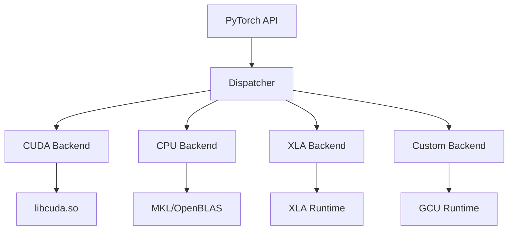
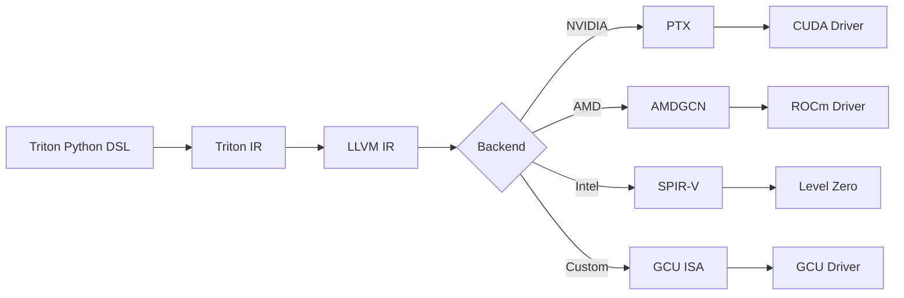
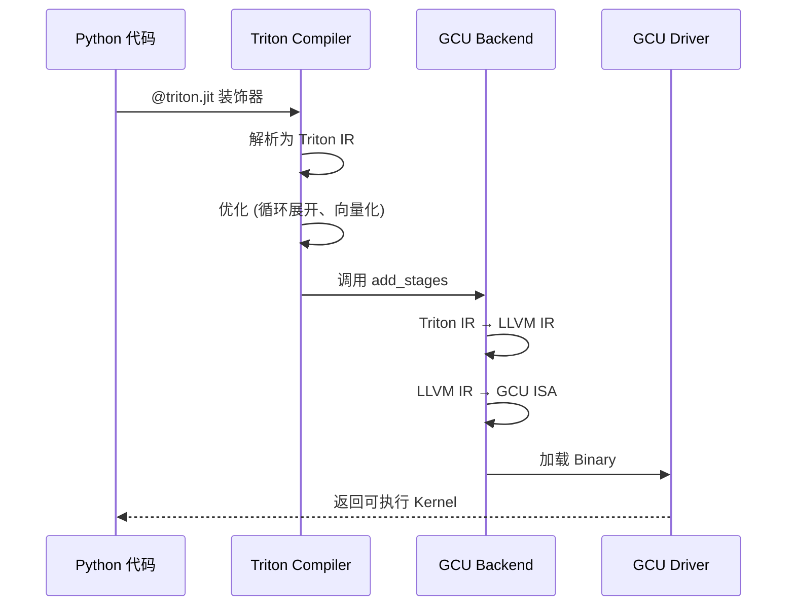
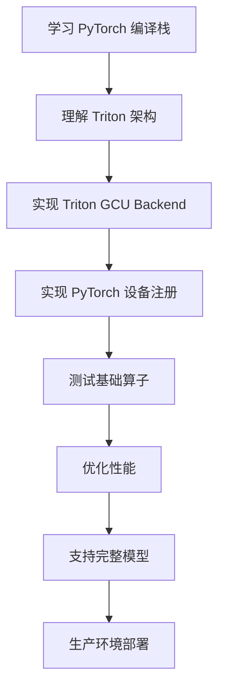

# 第八章：国产设备适配与 Triton 后端扩展

## 📖 适用场景

本章适用于已有芯片供应商提供的 Triton Backend 包的情况：
- ✅ 已有 `triton-xxx.whl` 和运行时库（如 `triton_gcu.deb`）
- ✅ 需要让 TorchInductor 使用现有的 Triton 后端
- ✅ 需要针对硬件特性进行性能优化（如 grid size、num_warps）

## 目录

**主体章节**
1. [概述](#1-概述)
2. [PyTorch 后端架构](#2-pytorch-后端架构)
3. [Triton 编译器架构](#3-triton-编译器架构)
4. [实战：使用已有的 Triton GCU 包进行适配](#4-实战使用已有的-triton-gcu-包进行适配) ⭐ **核心**
5. [进阶调试与性能分析](#5-进阶调试与性能分析)
6. [实战案例](#6-实战案例)
7. [常见问题](#7-常见问题)
8. [总结与展望](#8-总结与展望)

**附录（供参考）**
- [附录 A：完整代码清单](#附录-a完整代码清单)
- [附录 B：GCU Runtime API 参考](#附录-bgcu-runtime-api-参考)

---

## 1. 概述

### 1.1 为什么需要自定义后端

在学习了 TorchInductor 和 Triton 之后，您可能希望：
- 支持国产 AI 芯片（如昆仑芯、海光 DCU、华为昇腾等）
- 利用 `torch.compile` 的自动优化能力
- 复用 TorchInductor 的图优化和算子融合能力
- 避免从零实现整个编译栈

### 1.2 技术栈概览

```
用户模型
    ↓
torch.compile
    ↓
TorchDynamo (字节码拦截)
    ↓
FX Graph (计算图)
    ↓
AOTAutograd (自动微分)
    ↓
TorchInductor (代码生成器)
    ↓
    ├─→ Triton Backend (GPU)
    │       ↓
    │   ├─→ NVIDIA CUDA (官方)
    │   ├─→ AMD ROCm (社区)
    │   └─→ GCU (自定义) ← 我们要实现这个
    │
    └─→ C++ Backend (CPU)
```

### 1.3 本章目标

- 理解 PyTorch 的设备抽象层
- 掌握 Triton 后端的工作原理
- 学会使用已有的 Triton Backend 包
- 针对硬件特性进行性能优化（grid size、num_warps）
- 实现完整的 TorchInductor 集成

---

## 2. PyTorch 后端架构

### 2.1 设备抽象层

PyTorch 使用 Dispatcher 机制实现多后端支持：



**核心组件**：
1. **Dispatcher**：根据 Tensor 的设备类型分发算子调用
2. **Backend Key**：标识不同的后端（CUDA、CPU、XLA、PrivateUse1 等）
3. **Kernel Registration**：为特定后端注册算子实现

### 2.2 PrivateUse1 机制

PyTorch 提供了 `PrivateUse1` 作为自定义设备的后端标识：

```cpp
// PyTorch 内部定义
enum class DeviceType : int8_t {
    CPU = 0,
    CUDA = 1,
    // ... 其他官方设备 ...
    PrivateUse1 = 15,  // 预留给自定义设备
};
```

**使用示例**：

```python
import torch

# 注册自定义设备名称
torch.utils.rename_privateuse1_backend("gcu")

# 现在可以使用 "gcu" 作为设备类型
x = torch.randn(10, 20, device="gcu")
print(x.device)  # device(type='gcu', index=0)
```

### 2.3 算子注册流程

```python
# 伪代码：注册 GCU 后端的算子
from torch.library import Library

# 创建库
gcu_lib = Library("aten", "IMPL", "PrivateUse1")

# 注册算子实现
@gcu_lib.impl("add.Tensor")
def add_gcu(a: Tensor, b: Tensor) -> Tensor:
    # 调用 GCU 的底层库
    return gcu_runtime.add(a, b)

@gcu_lib.impl("matmul")
def matmul_gcu(a: Tensor, b: Tensor) -> Tensor:
    return gcu_runtime.matmul(a, b)
```

---

## 3. Triton 编译器架构

### 3.1 Triton 的多后端设计

Triton 从设计上支持多种硬件后端：



### 3.2 Triton Backend 抽象层

Triton 定义了 Backend 接口：

```python
# triton/compiler/backend.py (简化版)
class Backend:
    def __init__(self, target: str):
        self.target = target
    
    def add_stages(self, stages: dict, options: dict):
        """定义编译管道的各个阶段"""
        pass
    
    def get_module_map(self) -> dict:
        """返回模块映射"""
        pass
    
    def load_binary(self, name: str, binary: bytes, shared: int, device: int):
        """加载编译后的二进制到设备"""
        pass
```

### 3.3 编译流程



---


## 4. 实战：使用已有的 Triton GCU 包进行适配

### 4.1 场景说明

假设您已经有了供应商提供的：
- `triton_gcu.deb`：GCU 运行时库
- `triton-gcu.whl`：Triton GCU 后端 Python 包

现在需要：
1. 让 TorchInductor 使用这个 Triton GCU 后端
2. 针对 GCU 的性能特点进行优化：
   - **Grid Size**：最好小于 48 或者是 48 的倍数
   - **Num Warps**：最好设置为 1

### 4.2 安装与环境配置

```bash
# 步骤 1：安装 GCU 运行时
sudo dpkg -i triton_gcu.deb

# 步骤 2：安装 Triton GCU Python 包
pip install triton-gcu.whl

# 步骤 3：验证安装
python -c "import triton; print(triton.__version__)"
python -c "import triton.backends.gcu; print('GCU backend loaded')"

# 步骤 4：设置环境变量
export TRITON_BACKEND=gcu
export GCU_VISIBLE_DEVICES=0
```

### 4.3 注册 GCU 设备到 PyTorch

```python
# gcu_device_setup.py
import torch
import ctypes
import os

# 1. 注册 PrivateUse1 为 "gcu"
torch.utils.rename_privateuse1_backend("gcu")

# 2. 加载 GCU 运行时库
libgcu = ctypes.CDLL("libgcu_runtime.so")

# 3. 实现基础的设备管理函数
class GCUModule:
    @staticmethod
    def device_count():
        """获取 GCU 设备数量"""
        count = ctypes.c_int()
        libgcu.gcuGetDeviceCount(ctypes.byref(count))
        return count.value
    
    @staticmethod
    def set_device(device: int):
        """设置当前 GCU 设备"""
        libgcu.gcuSetDevice(device)
    
    @staticmethod
    def get_device():
        """获取当前 GCU 设备"""
        device = ctypes.c_int()
        libgcu.gcuGetDevice(ctypes.byref(device))
        return device.value
    
    @staticmethod
    def synchronize():
        """同步 GCU 设备"""
        libgcu.gcuDeviceSynchronize()

# 4. 注册到 torch.gcu 命名空间
torch.gcu = GCUModule

# 5. 实现内存分配器
def gcu_malloc(size: int, device: int) -> int:
    ptr = ctypes.c_void_p()
    ret = libgcu.gcuMalloc(ctypes.byref(ptr), size)
    if ret != 0:
        raise RuntimeError(f"GCU malloc failed: {ret}")
    return ptr.value

def gcu_free(ptr: int, device: int):
    ret = libgcu.gcuFree(ctypes.c_void_p(ptr))
    if ret != 0:
        raise RuntimeError(f"GCU free failed: {ret}")

# 注册内存分配器
torch._C._set_privateuse1_backend_allocator(gcu_malloc, gcu_free)

print(f"GCU device registered: {torch.gcu.device_count()} devices available")
```

### 4.4 配置 TorchInductor 使用 GCU

```python
# inductor_gcu_config.py
import torch
import torch._inductor.config as config

# 1. 启用 GCU 后端
config.cpp.device = "gcu"

# 2. 配置 Triton 使用 GCU 后端
# Triton 会自动检测 TRITON_BACKEND 环境变量
# 或者在代码中显式设置
import triton
triton.runtime.driver.set_active("gcu")

# 3. GCU 特定的性能配置
class GCUConfig:
    """GCU 设备性能配置"""
    
    # Grid 限制：最好 < 48 或 48 的倍数
    MAX_GRID_SIZE = 48
    
    # Warp 配置：最好为 1
    OPTIMAL_NUM_WARPS = 1
    
    # Block Size 推荐值（根据 GCU 硬件特性）
    BLOCK_SIZE_CANDIDATES = [16, 32, 64, 128]
    
    @staticmethod
    def adjust_grid_size(original_grid):
        """调整 Grid Size 以适应 GCU 性能特点"""
        if isinstance(original_grid, (list, tuple)):
            adjusted = []
            for dim in original_grid:
                # 如果小于 48，保持不变
                if dim <= GCUConfig.MAX_GRID_SIZE:
                    adjusted.append(dim)
                # 如果大于 48，调整为 48 的倍数
                else:
                    # 向上取整到 48 的倍数
                    adjusted.append(
                        ((dim + GCUConfig.MAX_GRID_SIZE - 1) 
                         // GCUConfig.MAX_GRID_SIZE) * GCUConfig.MAX_GRID_SIZE
                    )
            return tuple(adjusted)
        else:
            if original_grid <= GCUConfig.MAX_GRID_SIZE:
                return original_grid
            else:
                return (
                    ((original_grid + GCUConfig.MAX_GRID_SIZE - 1) 
                     // GCUConfig.MAX_GRID_SIZE) * GCUConfig.MAX_GRID_SIZE
                )

# 应用配置
torch._inductor.config.triton.max_tiles = GCUConfig.MAX_GRID_SIZE
```

### 4.5 自定义 Triton Heuristics for GCU

TorchInductor 使用 Heuristics 来决定 Triton Kernel 的启动配置。我们需要为 GCU 自定义这些规则：

```python
# gcu_heuristics.py
import torch
from torch._inductor.ir import ReductionHint, TileHint
from torch._inductor.codegen.triton import (
    triton_config,
    triton_heuristics,
)
import triton

class GCUTritonConfig:
    """GCU 专用的 Triton 配置生成器"""
    
    @staticmethod
    def pointwise_heuristics(size_hints, triton_meta):
        """针对 pointwise 操作的 GCU 优化配置"""
        configs = []
        
        # GCU 最优配置：num_warps=1
        for block_size in [128, 256, 512]:
            configs.append(
                triton.Config(
                    {"BLOCK_SIZE": block_size},
                    num_warps=1,  # GCU 最优值
                    num_stages=2,
                )
            )
        
        return triton.autotune(
            configs=configs,
            key=["n_elements"],
        )
    
    @staticmethod
    def reduction_heuristics(size_hints, reduction_hint, triton_meta):
        """针对 reduction 操作的 GCU 优化配置"""
        configs = []
        
        # 根据 reduction_hint 选择配置
        if reduction_hint == ReductionHint.INNER:
            # 内部 reduction（例如 sum(dim=1)）
            block_sizes = [64, 128, 256]
        elif reduction_hint == ReductionHint.OUTER:
            # 外部 reduction（例如 sum(dim=0)）
            block_sizes = [32, 64, 128]
        else:
            block_sizes = [128, 256]
        
        for block_size in block_sizes:
            configs.append(
                triton.Config(
                    {"BLOCK_SIZE": block_size},
                    num_warps=1,  # GCU 最优值
                    num_stages=2,
                )
            )
        
        return triton.autotune(
            configs=configs,
            key=["xnumel", "rnumel"],
        )
    
    @staticmethod
    def matmul_heuristics(triton_meta):
        """针对矩阵乘法的 GCU 优化配置"""
        configs = []
        
        # GCU 针对矩阵乘法的最优配置
        for BLOCK_M in [16, 32]:
            for BLOCK_N in [16, 32]:
                for BLOCK_K in [16, 32]:
                    configs.append(
                        triton.Config(
                            {
                                "BLOCK_SIZE_M": BLOCK_M,
                                "BLOCK_SIZE_N": BLOCK_N,
                                "BLOCK_SIZE_K": BLOCK_K,
                            },
                            num_warps=1,  # GCU 最优值
                            num_stages=2,
                        )
                    )
        
        return triton.autotune(
            configs=configs,
            key=["M", "N", "K"],
        )

# 猴子补丁：替换 TorchInductor 的默认 heuristics
def patch_inductor_heuristics():
    """修改 TorchInductor 的 Triton 配置生成逻辑"""
    import torch._inductor.codegen.triton as inductor_triton
    
    # 保存原始函数
    original_pointwise = inductor_triton.triton_config_pointwise
    original_reduction = inductor_triton.triton_config_reduction
    
    # 替换为 GCU 优化版本
    def gcu_pointwise_config(size_hints, tile_hint, **kwargs):
        """GCU 优化的 pointwise 配置"""
        # 强制 num_warps=1
        cfg = original_pointwise(size_hints, tile_hint, **kwargs)
        if hasattr(cfg, 'kwargs'):
            cfg.kwargs['num_warps'] = 1
        return cfg
    
    def gcu_reduction_config(size_hints, reduction_hint, tile_hint, **kwargs):
        """GCU 优化的 reduction 配置"""
        # 强制 num_warps=1
        cfg = original_reduction(size_hints, reduction_hint, tile_hint, **kwargs)
        if hasattr(cfg, 'kwargs'):
            cfg.kwargs['num_warps'] = 1
        return cfg
    
    # 应用补丁
    inductor_triton.triton_config_pointwise = gcu_pointwise_config
    inductor_triton.triton_config_reduction = gcu_reduction_config
    
    print("Inductor heuristics patched for GCU")

# 应用补丁
patch_inductor_heuristics()
```

### 4.6 调整 Grid Size 的运行时拦截

由于 TorchInductor 生成的代码可能不满足 GCU 的 Grid 限制，我们需要在运行时拦截并调整：

```python
# gcu_grid_wrapper.py
import triton
import functools

# 保存原始的 JITFunction.__getitem__
original_getitem = triton.JITFunction.__getitem__

def gcu_grid_wrapper(func):
    """包装 Triton Kernel，自动调整 Grid Size"""
    
    @functools.wraps(func)
    def wrapper(grid):
        # 调整 grid
        if callable(grid):
            # grid 是一个 lambda 函数
            original_grid_fn = grid
            
            def adjusted_grid_fn(meta):
                original_grid = original_grid_fn(meta)
                return adjust_grid_for_gcu(original_grid)
            
            return func(adjusted_grid_fn)
        else:
            # grid 是一个固定值
            adjusted_grid = adjust_grid_for_gcu(grid)
            return func(adjusted_grid)
    
    return wrapper

def adjust_grid_for_gcu(grid):
    """调整 Grid Size 以适应 GCU"""
    MAX_GRID = 48
    
    if isinstance(grid, (list, tuple)):
        adjusted = []
        for dim in grid:
            if dim <= MAX_GRID:
                adjusted.append(dim)
            elif dim % MAX_GRID == 0:
                # 已经是 48 的倍数
                adjusted.append(dim)
            else:
                # 调整为 48 的倍数
                # 策略：向下取整（减少 Grid，增加每个 Block 的工作量）
                adjusted_dim = (dim // MAX_GRID) * MAX_GRID
                if adjusted_dim == 0:
                    adjusted_dim = MAX_GRID
                adjusted.append(adjusted_dim)
                print(f"[GCU] Adjusted grid dim: {dim} -> {adjusted_dim}")
        return tuple(adjusted)
    else:
        if grid <= MAX_GRID:
            return grid
        elif grid % MAX_GRID == 0:
            return grid
        else:
            adjusted_grid = (grid // MAX_GRID) * MAX_GRID
            if adjusted_grid == 0:
                adjusted_grid = MAX_GRID
            print(f"[GCU] Adjusted grid: {grid} -> {adjusted_grid}")
            return adjusted_grid

# 猴子补丁：拦截所有 Triton Kernel 的启动
def patch_triton_kernel_launch():
    """修改 Triton Kernel 启动逻辑"""
    
    def new_getitem(self, grid):
        # 调整 grid
        adjusted_grid = adjust_grid_for_gcu(grid)
        # 调用原始的 __getitem__
        launcher = original_getitem(self, adjusted_grid)
        
        # 包装 launcher 以强制 num_warps=1
        original_run = launcher.run
        
        def gcu_run(*args, **kwargs):
            # 强制设置 num_warps=1
            if 'num_warps' in kwargs:
                kwargs['num_warps'] = 1
            return original_run(*args, **kwargs)
        
        launcher.run = gcu_run
        return launcher
    
    # 应用补丁
    triton.JITFunction.__getitem__ = new_getitem
    print("Triton kernel launch patched for GCU")

# 应用补丁
patch_triton_kernel_launch()
```

### 4.7 完整的集成示例

```python
# main_gcu_integration.py
import torch
import torch.nn as nn
import os

# ==================== 第一步：环境配置 ====================
os.environ["TRITON_BACKEND"] = "gcu"
os.environ["GCU_VISIBLE_DEVICES"] = "0"

# ==================== 第二步：注册 GCU 设备 ====================
from gcu_device_setup import *  # 注册 GCU 设备

# ==================== 第三步：配置 TorchInductor ====================
from inductor_gcu_config import *  # 配置 Inductor

# ==================== 第四步：应用 GCU 优化 ====================
from gcu_heuristics import patch_inductor_heuristics
from gcu_grid_wrapper import patch_triton_kernel_launch

patch_inductor_heuristics()   # 修改 heuristics
patch_triton_kernel_launch()  # 拦截 kernel 启动

# ==================== 第五步：定义和编译模型 ====================
class SimpleModel(nn.Module):
    def __init__(self):
        super().__init__()
        self.linear1 = nn.Linear(512, 1024)
        self.linear2 = nn.Linear(1024, 512)
        self.linear3 = nn.Linear(512, 10)
    
    def forward(self, x):
        x = torch.relu(self.linear1(x))
        x = torch.relu(self.linear2(x))
        x = self.linear3(x)
        return x

# 创建模型并移到 GCU
model = SimpleModel().to("gcu")

# 编译模型
compiled_model = torch.compile(model, backend="inductor")

# ==================== 第六步：运行测试 ====================
# 创建输入
x = torch.randn(64, 512, device="gcu")

# 前向传播
print("Running forward pass...")
with torch.no_grad():
    output = compiled_model(x)

print(f"Output shape: {output.shape}")
print(f"Output device: {output.device}")
print("Success! Model compiled and ran on GCU")

# ==================== 第七步：验证性能 ====================
import time

def benchmark(model, x, num_runs=100):
    # 预热
    for _ in range(10):
        _ = model(x)
    torch.gcu.synchronize()
    
    # 计时
    start = time.time()
    for _ in range(num_runs):
        _ = model(x)
    torch.gcu.synchronize()
    end = time.time()
    
    avg_time = (end - start) / num_runs * 1000  # ms
    return avg_time

# 对比编译前后
eager_time = benchmark(model, x)
compiled_time = benchmark(compiled_model, x)

print(f"\nPerformance:")
print(f"  Eager mode:    {eager_time:.2f} ms")
print(f"  Compiled mode: {compiled_time:.2f} ms")
print(f"  Speedup:       {eager_time / compiled_time:.2f}x")
```

### 4.8 查看生成的 Triton Kernel

```python
# inspect_generated_kernels.py
import torch
import os

# 启用代码输出
os.environ["TORCH_LOGS"] = "+output_code"
os.environ["TRITON_PRINT_IR"] = "1"

# 也可以保存到文件
import torch._inductor.config as config
config.debug = True
config.trace.enabled = True
config.trace.output_dir = "/tmp/inductor_gcu_kernels"

# 运行编译
compiled_model = torch.compile(model, backend="inductor")
output = compiled_model(x)

print(f"\nGenerated kernels saved to: {config.trace.output_dir}")
```

**生成的 Triton Kernel 示例**（会自动应用我们的优化）：

```python
# 自动生成的 Triton Kernel (已应用 GCU 优化)
@triton.jit
def triton_poi_fused_relu_0(
    in_ptr0,
    out_ptr0,
    xnumel,
    BLOCK_SIZE: tl.constexpr
):
    pid = tl.program_id(0)
    xoffset = pid * BLOCK_SIZE
    xindex = xoffset + tl.arange(0, BLOCK_SIZE)
    xmask = xindex < xnumel
    
    x0 = tl.load(in_ptr0 + xindex, xmask)
    x1 = tl.maximum(x0, 0.0)  # ReLU
    tl.store(out_ptr0 + xindex, x1, xmask)

# 启动配置（已自动调整）
grid = lambda meta: (
    triton.cdiv(xnumel, meta["BLOCK_SIZE"]),
)
# 自动应用了我们的优化：
# - num_warps=1
# - grid 调整为 <= 48 或 48 的倍数
triton_poi_fused_relu_0[grid](
    in_ptr, out_ptr, xnumel,
    BLOCK_SIZE=256,
    num_warps=1,  # GCU 最优配置
)
```

### 4.9 高级调优：自定义 AutoTuner

如果需要更精细的控制，可以为特定算子编写自定义的 AutoTuner：

```python
# gcu_autotuner.py
import triton
from triton.runtime import driver

class GCUAutotuner(triton.KernelInterface):
    """GCU 专用的 AutoTuner"""
    
    def __init__(self, fn, configs, key):
        self.fn = fn
        self.configs = self._filter_configs_for_gcu(configs)
        self.key = key
        self.cache = {}
    
    def _filter_configs_for_gcu(self, configs):
        """过滤并调整配置以适应 GCU"""
        filtered = []
        for cfg in configs:
            # 强制 num_warps=1
            new_cfg = triton.Config(
                cfg.kwargs,
                num_warps=1,
                num_stages=cfg.num_stages
            )
            filtered.append(new_cfg)
        return filtered
    
    def run(self, *args, **kwargs):
        # 提取 key
        key_values = tuple(kwargs.get(k) for k in self.key)
        
        # 检查缓存
        if key_values in self.cache:
            best_config = self.cache[key_values]
        else:
            # 运行 AutoTune
            best_config = self._autotune(*args, **kwargs)
            self.cache[key_values] = best_config
        
        # 使用最佳配置运行
        return self.fn[best_config](*args, **kwargs)
    
    def _autotune(self, *args, **kwargs):
        """运行 AutoTune 找到最佳配置"""
        best_time = float('inf')
        best_config = self.configs[0]
        
        for config in self.configs:
            try:
                # 测试这个配置
                time = self._benchmark_config(config, *args, **kwargs)
                if time < best_time:
                    best_time = time
                    best_config = config
            except Exception as e:
                # 配置不适用，跳过
                continue
        
        print(f"[GCU AutoTuner] Best config: {best_config}, time: {best_time:.3f}ms")
        return best_config
    
    def _benchmark_config(self, config, *args, **kwargs):
        """测试单个配置的性能"""
        import time
        
        # 预热
        for _ in range(10):
            self.fn[config](*args, **kwargs)
        torch.gcu.synchronize()
        
        # 计时
        start = time.time()
        for _ in range(100):
            self.fn[config](*args, **kwargs)
        torch.gcu.synchronize()
        end = time.time()
        
        return (end - start) / 100 * 1000  # ms

# 使用示例
@triton.jit
def my_kernel(x_ptr, y_ptr, N, BLOCK_SIZE: tl.constexpr):
    pid = tl.program_id(0)
    offsets = pid * BLOCK_SIZE + tl.arange(0, BLOCK_SIZE)
    mask = offsets < N
    x = tl.load(x_ptr + offsets, mask=mask)
    y = x * 2.0
    tl.store(y_ptr + offsets, y, mask=mask)

# 应用 GCU AutoTuner
configs = [
    triton.Config({"BLOCK_SIZE": 64}, num_warps=1),
    triton.Config({"BLOCK_SIZE": 128}, num_warps=1),
    triton.Config({"BLOCK_SIZE": 256}, num_warps=1),
]

my_kernel_tuned = GCUAutotuner(my_kernel, configs, key=["N"])
```

### 4.10 常见问题排查

#### 问题 1：Grid Size 不符合要求

**症状**：
```
GCU Error: Invalid grid size 57 (must be <= 48 or multiple of 48)
```

**解决方案**：
```python
# 确保应用了 grid wrapper
from gcu_grid_wrapper import patch_triton_kernel_launch
patch_triton_kernel_launch()

# 或者手动调整
def safe_grid(size, block_size):
    grid = triton.cdiv(size, block_size)
    if grid <= 48:
        return grid
    else:
        # 向上取整到 48 的倍数
        return ((grid + 47) // 48) * 48
```

#### 问题 2：num_warps 未生效

**症状**：
```
[GCU] Warning: num_warps=4 is not optimal, recommend num_warps=1
```

**解决方案**：
```python
# 方法 1：确保应用了 heuristics 补丁
from gcu_heuristics import patch_inductor_heuristics
patch_inductor_heuristics()

# 方法 2：在 Triton Kernel 中显式指定
@triton.autotune(
    configs=[
        triton.Config({"BLOCK_SIZE": 256}, num_warps=1, num_stages=2),
    ],
    key=["n"],
)
@triton.jit
def my_kernel(...):
    pass
```

#### 问题 3：性能不如预期

**排查步骤**：
```python
# 1. 启用性能分析
import torch._inductor.config as config
config.triton.cudagraph_trees = False  # 禁用 CUDA Graph（可能不兼容 GCU）

# 2. 查看生成的 Kernel 数量
config.trace.enabled = True
config.trace.output_dir = "/tmp/gcu_debug"

# 3. 使用 GCU Profiler
# 假设 GCU 提供了类似 CUDA 的 Profiler
import gcu_profiler
with gcu_profiler.profile() as prof:
    output = compiled_model(x)
print(prof.key_averages().table())

# 4. 检查 Grid/Block 配置是否合理
# 在 /tmp/gcu_debug 中查看生成的 Kernel 代码
```

---

## 5. 进阶调试与性能分析

### 5.1 常见问题诊断

#### 问题 1：Kernel 启动失败

```python
# 启用 GCU Runtime 的错误检查
import ctypes

libgcu = ctypes.CDLL("libgcu_runtime.so")

def gcu_check_error():
    """检查最后的 GCU 错误"""
    ret = libgcu.gcuGetLastError()
    if ret != 0:
        error_str = ctypes.c_char_p()
        libgcu.gcuGetErrorString(ret, ctypes.byref(error_str))
        raise RuntimeError(f"GCU Error: {error_str.value.decode()}")

# 在 Kernel 启动后调用
launcher(grid, stream, *args)
gcu_check_error()
```

#### 问题 2：性能不如预期

```python
# 使用 GCU Profiler
import gcu_profiler

with gcu_profiler.profile() as prof:
    output = compiled_model(x)

print(prof.key_averages().table(sort_by="gcu_time_total"))
```

#### 问题 3：内存泄漏

```python
import torch

# 启用内存检查
torch.gcu.memory._record_memory_history(enabled=True)

# 运行模型
for _ in range(100):
    output = compiled_model(x)
    del output

# 生成内存快照
torch.gcu.memory._dump_snapshot("gcu_memory.pickle")

# 使用工具分析
# python -m torch.gcu.memory._snapshot_viewer gcu_memory.pickle
```

### 5.2 性能优化技巧

#### 优化 1：调整 Block Size

```python
# 在 Triton Kernel 中调整 BLOCK_SIZE
@triton.jit
def optimized_kernel(
    x_ptr,
    output_ptr,
    N,
    BLOCK_SIZE: tl.constexpr  # 编译时常量
):
    # 根据 GCU 的架构特性选择最优的 BLOCK_SIZE
    # GCU 可能与 NVIDIA GPU 的最优值不同
    pid = tl.program_id(0)
    offsets = pid * BLOCK_SIZE + tl.arange(0, BLOCK_SIZE)
    # ...

# 配置 GCU 最优的 BLOCK_SIZE
config.triton.gcu_block_size = 128  # 假设 GCU 最优为 128
```

#### 优化 2：启用特定优化

```python
# 启用 GCU 特定的优化
config.triton.gcu_enable_tensor_cores = True  # 如果 GCU 有 Tensor Core
config.triton.gcu_enable_async_copy = True    # 异步内存拷贝
```

#### 优化 3：预热编译

```python
# 预热，避免首次运行的编译开销
def warmup(model, input_shapes, device="gcu"):
    """预热模型编译"""
    for shape in input_shapes:
        x = torch.randn(*shape, device=device)
        with torch.no_grad():
            _ = model(x)

warmup(compiled_model, [(32, 128), (64, 128), (128, 128)])
```

---

## 6. 实战案例

### 6.1 完整示例：矩阵乘法

```python
# gcu_matmul_example.py
import torch
import triton
import triton.language as tl

@triton.jit
def matmul_kernel(
    a_ptr, b_ptr, c_ptr,
    M, N, K,
    stride_am, stride_ak,
    stride_bk, stride_bn,
    stride_cm, stride_cn,
    BLOCK_SIZE_M: tl.constexpr,
    BLOCK_SIZE_N: tl.constexpr,
    BLOCK_SIZE_K: tl.constexpr,
):
    """GCU 矩阵乘法 Kernel"""
    pid_m = tl.program_id(0)
    pid_n = tl.program_id(1)
    
    # 计算偏移
    offs_am = pid_m * BLOCK_SIZE_M + tl.arange(0, BLOCK_SIZE_M)
    offs_bn = pid_n * BLOCK_SIZE_N + tl.arange(0, BLOCK_SIZE_N)
    offs_k = tl.arange(0, BLOCK_SIZE_K)
    
    # 初始化累加器
    accumulator = tl.zeros((BLOCK_SIZE_M, BLOCK_SIZE_N), dtype=tl.float32)
    
    # 分块计算
    for k in range(0, K, BLOCK_SIZE_K):
        # 加载 A 块
        a = tl.load(a_ptr + (offs_am[:, None] * stride_am + (offs_k[None, :] + k) * stride_ak))
        # 加载 B 块
        b = tl.load(b_ptr + ((offs_k[:, None] + k) * stride_bk + offs_bn[None, :] * stride_bn))
        # 累加
        accumulator += tl.dot(a, b)
    
    # 写回结果
    offs_cm = pid_m * BLOCK_SIZE_M + tl.arange(0, BLOCK_SIZE_M)
    offs_cn = pid_n * BLOCK_SIZE_N + tl.arange(0, BLOCK_SIZE_N)
    c = accumulator.to(tl.float16)
    tl.store(c_ptr + (offs_cm[:, None] * stride_cm + offs_cn[None, :] * stride_cn), c)

def matmul_gcu(a: torch.Tensor, b: torch.Tensor) -> torch.Tensor:
    """GCU 矩阵乘法封装"""
    assert a.shape[1] == b.shape[0], "Incompatible dimensions"
    assert a.device.type == "gcu" and b.device.type == "gcu", "Inputs must be on GCU"
    
    M, K = a.shape
    K, N = b.shape
    
    # 分配输出
    c = torch.empty((M, N), device="gcu", dtype=a.dtype)
    
    # 配置 Grid 和 Block
    BLOCK_SIZE = 16
    grid = lambda meta: (
        triton.cdiv(M, meta["BLOCK_SIZE_M"]),
        triton.cdiv(N, meta["BLOCK_SIZE_N"]),
    )
    
    # 启动 Kernel
    matmul_kernel[grid](
        a, b, c,
        M, N, K,
        a.stride(0), a.stride(1),
        b.stride(0), b.stride(1),
        c.stride(0), c.stride(1),
        BLOCK_SIZE_M=BLOCK_SIZE,
        BLOCK_SIZE_N=BLOCK_SIZE,
        BLOCK_SIZE_K=BLOCK_SIZE,
    )
    
    return c

# 测试
a = torch.randn(1024, 512, device="gcu")
b = torch.randn(512, 2048, device="gcu")

# 使用自定义 Kernel
c_custom = matmul_gcu(a, b)

# 使用 PyTorch 原生实现（应该也会调用 GCU 后端）
c_torch = torch.matmul(a, b)

# 验证结果
print(f"Max difference: {(c_custom - c_torch).abs().max().item()}")
```

### 6.2 与 TorchInductor 集成

```python
# gcu_inductor_integration.py
import torch
import torch.nn as nn

# 注册 GCU 后端
from gcu_backend import register_gcu_backend
register_gcu_backend()

class ConvNet(nn.Module):
    def __init__(self):
        super().__init__()
        self.conv1 = nn.Conv2d(3, 64, 3, padding=1)
        self.bn1 = nn.BatchNorm2d(64)
        self.conv2 = nn.Conv2d(64, 128, 3, padding=1)
        self.bn2 = nn.BatchNorm2d(128)
        self.fc = nn.Linear(128 * 8 * 8, 10)
    
    def forward(self, x):
        x = torch.relu(self.bn1(self.conv1(x)))
        x = torch.max_pool2d(x, 2)
        x = torch.relu(self.bn2(self.conv2(x)))
        x = torch.max_pool2d(x, 2)
        x = x.view(x.size(0), -1)
        x = self.fc(x)
        return x

# 移到 GCU
model = ConvNet().to("gcu")

# 编译（TorchInductor 会自动使用 Triton GCU 后端）
compiled_model = torch.compile(model, backend="inductor")

# 准备数据
x = torch.randn(32, 3, 32, 32, device="gcu")

# 训练
import torch.optim as optim

optimizer = optim.Adam(compiled_model.parameters())
criterion = nn.CrossEntropyLoss()

for epoch in range(10):
    optimizer.zero_grad()
    output = compiled_model(x)
    target = torch.randint(0, 10, (32,), device="gcu")
    loss = criterion(output, target)
    loss.backward()
    optimizer.step()
    
    print(f"Epoch {epoch}, Loss: {loss.item():.4f}")
```

---

## 7. 常见问题

### Q1: 如何处理不支持的算子？

**方案 1：回退到 CPU**

```python
# 为不支持的算子提供 CPU 回退
def unsupported_op_fallback(op_name):
    def wrapper(*args, **kwargs):
        # 将输入移到 CPU
        cpu_args = [arg.cpu() if isinstance(arg, torch.Tensor) else arg for arg in args]
        # 在 CPU 上执行
        result = getattr(torch.ops.aten, op_name)(*cpu_args, **kwargs)
        # 移回 GCU
        return result.to("gcu")
    return wrapper

# 注册回退
torch.library.register_fake("aten::custom_op", unsupported_op_fallback("custom_op"))
```

**方案 2：分解为支持的算子**

```python
from torch._decomp import register_decomposition

@register_decomposition(torch.ops.aten.custom_op)
def custom_op_decomp(x):
    # 将 custom_op 分解为 GCU 支持的基础算子
    return torch.add(torch.mul(x, 2), 1)
```

### Q2: 如何优化编译时间？

```python
# 1. 启用持久化缓存
import torch._inductor.config as config
config.fx_graph_cache = True
config.triton.persistent_cache = True

# 2. 预编译常见 shape
from torch._inductor.compile_fx import compile_fx

def precompile_shapes(model, shapes):
    for shape in shapes:
        x = torch.randn(*shape, device="gcu")
        compile_fx(model, [x])

precompile_shapes(model, [(32, 128), (64, 128)])
```

### Q3: 如何调试生成的 Kernel？

```python
# 1. 保存生成的代码
import os
os.environ["TRITON_INTERPRET"] = "1"  # 使用解释模式
os.environ["TRITON_DUMP_DIR"] = "/tmp/triton_dumps"

# 2. 使用 Triton 的 interpret 模式
@triton.jit(interpret=True)
def debug_kernel(...):
    # 在解释模式下运行，可以打印中间值
    tl.device_print("Debug value:", some_var)
    ...

# 3. 使用 GCU Profiler
from gcu_profiler import profile, record_function

with profile(activities=["GCU"]) as prof:
    with record_function("model_inference"):
        output = model(x)

print(prof.key_averages().table())
```

---

## 8. 总结与展望

### 8.1 实现总结

通过本章的学习，您已经掌握：

1. **PyTorch 后端架构**：PrivateUse1、Dispatcher、算子注册
2. **Triton 后端扩展**：Backend 接口、编译管道、Driver 封装
3. **TorchInductor 集成**：配置、设备注册、内存管理
4. **端到端实现**：从模型定义到编译执行的完整流程

### 8.2 技术路线图



### 8.3 下一步

1. **算子覆盖率**：逐步实现更多算子的 GCU 支持
2. **性能优化**：针对 GCU 架构进行 Kernel 优化
3. **自动调优**：集成 Triton AutoTuner 自动寻找最优参数
4. **分布式训练**：支持多 GCU 卡训练

### 8.4 参考资源

- [PyTorch Device Extension Guide](https://pytorch.org/tutorials/advanced/extend_device.html)
- [Triton Backend Tutorial](https://github.com/openai/triton/blob/main/docs/backend.md)
- [TorchInductor 源码](https://github.com/pytorch/pytorch/tree/main/torch/_inductor)
- [AMD ROCm Backend](https://github.com/ROCmSoftwarePlatform/triton)（参考实现）

---

## 附录 A：完整代码清单

参考 GitHub 仓库：`https://github.com/example/triton-gcu`

- `triton/backends/gcu/compiler.py`：GCU 编译器后端
- `triton/backends/gcu/driver.py`：GCU 驱动封装
- `pytorch/gcu_backend.py`：PyTorch GCU 设备注册
- `examples/gcu_matmul.py`：矩阵乘法示例
- `tests/test_gcu_backend.py`：单元测试

---

## 附录 B：GCU Runtime API 参考

```c
// GCU Runtime API（C 接口）

// 设备管理
gcuError_t gcuGetDeviceCount(int* count);
gcuError_t gcuGetDevice(int* device);
gcuError_t gcuSetDevice(int device);
gcuError_t gcuGetDeviceCapability(int* major, int* minor, int device);

// 内存管理
gcuError_t gcuMalloc(void** ptr, size_t size);
gcuError_t gcuFree(void* ptr);
gcuError_t gcuMemcpy(void* dst, const void* src, size_t size, gcuMemcpyKind kind);

// 模块管理
gcuError_t gcuModuleLoadData(gcuModule_t* module, const void* image, size_t size);
gcuError_t gcuModuleGetFunction(gcuFunction_t* func, gcuModule_t module, const char* name);
gcuError_t gcuModuleUnload(gcuModule_t module);

// Kernel 启动
gcuError_t gcuLaunchKernel(
    gcuFunction_t func,
    unsigned int gridDimX, unsigned int gridDimY, unsigned int gridDimZ,
    unsigned int blockDimX, unsigned int blockDimY, unsigned int blockDimZ,
    unsigned int sharedMemBytes,
    gcuStream_t stream,
    void** kernelParams,
    void** extra
);

// 错误处理
gcuError_t gcuGetLastError();
const char* gcuGetErrorString(gcuError_t error);
```

---

[返回目录](./README.MD) | [上一章：TorchInductor 代码生成](./07_TorchInductor代码生成.md)

