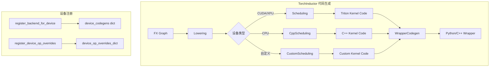
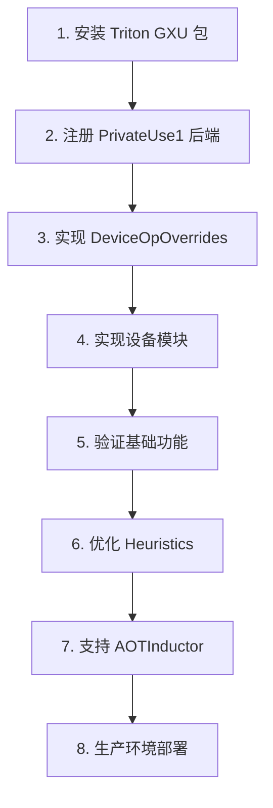

# 第八章：国产设备适配与 Triton 后端扩展

## 📖 适用场景

本章适用于已有芯片供应商提供的 Triton Backend 包的情况：
- ✅ 已有 `triton-xxx.whl` 和运行时库（如 `triton_gxu.deb`）
- ✅ 需要让 TorchInductor 使用现有的 Triton 后端
- ✅ 需要针对硬件特性进行性能优化（如 grid size、num_warps）

## 目录

**主体章节**
1. [概述](#1-概述)
2. [TorchInductor 设备注册架构](#2-torchinductor-设备注册架构)
3. [核心组件详解](#3-核心组件详解)
4. [实战：为 GXU 实现 TorchInductor 后端](#4-实战为-gxu-实现-torchinductor-后端) ⭐ **核心**
5. [Triton Heuristics 自定义](#5-triton-heuristics-自定义)
6. [进阶调试与性能分析](#6-进阶调试与性能分析)
7. [完整示例](#7-完整示例)
8. [常见问题](#8-常见问题)
9. [总结与展望](#9-总结与展望)

**附录**
- [附录 A：完整代码清单](#附录-a完整代码清单)
- [附录 B：参考实现链接](#附录-b参考实现链接)

---

## 1. 概述

### 1.1 为什么需要自定义后端

在学习了 TorchInductor 和 Triton 之后，您可能希望：
- 支持国产 AI 芯片（如昆仑芯、海光 DCU、华为昇腾、摩尔线程等）
- 利用 `torch.compile` 的自动优化能力
- 复用 TorchInductor 的图优化和算子融合能力
- 避免从零实现整个编译栈

### 1.2 技术栈概览

```
用户模型
    ↓
torch.compile
    ↓
TorchDynamo (字节码拦截)
    ↓
FX Graph (计算图)
    ↓
AOTAutograd (自动微分)
    ↓
TorchInductor (代码生成器)
    ↓
    ├─→ Scheduling (内核代码生成调度)
    │       ├─→ TritonScheduling (Triton 内核)
    │       ├─→ CppScheduling (C++/OpenMP 内核)
    │       └─→ 自定义 Scheduling
    │
    └─→ WrapperCodegen (宿主代码生成)
            ├─→ PythonWrapperCodegen (Python wrapper)
            ├─→ CppWrapperGpu (AOTInductor C++ wrapper)
            └─→ 自定义 WrapperCodegen
```

### 1.3 本章目标

- 理解 TorchInductor 的设备注册架构
- 掌握 `DeviceOpOverrides` 的作用和实现
- 学会使用 `register_backend_for_device` 注册自定义后端
- 理解 `PrivateUse1` 机制和自定义设备模块注册
- 针对硬件特性进行性能优化（grid size、num_warps）

---

## 2. TorchInductor 设备注册架构

### 2.1 架构总览

TorchInductor 生成的代码分为两部分：**内核代码**和**包装代码**。



### 2.2 核心注册函数

TorchInductor 提供了两个核心注册 API：

#### 2.2.1 `register_backend_for_device`

```python
# torch/_inductor/codegen/common.py
def register_backend_for_device(
    device: str,                                        # 设备名称，如 "gxu"
    device_scheduling: SchedulingConstructor,           # 调度器构造函数
    device_wrapper_codegen: WrapperConstructor,         # Python wrapper 代码生成器
    device_cpp_wrapper_codegen: Optional[WrapperConstructor] = None,  # C++ wrapper
    device_fx_wrapper_codegen: Optional[WrapperConstructor] = None,   # FX wrapper
    device_custom_pass: Optional[CustomGraphModulePass] = None,       # 自定义 Pass
    device_custom_config: Optional[ConfigModule] = None,              # 自定义配置
) -> None:
```

#### 2.2.2 `register_device_op_overrides`

```python
# torch/_inductor/codegen/common.py
def register_device_op_overrides(
    device: str, 
    device_op_overrides: DeviceOpOverrides
) -> None:
    """注册设备特定的操作覆盖"""
    device_op_overrides_dict[device] = device_op_overrides
```

### 2.3 内置设备注册示例

```python
# torch/_inductor/codegen/common.py - init_backend_registration()

# CPU 后端
register_backend_for_device(
    "cpu",
    lambda scheduling: cpu_backends[config.cpu_backend](scheduling),
    PythonWrapperCodegen,
    CppWrapperCpuArrayRef if config.aot_inductor.allow_stack_allocation else CppWrapperCpu,
    WrapperFxCodegen,
)

# CUDA 后端
register_backend_for_device(
    "cuda",
    lambda scheduling: cuda_backends[config.cuda_backend](scheduling),
    PythonWrapperCodegen,
    CppWrapperGpu,
    WrapperFxCodegen,
)

# XPU 后端 (Intel GPU)
register_backend_for_device(
    "xpu",
    TritonScheduling,
    PythonWrapperCodegen,
    CppWrapperGpu,
    WrapperFxCodegen,
)
```

---

## 3. 核心组件详解

### 3.1 DeviceOpOverrides 类

`DeviceOpOverrides` 定义了设备特定的代码片段，用于生成 wrapper 代码：

```python
# torch/_inductor/codegen/common.py

class DeviceOpOverrides:
    """设备操作覆盖基类，定义设备特定的代码生成方法"""
    
    def import_get_raw_stream_as(self, name: str) -> str:
        """生成获取原始流的导入语句"""
        raise NotImplementedError

    def set_device(self, device_idx: int) -> str:
        """生成设置设备的代码"""
        raise NotImplementedError

    def synchronize(self) -> str:
        """生成同步代码"""
        raise NotImplementedError

    def device_guard(self, device_idx: int) -> str:
        """生成设备上下文管理器代码"""
        raise NotImplementedError

    def cpp_device_guard(self) -> str:
        """C++ 设备 Guard 类名"""
        raise NotImplementedError

    def cpp_aoti_device_guard(self) -> str:
        """AOTInductor 设备 Guard 类名"""
        raise NotImplementedError

    def cpp_stream_guard(self) -> str:
        """C++ Stream Guard 类名"""
        raise NotImplementedError

    def cpp_aoti_stream_guard(self) -> str:
        """AOTInductor Stream Guard 类名"""
        raise NotImplementedError

    def cpp_getStreamFromExternal(self) -> str:
        """获取外部流的 C++ 函数"""
        raise NotImplementedError

    def kernel_header(self) -> str:
        """内核头文件包含"""
        raise NotImplementedError

    def kernel_driver(self) -> str:
        """内核驱动代码（加载/启动内核）"""
        raise NotImplementedError

    def cpp_stream_type(self) -> str:
        """C++ 流类型"""
        raise NotImplementedError

    def aoti_get_stream(self) -> str:
        """AOTInductor 获取流的函数"""
        raise NotImplementedError

    def cpp_kernel_type(self) -> str:
        """C++ 内核类型"""
        raise NotImplementedError

    def cpp_device_ptr(self) -> str:
        """C++ 设备指针类型"""
        raise NotImplementedError
```

### 3.2 现有实现参考

#### 3.2.1 CUDA DeviceOpOverrides

```python
# torch/_inductor/codegen/cuda/device_op_overrides.py

class CUDADeviceOpOverrides(DeviceOpOverrides):
    def import_get_raw_stream_as(self, name: str) -> str:
        return f"from torch._C import _cuda_getCurrentRawStream as {name}"

    def set_device(self, device_idx: int) -> str:
        return f"torch.cuda.set_device({device_idx})"

    def synchronize(self) -> str:
        return "torch.cuda.synchronize()"

    def device_guard(self, device_idx: int) -> str:
        return f"torch.cuda._DeviceGuard({device_idx})"

    def cpp_device_guard(self) -> str:
        return "at::cuda::CUDAGuard"

    def cpp_aoti_device_guard(self) -> str:
        return "AOTICudaGuard"

    def cpp_stream_guard(self) -> str:
        return "at::cuda::CUDAStreamGuard"

    def cpp_aoti_stream_guard(self) -> str:
        return "AOTICudaStreamGuard"

    def cpp_getStreamFromExternal(self) -> str:
        return "at::cuda::getStreamFromExternal"

    def kernel_header(self) -> str:
        return """
        #include <c10/cuda/CUDAGuard.h>
        #include <c10/cuda/CUDAStream.h>
        #include <ATen/cuda/EmptyTensor.h>
        """

    def kernel_driver(self) -> str:
        # 包含 CUDA driver API 调用代码
        # loadKernel, launchKernel 等函数
        return "..."  # 见完整源码

    def cpp_stream_type(self) -> str:
        return "cudaStream_t"

    def aoti_get_stream(self) -> str:
        return "aoti_torch_get_current_cuda_stream"

    def cpp_kernel_type(self) -> str:
        return "CUfunction"

    def cpp_device_ptr(self) -> str:
        return "CUdeviceptr"

# 注册
register_device_op_overrides("cuda", CUDADeviceOpOverrides())
```

#### 3.2.2 XPU DeviceOpOverrides

```python
# torch/_inductor/codegen/xpu/device_op_overrides.py

class XPUDeviceOpOverrides(DeviceOpOverrides):
    def import_get_raw_stream_as(self, name: str) -> str:
        return f"from torch._C import _xpu_getCurrentRawStream as {name}"

    def set_device(self, device_idx: int) -> str:
        return f"torch.xpu.set_device({device_idx})"

    def synchronize(self) -> str:
        return "torch.xpu.synchronize()"

    def device_guard(self, device_idx: int) -> str:
        return f"torch.xpu._DeviceGuard({device_idx})"

    def cpp_device_guard(self) -> str:
        return "at::DeviceGuard"

    def cpp_stream_guard(self) -> str:
        return "at::xpu::XPUStreamGuard"

    def kernel_header(self) -> str:
        return """
        #include <torch/csrc/inductor/aoti_runtime/sycl_runtime_wrappers.h>
        """

    def cpp_stream_type(self) -> str:
        return "sycl::queue*"

    def cpp_kernel_type(self) -> str:
        return "std::unique_ptr<sycl::kernel>"

    def cpp_device_ptr(self) -> str:
        return "void *"

register_device_op_overrides("xpu", XPUDeviceOpOverrides())
```

### 3.3 PrivateUse1 自动发现机制

对于自定义设备，TorchInductor 会尝试自动发现：

```python
# torch/_inductor/codegen/common.py - init_backend_registration()

private_backend = torch._C._get_privateuse1_backend_name()
if (
    private_backend != "privateuseone"
    and get_scheduling_for_device(private_backend) is None
):
    from torch.utils.backend_registration import _get_custom_mod_func

    try:
        # 从自定义设备模块获取必要组件
        device_scheduling = _get_custom_mod_func("Scheduling")
        wrapper_codegen = _get_custom_mod_func("PythonWrapperCodegen")
        cpp_wrapper_codegen = _get_custom_mod_func("CppWrapperCodegen")
        fx_wrapper_codegen = _get_custom_mod_func("WrapperFxCodegen")
        
        if device_scheduling and wrapper_codegen and cpp_wrapper_codegen:
            register_backend_for_device(
                private_backend,
                device_scheduling,
                wrapper_codegen,
                cpp_wrapper_codegen,
                fx_wrapper_codegen,
            )
    except RuntimeError:
        pass
```

---

## 4. 实战：为 GXU 实现 TorchInductor 后端

### 4.1 整体步骤


### 4.2 步骤 1：安装 Triton GXU 包

```bash
# 安装 GXU 运行时库
sudo dpkg -i triton_gxu.deb

# 安装 Triton GXU Python 包
pip install triton-gxu.whl

# 验证安装
python -c "import triton; print(triton.__version__)"
python -c "import triton.backends.gxu; print('GXU backend loaded')"
```

### 4.3 步骤 2：注册 PrivateUse1 后端名称

```python
# gxu/__init__.py
import torch

# 注册 PrivateUse1 后端名称为 "gxu"
torch.utils.rename_privateuse1_backend("gxu")
```

### 4.4 步骤 3：实现 GXU DeviceOpOverrides

创建文件 `gxu/device_op_overrides.py`：

```python
# gxu/device_op_overrides.py
from __future__ import annotations

from typing import Optional

from torch._inductor.codegen.common import (
    DeviceOpOverrides,
    register_device_op_overrides,
    TritonScratchWorkspace,
)


class GXUDeviceOpOverrides(DeviceOpOverrides):
    """GXU 设备的操作覆盖实现"""
    
    def import_get_raw_stream_as(self, name: str) -> str:
        """获取原始流的导入语句"""
        # 需要 GXU 提供类似 CUDA 的 getCurrentRawStream API
        return f"from torch._C import _gxu_getCurrentRawStream as {name}"

    def set_device(self, device_idx: int) -> str:
        """设置设备"""
        return f"torch.gxu.set_device({device_idx})"

    def synchronize(self) -> str:
        """同步设备"""
        return "torch.gxu.synchronize()"

    def device_guard(self, device_idx: int) -> str:
        """设备上下文管理器"""
        return f"torch.gxu._DeviceGuard({device_idx})"

    def cpp_device_guard(self) -> str:
        """C++ 设备 Guard"""
        return "at::gxu::GXUGuard"

    def cpp_aoti_device_guard(self) -> str:
        """AOTInductor Guard"""
        return "AOTIGcuGuard"

    def cpp_stream_guard(self) -> str:
        """C++ Stream Guard"""
        return "at::gxu::GXUStreamGuard"

    def cpp_aoti_stream_guard(self) -> str:
        """AOTInductor Stream Guard"""
        return "AOTIGcuStreamGuard"

    def cpp_getStreamFromExternal(self) -> str:
        """从外部获取流"""
        return "at::gxu::getStreamFromExternal"

    def kernel_header(self) -> str:
        """内核头文件"""
        return """
        #include <c10/gxu/GXUGuard.h>
        #include <c10/gxu/GXUStream.h>
        #include <ATen/gxu/EmptyTensor.h>
        """

    def kernel_driver(self) -> str:
        """内核驱动代码"""
        return """
            #define GXU_DRIVER_CHECK(EXPR)                    \\
            do {                                               \\
                gxuError_t code = EXPR;                        \\
                if (code != GXU_SUCCESS) {                     \\
                    const char *msg = gxuGetErrorString(code); \\
                    throw std::runtime_error(                  \\
                        std::string("GXU driver error: ") +    \\
                        std::string(msg));                     \\
                }                                              \\
            } while (0);

            static inline gxuFunction loadKernel(
                    std::string filePath,
                    const std::string &funcName,
                    uint32_t sharedMemBytes,
                    const std::optional<std::string> &cubinDir = std::nullopt) {
                if (cubinDir) {
                    std::filesystem::path p1{*cubinDir};
                    std::filesystem::path p2{filePath};
                    filePath = (p1 / p2.filename()).string();
                }

                gxuModule mod;
                gxuFunction func;
                GXU_DRIVER_CHECK(gxuModuleLoad(&mod, filePath.c_str()));
                GXU_DRIVER_CHECK(gxuModuleGetFunction(&func, mod, funcName.c_str()));
                if (sharedMemBytes > 0) {
                    GXU_DRIVER_CHECK(gxuFuncSetAttribute(
                        func,
                        GXU_FUNC_ATTRIBUTE_MAX_DYNAMIC_SHARED_SIZE_BYTES,
                        sharedMemBytes
                    ))
                }
                return func;
            }

            static inline void launchKernel(
                    gxuFunction func,
                    uint32_t gridX,
                    uint32_t gridY,
                    uint32_t gridZ,
                    uint32_t numWarps,
                    uint32_t sharedMemBytes,
                    void* args[],
                    gxuStream_t stream) {
                // GXU 特性：warp size 可能不同于 32
                const uint32_t GXU_WARP_SIZE = 32;  // 根据实际硬件调整
                GXU_DRIVER_CHECK(gxuLaunchKernel(
                    func, gridX, gridY, gridZ, 
                    GXU_WARP_SIZE * numWarps, 1, 1, 
                    sharedMemBytes, stream, args, nullptr
                ));
            }
        """

    def cpp_stream_type(self) -> str:
        """流类型"""
        return "gxuStream_t"

    def aoti_get_stream(self) -> str:
        """AOTInductor 获取流函数"""
        return "aoti_torch_get_current_gxu_stream"

    def cpp_kernel_type(self) -> str:
        """内核类型"""
        return "gxuFunction"

    def cpp_device_ptr(self) -> str:
        """设备指针类型"""
        return "gxuDevicePtr"

    def cpp_scratch(
        self, idx: int, workspace: TritonScratchWorkspace, prefix: Optional[str] = None
    ) -> Optional[tuple[list[str], str]]:
        """临时空间分配"""
        prefix = f"{prefix}_" if prefix else ""
        var_name = f"{prefix}scratch_{idx}"
        if workspace.size > 0:
            size_array = f"int64_t {var_name}_size[] = {{{workspace.size}}};"
            stride_array = f"int64_t {var_name}_stride[] = {{1}};"
            device_type = "cached_torch_device_type_gxu"
            device_idx = "device_idx_"

            return (
                [
                    f"{size_array}",
                    f"{stride_array}",
                    f"AtenTensorHandle {var_name}_handle;",
                    (
                        f"AOTI_TORCH_ERROR_CODE_CHECK(aoti_torch_empty_strided(1, {var_name}_size, {var_name}_stride, "
                        f"{workspace.generate_dtype_str()}, {device_type}, {device_idx}, &{var_name}_handle));"
                    ),
                    f"RAIIAtenTensorHandle {var_name}_tensor({var_name}_handle);",
                    f"gxuDevicePtr {var_name} = reinterpret_cast<gxuDevicePtr>({var_name}_tensor.data_ptr());",
                ],
                var_name,
            )
        else:
            return [f"gxuDevicePtr {var_name} = 0;"], var_name


# 注册 GXU DeviceOpOverrides
register_device_op_overrides("gxu", GXUDeviceOpOverrides())
```

### 4.5 步骤 4：实现 GXU 设备模块

创建文件 `gxu/module.py`：

```python
# gxu/module.py
import torch
import ctypes
from typing import Optional

# 加载 GXU 运行时库
try:
    _libgxu = ctypes.CDLL("libgxu_runtime.so")
except OSError:
    _libgxu = None


class GXUModule:
    """GXU 设备模块，提供设备管理功能"""
    
    @staticmethod
    def is_available() -> bool:
        """检查 GXU 是否可用"""
        if _libgxu is None:
            return False
        try:
            count = GXUModule.device_count()
            return count > 0
        except Exception:
            return False
    
    @staticmethod
    def is_initialized() -> bool:
        """检查是否已初始化"""
        return _libgxu is not None
    
    @staticmethod
    def device_count() -> int:
        """获取 GXU 设备数量"""
        if _libgxu is None:
            return 0
        count = ctypes.c_int()
        ret = _libgxu.gxuGetDeviceCount(ctypes.byref(count))
        if ret != 0:
            return 0
        return count.value
    
    @staticmethod
    def current_device() -> int:
        """获取当前设备索引"""
        device = ctypes.c_int()
        _libgxu.gxuGetDevice(ctypes.byref(device))
        return device.value
    
    @staticmethod
    def set_device(device: int) -> None:
        """设置当前设备"""
        ret = _libgxu.gxuSetDevice(device)
        if ret != 0:
            raise RuntimeError(f"Failed to set GXU device {device}")
    
    @staticmethod
    def synchronize(device: Optional[int] = None) -> None:
        """同步设备"""
        if device is not None:
            old_device = GXUModule.current_device()
            GXUModule.set_device(device)
            _libgxu.gxuDeviceSynchronize()
            GXUModule.set_device(old_device)
        else:
            _libgxu.gxuDeviceSynchronize()
    
    @staticmethod
    def _is_in_bad_fork() -> bool:
        """检查是否在 fork 后的坏状态"""
        return False
    
    # ========== TorchInductor 需要的组件 ==========
    
    @staticmethod
    def Scheduling(scheduler):
        """返回调度器类"""
        from torch._inductor.codegen.triton import TritonScheduling
        return TritonScheduling(scheduler)
    
    @staticmethod
    def PythonWrapperCodegen():
        """返回 Python Wrapper 代码生成器"""
        from torch._inductor.codegen.wrapper import PythonWrapperCodegen
        return PythonWrapperCodegen
    
    @staticmethod
    def CppWrapperCodegen():
        """返回 C++ Wrapper 代码生成器"""
        from torch._inductor.codegen.cpp_wrapper_gpu import CppWrapperGpu
        return CppWrapperGpu
    
    @staticmethod
    def WrapperFxCodegen():
        """返回 FX Wrapper 代码生成器"""
        from torch._inductor.codegen.wrapper_fxir import WrapperFxCodegen
        return WrapperFxCodegen


class _DeviceGuard:
    """GXU 设备上下文管理器"""
    
    def __init__(self, device_idx: int):
        self.device_idx = device_idx
        self.prev_device = None
    
    def __enter__(self):
        self.prev_device = GXUModule.current_device()
        GXUModule.set_device(self.device_idx)
        return self
    
    def __exit__(self, exc_type, exc_val, exc_tb):
        if self.prev_device is not None:
            GXUModule.set_device(self.prev_device)
        return False


# 注册设备模块
torch._register_device_module("gxu", GXUModule)

# 添加快捷访问
torch.gxu = GXUModule
torch.gxu._DeviceGuard = _DeviceGuard
```

### 4.6 步骤 5：实现自定义 Scheduling（可选）

如果需要针对 GXU 优化 Triton 内核配置，可以创建自定义 Scheduling：

```python
# gxu/scheduling.py
from torch._inductor.codegen.triton import TritonScheduling
from torch._inductor.codegen.common import BackendFeature
from torch.utils._ordered_set import OrderedSet


class GXUTritonScheduling(TritonScheduling):
    """GXU 专用的 Triton 调度器"""
    
    backend_features = OrderedSet([
        BackendFeature.FOREACH,
        BackendFeature.BUCKETIZE,
        BackendFeature.INPLACE_BUFFERS,
        BackendFeature.MASKED_SCATTER_WITH_INDEX,
        BackendFeature.SCAN,
        BackendFeature.SORT,
        BackendFeature.TRITON_TEMPLATES,
        BackendFeature.TUPLE_REDUCTION,
    ])
    
    def __init__(self, scheduler):
        super().__init__(scheduler)
        # GXU 特定的配置
        self.gxu_max_grid_size = 48
        self.gxu_optimal_num_warps = 1
    
    def get_backend_features(self, device):
        """返回后端支持的特性"""
        return self.backend_features
```

### 4.7 步骤 6：完整初始化脚本

创建 `gxu/__init__.py`：

```python
# gxu/__init__.py
"""
GXU TorchInductor 后端
用法：
    import gxu  # 自动完成所有注册
    
    model = MyModel().to("gxu")
    compiled = torch.compile(model)
"""
import torch

# 1. 注册后端名称
torch.utils.rename_privateuse1_backend("gxu")

# 2. 导入并注册设备模块
from . import module  # 注册 torch.gxu

# 3. 导入并注册 DeviceOpOverrides
from . import device_op_overrides

# 4. 可选：导入自定义 Scheduling
# from . import scheduling

# 5. 导出公共 API
__all__ = ["is_available", "device_count", "set_device", "synchronize"]

is_available = module.GXUModule.is_available
device_count = module.GXUModule.device_count
set_device = module.GXUModule.set_device
synchronize = module.GXUModule.synchronize

print(f"GXU backend initialized. {device_count()} device(s) available.")
```

---

## 5. Triton Heuristics 自定义

### 5.1 理解 Triton Heuristics

TorchInductor 使用 heuristics 决定 Triton kernel 的启动配置：

```python
# torch/_inductor/runtime/triton_heuristics.py

def triton_config(
    size_hints,
    x,
    y=None,
    z=None,
    num_stages=1,
    num_elements_per_warp=256,
    min_elem_per_thread=0,
    num_warps=None,
    matrix_instr=None,
    waves_per_eu=None,
) -> Config:
    """构造 pointwise Triton 配置"""
    # 默认 grid 和 block 大小限制
    maxGridSize = [2147483647, 65535, 65535]
    # ...
```

### 5.2 设备属性感知

heuristics 通过 `DeviceProperties` 获取设备信息：

```python
# torch/_inductor/runtime/hints.py

class DeviceProperties(typing.NamedTuple):
    type: str
    index: int
    multi_processor_count: int
    cc: int  # compute capability
    major: int | None = None
    regs_per_multiprocessor: int | None = None
    max_threads_per_multi_processor: int | None = None
    max_threads_per_block: int | None = None
    warp_size: int | None = None

    @classmethod
    @functools.cache
    def create(cls, device) -> DeviceProperties:
        """从设备获取属性"""
        device_interface = get_interface_for_device(device)
        props = device_interface.get_device_properties(device)
        
        # 特殊处理不同设备类型
        if device_type == "xpu":
            multi_processor_count = props.gpu_subslice_count
        elif device_type == "mtia":
            multi_processor_count = 64
        # ...
```

### 5.3 为 GXU 自定义 Heuristics

```python
# gxu/heuristics.py
import functools
from torch._inductor.runtime.triton_heuristics import triton_config
from torch._inductor.runtime.hints import DeviceProperties


class GXUHeuristics:
    """GXU 专用的启发式配置"""
    
    # GXU 硬件限制
    MAX_GRID_SIZE = 48  # Grid 最好 < 48 或 48 的倍数
    OPTIMAL_NUM_WARPS = 1  # Warp 数最好为 1
    WARP_SIZE = 32  # 可能需要根据实际硬件调整
    
    @staticmethod
    def adjust_grid(grid):
        """调整 grid 大小以适应 GXU"""
        if isinstance(grid, (list, tuple)):
            adjusted = []
            for dim in grid:
                if dim <= GXUHeuristics.MAX_GRID_SIZE:
                    adjusted.append(dim)
                elif dim % GXUHeuristics.MAX_GRID_SIZE == 0:
                    adjusted.append(dim)
                else:
                    # 向上取整到 48 的倍数
                    new_dim = ((dim + GXUHeuristics.MAX_GRID_SIZE - 1) 
                               // GXUHeuristics.MAX_GRID_SIZE 
                               * GXUHeuristics.MAX_GRID_SIZE)
                    adjusted.append(new_dim)
            return tuple(adjusted)
        else:
            if grid <= GXUHeuristics.MAX_GRID_SIZE:
                return grid
            elif grid % GXUHeuristics.MAX_GRID_SIZE == 0:
                return grid
            else:
                return ((grid + GXUHeuristics.MAX_GRID_SIZE - 1) 
                        // GXUHeuristics.MAX_GRID_SIZE 
                        * GXUHeuristics.MAX_GRID_SIZE)
    
    @staticmethod
    def get_config(size_hints, **kwargs):
        """获取 GXU 优化的配置"""
        # 强制使用最优 num_warps
        kwargs['num_warps'] = GXUHeuristics.OPTIMAL_NUM_WARPS
        return triton_config(size_hints, **kwargs)


# Monkey patch 示例（如果需要）
def patch_triton_heuristics():
    """修改 TorchInductor 的默认 heuristics"""
    import torch._inductor.runtime.triton_heuristics as th
    
    _original_triton_config = th.triton_config
    
    @functools.wraps(_original_triton_config)
    def gxu_triton_config(*args, **kwargs):
        # 强制 num_warps=1 for GXU
        import torch
        if torch.gxu.is_available():
            kwargs['num_warps'] = GXUHeuristics.OPTIMAL_NUM_WARPS
        return _original_triton_config(*args, **kwargs)
    
    th.triton_config = gxu_triton_config
```

### 5.4 自定义 DeviceProperties

```python
# gxu/device_properties.py
from torch._inductor.runtime.hints import DeviceProperties


def create_gxu_device_properties(device) -> DeviceProperties:
    """创建 GXU 设备属性"""
    import torch
    
    # 从 GXU runtime 获取属性
    props = get_gxu_device_properties(device.index)
    
    return DeviceProperties(
        type="gxu",
        index=device.index,
        multi_processor_count=props.multi_processor_count,
        cc=props.compute_capability,
        major=props.major,
        regs_per_multiprocessor=props.regs_per_multiprocessor,
        max_threads_per_multi_processor=props.max_threads_per_sm,
        max_threads_per_block=props.max_threads_per_block,
        warp_size=32,  # 或 GXU 实际的 warp size
    )
```

---

## 6. 进阶调试与性能分析

### 6.1 查看生成的代码

```python
import torch
import os

# 启用代码输出
os.environ["TORCH_LOGS"] = "+output_code"
torch._inductor.config.debug = True
torch._inductor.config.trace.enabled = True
torch._inductor.config.trace.output_dir = "/tmp/inductor_gxu"

# 编译模型
model = MyModel().to("gxu")
compiled = torch.compile(model, backend="inductor")

# 运行
x = torch.randn(32, 128, device="gxu")
output = compiled(x)

print(f"生成的代码保存在: /tmp/inductor_gxu")
```

### 6.2 调试 DeviceOpOverrides

```python
# 验证 DeviceOpOverrides 注册
from torch._inductor.codegen.common import get_device_op_overrides

try:
    overrides = get_device_op_overrides("gxu")
    print("DeviceOpOverrides 已注册")
    print(f"  set_device: {overrides.set_device(0)}")
    print(f"  synchronize: {overrides.synchronize()}")
    print(f"  device_guard: {overrides.device_guard(0)}")
except KeyError:
    print("错误: GXU DeviceOpOverrides 未注册")
```

### 6.3 调试 Backend 注册

```python
from torch._inductor.codegen.common import (
    get_scheduling_for_device,
    get_wrapper_codegen_for_device,
)

# 检查调度器
scheduling = get_scheduling_for_device("gxu")
print(f"Scheduling: {scheduling}")

# 检查 wrapper codegen
wrapper = get_wrapper_codegen_for_device("gxu")
print(f"Wrapper Codegen: {wrapper}")

cpp_wrapper = get_wrapper_codegen_for_device("gxu", cpp_wrapper=True)
print(f"C++ Wrapper Codegen: {cpp_wrapper}")
```

### 6.4 常见问题诊断

#### 问题 1：设备未找到

```python
# 检查设备注册
import torch
print(f"PrivateUse1 后端名: {torch._C._get_privateuse1_backend_name()}")
print(f"GXU 模块是否存在: {hasattr(torch, 'gxu')}")
print(f"设备数量: {torch.gxu.device_count()}")
```

#### 问题 2：Triton 编译失败

```python
# 检查 Triton 后端
import triton
print(f"Triton 版本: {triton.__version__}")

# 检查 GXU 后端是否加载
try:
    import triton.backends.gxu
    print("Triton GXU 后端已加载")
except ImportError:
    print("错误: Triton GXU 后端未安装")
```

---

## 7. 完整示例

### 7.1 完整目录结构

```
gxu/
├── __init__.py           # 初始化和导出
├── module.py             # 设备模块
├── device_op_overrides.py # DeviceOpOverrides 实现
├── scheduling.py         # 自定义 Scheduling (可选)
├── heuristics.py         # 自定义 heuristics (可选)
└── device_properties.py  # 设备属性 (可选)
```

### 7.2 使用示例

```python
import torch
import torch.nn as nn

# 导入 GXU 后端（自动完成注册）
import gxu

# 定义模型
class SimpleModel(nn.Module):
    def __init__(self):
        super().__init__()
        self.linear1 = nn.Linear(512, 1024)
        self.linear2 = nn.Linear(1024, 512)
        self.linear3 = nn.Linear(512, 10)
    
    def forward(self, x):
        x = torch.relu(self.linear1(x))
        x = torch.relu(self.linear2(x))
        x = self.linear3(x)
        return x

# 创建模型并移到 GXU
model = SimpleModel().to("gxu")

# 编译模型
compiled_model = torch.compile(model, backend="inductor")

# 运行推理
x = torch.randn(64, 512, device="gxu")
with torch.no_grad():
    output = compiled_model(x)

print(f"输出形状: {output.shape}")
print(f"输出设备: {output.device}")

# 性能对比
import time

def benchmark(model, x, num_runs=100):
    # 预热
    for _ in range(10):
        _ = model(x)
    torch.gxu.synchronize()
    
    # 计时
    start = time.time()
    for _ in range(num_runs):
        _ = model(x)
    torch.gxu.synchronize()
    
    return (time.time() - start) / num_runs * 1000  # ms

eager_time = benchmark(model, x)
compiled_time = benchmark(compiled_model, x)

print(f"\n性能对比:")
print(f"  Eager 模式:    {eager_time:.2f} ms")
print(f"  Compiled 模式: {compiled_time:.2f} ms")
print(f"  加速比:        {eager_time / compiled_time:.2f}x")
```

---

## 8. 常见问题

### Q1: DeviceOpOverrides 和 register_backend_for_device 的区别？

**DeviceOpOverrides**：定义设备特定的**代码片段**，用于 wrapper 代码生成
- `set_device()` 返回的是代码字符串，如 `"torch.cuda.set_device(0)"`
- 用于生成 Python/C++ wrapper 中的设备管理代码

**register_backend_for_device**：注册**代码生成器类**
- `Scheduling` 决定如何生成内核代码
- `WrapperCodegen` 决定如何生成 wrapper 代码框架

### Q2: 如何处理不同的 warp size？

```python
# 在 DeviceOpOverrides.kernel_driver() 中调整
def kernel_driver(self) -> str:
    return f"""
        static inline void launchKernel(...) {{
            // GXU warp size 可能不是 32
            const uint32_t GXU_WARP_SIZE = {self.warp_size};
            gxuLaunchKernel(
                func, gridX, gridY, gridZ,
                GXU_WARP_SIZE * numWarps, 1, 1,
                ...
            );
        }}
    """
```

### Q3: 如何使用自定义的 Triton 后端？

Triton 会通过环境变量或 `triton.runtime.driver.set_active()` 选择后端：

```python
import os
os.environ["TRITON_BACKEND"] = "gxu"

# 或
import triton
triton.runtime.driver.set_active("gxu")
```

### Q4: AOTInductor 支持需要什么额外工作？

1. 实现 C++ 头文件（`c10/gxu/GXUGuard.h` 等）
2. 实现 AOTInductor runtime wrapper（`AOTIGcuGuard` 等）
3. 在 `cpp_aoti_*` 方法中返回正确的类名

---

## 9. 总结与展望

### 9.1 实现总结

通过本章学习，您已经掌握：

| 组件 | 作用 | 文件位置 |
|------|------|----------|
| `DeviceOpOverrides` | 设备特定代码片段 | `codegen/common.py` |
| `register_device_op_overrides` | 注册 DeviceOpOverrides | `codegen/common.py` |
| `register_backend_for_device` | 注册后端代码生成器 | `codegen/common.py` |
| `PrivateUse1` 机制 | 自定义设备支持 | `torch.utils.rename_privateuse1_backend` |
| `_get_custom_mod_func` | 自动发现设备模块 | `torch.utils.backend_registration` |

### 9.2 技术路线图



### 9.3 参考资源

- [Intel IPEX Inductor 实现](https://github.com/intel/intel-extension-for-pytorch/blob/main/intel_extension_for_pytorch/_inductor/__init__.py)
- [PyTorch Device Extension Guide](https://pytorch.org/tutorials/advanced/extend_device.html)
- [TorchInductor 源码](https://github.com/pytorch/pytorch/tree/main/torch/_inductor)

---

## 附录 A：完整代码清单

完整代码见：

```
gxu/
├── __init__.py
├── module.py
├── device_op_overrides.py
├── scheduling.py (可选)
├── heuristics.py (可选)
└── device_properties.py (可选)
```

## 附录 B：参考实现链接

| 项目 | 链接 | 说明 |
|------|------|------|
| Intel IPEX | [GitHub](https://github.com/intel/intel-extension-for-pytorch) | XPU 后端参考 |
| AMD ROCm | [GitHub](https://github.com/ROCmSoftwarePlatform/triton) | Triton AMD 后端 |
| PyTorch XPU | `torch/_inductor/codegen/xpu/` | XPU DeviceOpOverrides |
| PyTorch CUDA | `torch/_inductor/codegen/cuda/` | CUDA DeviceOpOverrides |

---

