# GraphLowering 详细解析：FX Graph 到 Inductor IR 的转换

> 本文档深入分析 PyTorch Inductor 中 GraphLowering 类的工作原理，展示它如何将 FX Graph 转换为 Inductor IR。

## 动画演示




---

## 一、核心类继承关系

### 1.1 GraphLowering 的继承结构

```python
# torch/_inductor/graph.py

class GraphLowering(torch.fx.Interpreter):
    """
    图降低器（Graph Lowering）
    
    继承自: torch.fx.Interpreter
    - 利用 Interpreter 的节点遍历机制
    - 重写节点处理方法，将 FX 节点转换为 IR
    
    核心职责:
    1. 遍历 FX Graph 的每个节点
    2. 调用对应的 lowering 函数
    3. 管理缓冲区和依赖关系
    4. 协调后续的代码生成
    """
    
    def __init__(
        self,
        gm: torch.fx.GraphModule,
        example_inputs: List[torch.Tensor] = None,
        shape_env = None,
        num_static_inputs: int = 0,
        graph_id: int = None,
        cpp_wrapper: bool = False,
        aot_mode: bool = False,
        is_inference: bool = False,
        user_visible_outputs = None,
        layout_opt: bool = None,
        extern_node_serializer = None,
    ):
        super().__init__(gm)  # 调用 Interpreter.__init__
        
        # 保存原始 GraphModule
        self.gm = gm
        self.graph = gm.graph
        self.example_inputs = example_inputs
        
        # === 缓冲区管理 ===
        self.buffers = []              # 所有缓冲区列表
        self.constants = {}            # 常量字典
        self.graph_inputs = {}         # 图输入映射
        self.graph_outputs = None      # 图输出
        
        # === 环境映射 ===
        # env: 从 FX Node 到 IR Node 的映射
        # 这是转换的核心数据结构！
        self.env = {}  # Dict[torch.fx.Node, IRNode]
        
        # === 调度器（稍后创建）===
        self.scheduler = None
        
        # === 其他配置 ===
        self.shape_env = shape_env
        self.num_static_inputs = num_static_inputs
        self.is_inference = is_inference
        # ...
```

### 1.2 torch.fx.Interpreter 的作用

```python
# torch/fx/interpreter.py

class Interpreter:
    """
    FX Graph 的解释器基类
    
    提供遍历 FX Graph 的标准方法
    子类可以重写各个节点类型的处理方法
    """
    
    def __init__(self, module: torch.nn.Module):
        self.module = module
        self.env = {}  # 节点执行结果缓存
    
    def run(self, *args) -> Any:
        """
        执行 FX Graph
        
        遍历所有节点，依次执行
        """
        # 将输入参数映射到 placeholder 节点
        args_iter = iter(args)
        for node in self.module.graph.nodes:
            if node.op == 'placeholder':
                self.env[node] = next(args_iter)
        
        # 按拓扑序遍历所有节点
        for node in self.module.graph.nodes:
            if node.op != 'placeholder':
                self.env[node] = self.run_node(node)
        
        # 返回输出节点的值
        return self.env[output_node]
    
    def run_node(self, n: Node) -> Any:
        """
        执行单个节点（子类可重写）
        
        根据 node.op 分发到不同的处理函数
        """
        args, kwargs = self.fetch_args_kwargs_from_env(n)
        
        if n.op == 'call_function':
            return self.call_function(n.target, args, kwargs)
        elif n.op == 'call_method':
            return self.call_method(n.target, args, kwargs)
        elif n.op == 'call_module':
            return self.call_module(n.target, args, kwargs)
        elif n.op == 'get_attr':
            return self.get_attr(n.target)
        # ...
    
    def fetch_args_kwargs_from_env(self, n: Node):
        """
        从 env 中获取节点的输入参数
        
        这是关键：将 FX Node 转换为实际值
        """
        args = tree_map(lambda arg: self.env[arg] if isinstance(arg, Node) else arg, n.args)
        kwargs = tree_map(lambda arg: self.env[arg] if isinstance(arg, Node) else arg, n.kwargs)
        return args, kwargs
```

**关键理解**：
- `Interpreter` 提供遍历框架
- `GraphLowering` 重写处理方法，将执行改为生成 IR
- `self.env` 从存储执行结果改为存储 IR 节点

---

## 二、GraphLowering.run() 的详细流程

### 2.1 run 方法的实现

```python
# torch/_inductor/graph.py

class GraphLowering(torch.fx.Interpreter):
    def run(self, *args):
        """
        执行 Lowering 过程
        
        不同于父类的执行，这里是生成 IR
        
        流程:
        1. 调用父类 run，触发节点遍历
        2. 每个节点调用 run_node
        3. run_node 根据 op 类型分发
        4. 各个处理函数生成 IR 并存入 env
        """
        # 调用 Interpreter.run()
        # 这会触发对所有节点的 run_node 调用
        return super().run(*args)
    
    def run_node(self, n: Node):
        """
        重写节点执行方法
        
        不执行计算，而是生成 IR
        """
        # 从 env 获取输入（已经是 IR 节点）
        args, kwargs = self.fetch_args_kwargs_from_env(n)
        
        # 根据节点类型分发
        if n.op == 'placeholder':
            # 输入节点
            result = self.placeholder(n.target, args, kwargs)
        
        elif n.op == 'call_function':
            # 函数调用 - 这是最重要的！
            result = self.call_function(n.target, args, kwargs)
        
        elif n.op == 'call_method':
            # 方法调用
            result = self.call_method(n.target, args, kwargs)
        
        elif n.op == 'call_module':
            # 模块调用
            result = self.call_module(n.target, args, kwargs)
        
        elif n.op == 'get_attr':
            # 获取属性
            result = self.get_attr(n.target)
        
        elif n.op == 'output':
            # 输出节点
            result = self.output(n.target, args, kwargs)
        
        else:
            raise NotImplementedError(f"Unknown op: {n.op}")
        
        # 将 IR 存入 env
        self.env[n] = result
        
        return result
```

### 2.2 placeholder 处理（输入节点）

```python
def placeholder(self, target: str, args, kwargs):
    """
    处理输入占位符
    
    FX 节点: %x : placeholder[target=x]
    转换为: InputBuffer('x', shape=...)
    """
    # 从 example_inputs 获取输入信息
    example_value = self.example_inputs[len(self.graph_inputs)]
    
    # 创建 InputBuffer IR 节点
    from torch._inductor.ir import InputBuffer
    
    input_buffer = InputBuffer(
        name=target,
        layout=FixedLayout(
            device=example_value.device,
            dtype=example_value.dtype,
            size=list(example_value.shape),
            stride=list(example_value.stride())
        )
    )
    
    # 记录图输入
    self.graph_inputs[target] = input_buffer
    
    # 包装为 TensorBox（统一接口）
    return TensorBox.create(input_buffer)
```

**状态变化示例**：

```python
# FX Graph 节点
%l_x_ : placeholder[target=l_x_]

# ↓ 转换后

# env 中存储:
env[%l_x_] = TensorBox(
    data=InputBuffer(
        name='l_x_',
        layout=FixedLayout(
            device='cuda',
            dtype=torch.float32,
            size=[2, 128],
            stride=[128, 1]
        )
    )
)
```

---

## 三、call_function 的核心转换逻辑

这是最重要的部分！

### 3.1 call_function 实现

```python
def call_function(self, target, args, kwargs):
    """
    处理函数调用节点
    
    FX 节点: %add = call_function[target=torch.ops.aten.add.Tensor](args=(%x, %y))
    转换为: Pointwise IR
    
    参数:
        target: 目标函数（如 torch.ops.aten.add.Tensor）
        args: 参数列表（已经是 IR 节点）
        kwargs: 关键字参数
    
    返回:
        IR 节点（如 TensorBox）
    """
    # ========== 步骤 1: 规范化输入 ==========
    # args 中的 TensorBox 需要解包
    args = [self.realize_input(arg) if isinstance(arg, TensorBox) else arg 
            for arg in args]
    
    # ========== 步骤 2: 查找 lowering 函数 ==========
    from torch._inductor import lowering
    
    # lowerings 是全局字典：{ATen 算子 -> lowering 函数}
    lowering_fn = lowering.lowerings.get(target)
    
    if lowering_fn is None:
        # 如果没有注册的 lowering，尝试回退
        lowering_fn = lowering.fallbacks.get(target)
        
        if lowering_fn is None:
            raise NotImplementedError(
                f"No lowering found for {target}\n"
                f"Available lowerings: {len(lowering.lowerings)}"
            )
    
    # ========== 步骤 3: 调用 lowering 函数 ==========
    # lowering 函数会返回 IR 节点
    result = lowering_fn(*args, **kwargs)
    
    # ========== 步骤 4: 包装结果 ==========
    # 确保结果是 TensorBox
    if not isinstance(result, TensorBox):
        result = TensorBox.create(result)
    
    return result
```

### 3.2 lowerings 字典的构建

```python
# torch/_inductor/lowering.py

# ========== 全局注册表 ==========
lowerings: Dict[OpOverload, Callable] = {}
fallbacks: Dict[OpOverload, Callable] = {}

# ========== 装饰器：注册 lowering 函数 ==========
def register_lowering(aten_op, broadcast=None, type_promotion_kind=None):
    """
    装饰器：注册 ATen 算子的 lowering 函数
    
    用法:
        @register_lowering(torch.ops.aten.add)
        def add_tensor(x, y):
            # 转换逻辑
            return IR_node
    """
    def decorator(fn):
        # 包装函数（处理广播、类型提升等）
        wrapped_fn = make_lowering_wrapper(fn, broadcast, type_promotion_kind)
        
        # 注册到字典
        lowerings[aten_op] = wrapped_fn
        
        return wrapped_fn
    
    return decorator

# ========== 示例：add 的 lowering ==========
@register_lowering(torch.ops.aten.add.Tensor)
def add_tensor(x: TensorBox, y: TensorBox):
    """
    将 aten.add 转换为 Pointwise IR
    
    参数:
        x, y: TensorBox（包装的 IR 节点）
    
    返回:
        TensorBox（包装的 Pointwise IR）
    """
    # 定义计算逻辑（延迟执行）
    def inner_fn(idx):
        """
        内部函数：定义逐点计算
        
        idx: 符号索引（如 (i, j) 对于 2D）
        返回: 表达式树节点
        """
        # 从输入加载值（符号化，不实际加载）
        x_val = ops.load(x, idx)
        y_val = ops.load(y, idx)
        
        # 构建加法表达式（符号化）
        return ops.add(x_val, y_val)
    
    # 创建 Pointwise IR 节点
    return Pointwise.create(
        device=x.get_device(),
        dtype=x.get_dtype(),
        inner_fn=inner_fn,
        ranges=list(x.get_size()),
    )
```

### 3.3 更多算子的 lowering 示例

```python
# ========== ReLU ==========
@register_lowering(torch.ops.aten.relu)
def relu(x: TensorBox):
    """
    ReLU: max(x, 0)
    """
    def inner_fn(idx):
        x_val = ops.load(x, idx)
        zero = ops.constant(0.0, x.get_dtype())
        return ops.maximum(x_val, zero)
    
    return Pointwise.create(
        device=x.get_device(),
        dtype=x.get_dtype(),
        inner_fn=inner_fn,
        ranges=list(x.get_size()),
    )

# ========== Sigmoid ==========
@register_lowering(torch.ops.aten.sigmoid)
def sigmoid(x: TensorBox):
    """
    Sigmoid: 1 / (1 + exp(-x))
    """
    def inner_fn(idx):
        x_val = ops.load(x, idx)
        neg_x = ops.neg(x_val)
        exp_neg_x = ops.exp(neg_x)
        one = ops.constant(1.0, x.get_dtype())
        denom = ops.add(one, exp_neg_x)
        return ops.truediv(one, denom)
    
    return Pointwise.create(
        device=x.get_device(),
        dtype=x.get_dtype(),
        inner_fn=inner_fn,
        ranges=list(x.get_size()),
    )

# ========== Sum (Reduction) ==========
@register_lowering(torch.ops.aten.sum.dim_IntList)
def sum_dims(x: TensorBox, dims: List[int], keepdim: bool = False):
    """
    Sum: 沿指定维度求和
    
    这是 Reduction 操作，不是 Pointwise
    """
    # 计算输出形状
    output_size = compute_output_size(x.get_size(), dims, keepdim)
    
    # 定义 reduction 逻辑
    def inner_fn(idx, reduction_idx):
        """
        idx: 输出索引
        reduction_idx: 归约维度索引
        """
        # 构造完整索引
        full_idx = expand_index(idx, reduction_idx, dims)
        
        # 加载值
        return ops.load(x, full_idx)
    
    return Reduction.create(
        device=x.get_device(),
        dtype=x.get_dtype(),
        inner_fn=inner_fn,
        ranges=output_size,
        reduction_ranges=[x.get_size()[d] for d in dims],
        reduction_type='sum'
    )
```

---

## 四、IR 节点的核心类型

### 4.1 TensorBox（包装器）

```python
# torch/_inductor/ir.py

class TensorBox:
    """
    张量包装器
    
    提供统一的张量接口，内部包装各种 IR 节点
    这是 Inductor 中最常用的类型
    """
    
    def __init__(self, data: IRNode):
        self.data = data  # 实际的 IR 节点
    
    def realize(self):
        """
        实体化：将延迟计算转换为实际缓冲区
        
        何时调用:
        1. 张量被多次使用（避免重复计算）
        2. 张量作为图输出
        3. 无法继续融合时
        """
        if isinstance(self.data, ComputedBuffer):
            return  # 已经实体化
        
        # 注册缓冲区
        name = V.graph.register_buffer(self.data)
        
        # 创建 ComputedBuffer
        self.data = ComputedBuffer(
            name=name,
            layout=self.data.get_layout(),
            data=self.data
        )
    
    def get_device(self):
        return self.data.get_device()
    
    def get_dtype(self):
        return self.data.get_dtype()
    
    def get_size(self):
        return self.data.get_size()
    
    @staticmethod
    def create(data):
        """创建 TensorBox，如果已经是则直接返回"""
        if isinstance(data, TensorBox):
            return data
        return TensorBox(data)
```

### 4.2 Pointwise（逐点操作）

```python
class Pointwise(IRNode):
    """
    逐点操作 IR 节点
    
    特点：每个输出元素独立计算
    """
    
    def __init__(
        self,
        device: torch.device,
        dtype: torch.dtype,
        inner_fn: Callable,
        ranges: List[Expr],
    ):
        self.device = device
        self.dtype = dtype
        self.inner_fn = inner_fn  # 计算逻辑（延迟）
        self.ranges = ranges      # 输出形状
    
    @staticmethod
    def create(device, dtype, inner_fn, ranges):
        """工厂方法"""
        return TensorBox.create(
            Pointwise(device, dtype, inner_fn, ranges)
        )
    
    def get_size(self):
        return self.ranges
    
    def get_device(self):
        return self.device
    
    def get_dtype(self):
        return self.dtype
```

### 4.3 Reduction（归约操作）

```python
class Reduction(IRNode):
    """
    归约操作 IR 节点
    
    特点：多个输入归约为一个输出
    """
    
    def __init__(
        self,
        device: torch.device,
        dtype: torch.dtype,
        inner_fn: Callable,
        ranges: List[Expr],           # 输出形状
        reduction_ranges: List[Expr], # 归约维度
        reduction_type: str,          # sum/max/min
    ):
        self.device = device
        self.dtype = dtype
        self.inner_fn = inner_fn
        self.ranges = ranges
        self.reduction_ranges = reduction_ranges
        self.reduction_type = reduction_type
```

### 4.4 ComputedBuffer（计算缓冲区）

```python
class ComputedBuffer(IRNode):
    """
    计算缓冲区
    
    表示一个需要分配内存的中间结果
    """
    
    def __init__(self, name: str, layout: Layout, data: IRNode):
        self.name = name      # 缓冲区名称（如 'buf0'）
        self.layout = layout  # 布局信息
        self.data = data      # 计算逻辑（Pointwise/Reduction）
```

---

## 五、完整转换示例

### 5.1 输入：FX Graph

```python
# 假设原始代码:
# y = x + 1
# z = torch.relu(y)

# FX Graph:
graph():
    %l_x_ : [num_users=1] = placeholder[target=l_x_]
    %add : [num_users=1] = call_function[target=torch.ops.aten.add.Tensor](
        args=(%l_x_, 1), 
        kwargs={}
    )
    %relu : [num_users=1] = call_function[target=torch.ops.aten.relu.default](
        args=(%add,), 
        kwargs={}
    )
    return relu
```

### 5.2 转换过程追踪

```python
# ===== 步骤 1: 处理 placeholder =====
node = %l_x_
op = 'placeholder'

GraphLowering.placeholder('l_x_', ...)
    → InputBuffer('l_x_', shape=[2, 128])
    → TensorBox(InputBuffer(...))

env[%l_x_] = TensorBox(InputBuffer('l_x_'))

# ===== 步骤 2: 处理第一个 call_function (add) =====
node = %add
op = 'call_function'
target = torch.ops.aten.add.Tensor

# 获取参数
args = [env[%l_x_], 1]  # [TensorBox, scalar]

# 查找 lowering
lowering_fn = lowerings[torch.ops.aten.add.Tensor]

# 调用 lowering
result = add_tensor(TensorBox(...), 1)

# add_tensor 内部:
def add_tensor(x, y):
    def inner_fn(idx):
        x_val = ops.load(x, idx)       # 符号化加载
        y_val = ops.constant(1.0, ...) # 常量
        return ops.add(x_val, y_val)   # 符号化加法
    
    return Pointwise.create(
        device='cuda',
        dtype=torch.float32,
        inner_fn=inner_fn,
        ranges=[2, 128],
    )

env[%add] = TensorBox(Pointwise(...))

# ===== 步骤 3: 处理第二个 call_function (relu) =====
node = %relu
op = 'call_function'
target = torch.ops.aten.relu.default

# 获取参数
args = [env[%add]]  # [TensorBox(Pointwise(...))]

# 查找 lowering
lowering_fn = lowerings[torch.ops.aten.relu.default]

# 调用 lowering
result = relu(TensorBox(Pointwise(...)))

# relu 内部:
def relu(x):
    def inner_fn(idx):
        x_val = ops.load(x, idx)       # 这里 x 是前一个 Pointwise
        zero = ops.constant(0.0, ...)
        return ops.maximum(x_val, zero)
    
    return Pointwise.create(
        device='cuda',
        dtype=torch.float32,
        inner_fn=inner_fn,
        ranges=[2, 128],
    )

env[%relu] = TensorBox(Pointwise(...))

# ===== 步骤 4: 处理 output =====
node = output
GraphLowering.output('output', (env[%relu],), {})
    → 记录输出
```

### 5.3 输出：Inductor IR

```python
# GraphLowering.env 的最终状态:

env = {
    %l_x_: TensorBox(
        data=InputBuffer(
            name='l_x_',
            layout=FixedLayout(device='cuda', dtype=float32, size=[2, 128])
        )
    ),
    
    %add: TensorBox(
        data=Pointwise(
            device='cuda',
            dtype=torch.float32,
            inner_fn=lambda idx: ops.add(
                ops.load(InputBuffer('l_x_'), idx),
                ops.constant(1.0, torch.float32)
            ),
            ranges=[2, 128]
        )
    ),
    
    %relu: TensorBox(
        data=Pointwise(
            device='cuda',
            dtype=torch.float32,
            inner_fn=lambda idx: ops.maximum(
                ops.load(
                    Pointwise(...),  # 指向 %add 的 Pointwise
                    idx
                ),
                ops.constant(0.0, torch.float32)
            ),
            ranges=[2, 128]
        )
    ),
}

# 注意：此时还没有融合！
# 融合会在后续的 Scheduler 阶段进行
```

---

## 六、关键设计思想

### 6.1 延迟计算（Lazy Evaluation）

```python
# inner_fn 不是立即执行，而是构建表达式树

# 定义时（Lowering 阶段）：
def inner_fn(idx):
    return ops.add(ops.load(x, idx), ops.constant(1.0))
# ↑ 这只是定义了一个计算配方，没有执行

# 执行时（Codegen 阶段）：
# 遍历表达式树，生成 Triton 代码
expr_tree = inner_fn(symbolic_idx)
triton_code = codegen_expr(expr_tree)
# ↓
# "tmp0 = tl.load(in_ptr0 + xindex, xmask)"
# "tmp1 = tmp0 + 1.0"
```

### 6.2 符号化表达式树

```python
# ops.load, ops.add 等返回的是表达式节点，不是值

class ExprNode:
    """表达式树节点"""
    pass

class Load(ExprNode):
    def __init__(self, buffer, index):
        self.buffer = buffer
        self.index = index

class BinOp(ExprNode):
    def __init__(self, op, lhs, rhs):
        self.op = op    # 'add', 'mul', etc.
        self.lhs = lhs
        self.rhs = rhs

# 示例：ops.add(ops.load(x, idx), 1.0)
# 构建的树:
#       BinOp('add')
#       /          \
#   Load(x, idx)   Constant(1.0)
```

### 6.3 TensorBox 的作用

```python
# TensorBox 提供统一接口，解耦具体 IR 类型

def lowering_func(x: TensorBox):
    # 不需要知道 x.data 是 Pointwise 还是 InputBuffer
    # 统一通过 TensorBox 接口访问
    device = x.get_device()
    dtype = x.get_dtype()
    size = x.get_size()
    
    # 创建新的 IR，也包装为 TensorBox
    return TensorBox.create(Pointwise(...))
```

---

## 七、模拟torch中FX转IR的过程

```python
import torch
import torch.fx as fx
import operator
from typing import Callable, List, Dict, Any
from dataclasses import dataclass

    
# ============================================================
# 第一部分：模拟 IR 节点类型
# ============================================================
@dataclass
class ExprNode:
    """表达式树节点基类"""
    pass

@dataclass
class Load(ExprNode):
    """加载操作"""
    buffer: str
    index: str

@dataclass
class Constant(ExprNode):
    """常量"""
    value: float
    
@dataclass
class BinOp(ExprNode):
    """二元操作"""
    op: str
    lhs: ExprNode
    rhs: ExprNode

@dataclass
class UnaryOp(ExprNode):
    """一元操作"""
    op: str
    arg: ExprNode

class ops:
    """符号化操作（返回表达式节点，不执行计算）"""
    @staticmethod
    def load(buffer: str, index: str):
        """"
        符号化加载
        """
        return Load(buffer=buffer, index=index)
    @staticmethod
    def constant(value: float):
        """常量"""
        return Constant(value=value)
    @staticmethod
    def add(lhs: ExprNode, rhs: ExprNode):
        """
        符号化加法
        """
        return BinOp(op='add', lhs=lhs, rhs=rhs)
    @staticmethod
    def mul(lhs: ExprNode, rhs: ExprNode):
        """
        符号化乘法
        """
        return BinOp(op='mul', lhs=lhs, rhs=rhs)
    @staticmethod
    def maximum(lhs: ExprNode, rhs: ExprNode):
        """
        符号化 maximum
        """
        return BinOp(op='maximum', lhs=lhs, rhs=rhs)
    @staticmethod
    def neg(arg: ExprNode):
        """
        符号化取负
        """
        return UnaryOp(op='neg', arg=arg)
    @staticmethod
    def exp(arg: ExprNode):
        """
        符号化指数
        """
        return UnaryOp(op='exp', arg=arg)
    @staticmethod
    def truediv(lhs: ExprNode, rhs: ExprNode):
        """
        符号化除法
        """
        return BinOp(op='truediv', lhs=lhs, rhs=rhs)
    
    @staticmethod
    def relu(arg: ExprNode):
        """
        符号化 ReLU
        """
        return UnaryOp(op='relu', arg=arg)
    @staticmethod
    def sigmoid(arg: ExprNode):
        """
        """
        return UnaryOp(op='sigmoid', arg=arg)

# ============================================================
# 第二部分：IR 节点类型
# ============================================================

class IRNode:
    """IR 节点基类"""
    def get_device(self):
        return self.device
    def get_dtype(self):
        return self.dtype
    def get_size(self):
        return self.ranges

class InputBuffer(IRNode):
    """输入缓冲区"""
    def __init__(self, name: str, device: str, dtype: str, size: List[int]):
        self.name = name
        self.device = device
        self.dtype = dtype
        self.ranges = size
    def __repr__(self):
        return f"InputBuffer(name='{self.name}', shape={self.ranges})"
class Pointwise(IRNode):
    """逐点操作"""
    def __init__(self, device: str, dtype: str, inner_fn: Callable, ranges: List[int]):
        self.device = device
        self.dtype = dtype
        self.inner_fn = inner_fn
        self.ranges = ranges
    def __repr__(self):
        return f"Pointwise(device='{self.device}', dtype='{self.dtype}', shape={self.ranges})"
class Reduction(IRNode):
    """归约操作"""
    def __init__(self, device: str, dtype: str, inner_fn: Callable, ranges: List[int], reduction_ranges: List[int], reduction_type: str):
        self.device = device
        self.dtype = dtype
        self.inner_fn = inner_fn
        self.ranges = ranges
        self.reduction_ranges = reduction_ranges
        self.reduction_type = reduction_type
    def __repr__(self):
        return f"Reduction(device='{self.device}', dtype='{self.dtype}', shape={self.ranges}, reduction_ranges={self.reduction_ranges}, reduction_type='{self.reduction_type}')"


class TensorBox:
    """张量包装器"""
    def __init__(self, data: IRNode):
        self.data = data
        
    def __repr__(self):
        return f"TensorBox({self.data})"
    
    @staticmethod
    def create(data):
        if isinstance(data, TensorBox):
            return data
        return TensorBox(data)
    
    def get_device(self):
        return self.data.get_device()
    def get_dtype(self):
        return self.data.get_dtype()
    def get_size(self):
        return self.data.get_size()
    
    
# ============================================================
# 第三部分：Lowering 函数注册
# ============================================================

lowerings: Dict[Any, Callable] = {}


def register_lowering(aten_op):
    """装饰器：注册 lowering 函数"""
    def decorator(fn):
        lowerings[aten_op] = fn
        return fn
    return decorator


@register_lowering('aten.add')
def add_tensor(x: TensorBox, y):
    """
    符号化加法
    y 可以是 TensorBox 或常量（int/float）
    """
    def inner_fn(idx):
        x_val = ops.load(x.data.name if isinstance(x.data, InputBuffer) else 'buf', idx)
        
        # 判断 y 是 TensorBox 还是常量
        if isinstance(y, TensorBox):
            y_val = ops.load(y.data.name if isinstance(y.data, InputBuffer) else 'buf', idx)
        else:
            # y 是常量（int/float）
            y_val = ops.constant(float(y))
        
        return ops.add(x_val, y_val)
    
    return TensorBox.create(Pointwise(
        device=x.get_device(),
        dtype=x.get_dtype(),
        inner_fn=inner_fn,
        ranges=list(x.get_size())))
    
@register_lowering('aten.mul')
def mul_tensor(x: TensorBox, y):
    """
    符号化乘法
    y 可以是 TensorBox 或常量（int/float）
    """
    def inner_fn(idx):
        x_val = ops.load(x.data.name if isinstance(x.data, InputBuffer) else 'buf', idx)
        
        # 判断 y 是 TensorBox 还是常量
        if isinstance(y, TensorBox):
            y_val = ops.load(y.data.name if isinstance(y.data, InputBuffer) else 'buf', idx)
        else:
            # y 是常量（int/float）
            y_val = ops.constant(float(y))
        
        return ops.mul(x_val, y_val)
    
    return TensorBox.create(Pointwise(
        device=x.get_device(),
        dtype=x.get_dtype(),
        inner_fn=inner_fn,
        ranges=list(x.get_size())))
@register_lowering('aten.relu')
def relu_tensor(x: TensorBox):
    """
    符号化 ReLU
    """
    def inner_fn(idx):
        x_val = ops.load(x.data.name if isinstance(x.data, InputBuffer) else 'buf', idx)
        return ops.relu(x_val)
    return TensorBox.create(Pointwise(
        device=x.get_device(),
        dtype=x.get_dtype(),
        inner_fn=inner_fn,
        ranges=list(x.get_size())))
    
@register_lowering('aten.sigmoid')
def sigmoid_tensor(x: TensorBox):
    """
    符号化 Sigmoid
    """
    def inner_fn(idx):
        x_val = ops.load(x.data.name if isinstance(x.data, InputBuffer) else 'buf', idx)
        return ops.sigmoid(x_val)
    return TensorBox.create(Pointwise(
        device=x.get_device(),
        dtype=x.get_dtype(),
        inner_fn=inner_fn,
        ranges=list(x.get_size())))
    
def linearize_expr(expr: ExprNode) -> list:
    """
    将表达式树线性化为操作序列
    
    返回: [(op_name, details, var_name), ...]
    """
    operations = []
    var_counter = [0]  # 使用列表以便在嵌套函数中修改
    var_map = {}  # 表达式节点 -> 临时变量名
    
    def visit(node):
        """后序遍历表达式树"""
        if id(node) in var_map:
            return var_map[id(node)]
        
        if isinstance(node, Load):
            var_name = f"tmp{var_counter[0]}"
            var_counter[0] += 1
            operations.append(('load', f"'{node.buffer}', {node.index}", var_name))
            var_map[id(node)] = var_name
            return var_name
        
        elif isinstance(node, Constant):
            var_name = f"tmp{var_counter[0]}"
            var_counter[0] += 1
            operations.append(('constant', f"{node.value}, dtype", var_name))
            var_map[id(node)] = var_name
            return var_name
        
        elif isinstance(node, BinOp):
            lhs_var = visit(node.lhs)
            rhs_var = visit(node.rhs)
            var_name = f"tmp{var_counter[0]}"
            var_counter[0] += 1
            operations.append((node.op, f"{lhs_var}, {rhs_var}", var_name))
            var_map[id(node)] = var_name
            return var_name
        
        elif isinstance(node, UnaryOp):
            arg_var = visit(node.arg)
            var_name = f"tmp{var_counter[0]}"
            var_counter[0] += 1
            operations.append((node.op, arg_var, var_name))
            var_map[id(node)] = var_name
            return var_name
        
        else:
            return "unknown"
    
    visit(expr)
    return operations

    
class MockGraphLowering:
    def __init__(self, gm: fx.GraphModule, example_inputs: List[torch.Tensor]):
        self.gm = gm
        self.graph = gm.graph
        self.example_inputs = example_inputs
        
        # 核心数据结构：FX Node → IR Node 的映射
        self.env: Dict[fx.Node, TensorBox] = {}
        
    def run(self):
        """运行 lowering 过程,遍历fx graph,调用对应的lowering函数"""
        input_idx = 0
        for node in self.graph.nodes:
            if node.op == "placeholder":
                self.placeholder(node, input_idx)
                input_idx += 1
            elif node.op == "call_function":
                self.call_function(node)
            elif node.op == "call_method":
                self.call_method(node)
            elif node.op == "output":
                self.output(node)
            else:
                raise NotImplementedError(f"Unknown op: {node.op}")
            
    def placeholder(self, node: fx.Node, idx: int):
        """处理输入占位符"""
        example_value = self.example_inputs[idx]
        input_buffer = InputBuffer(
            name=node.name,
            device=str(example_value.device),
            dtype=str(example_value.dtype),
            size=list(example_value.shape))
        self.env[node] = TensorBox.create(input_buffer)
        
    def call_function(self, node: fx.Node):
        """处理函数调用"""
        lowering_fn = self._get_node_fn(node)
        args = self._get_node_args(node)
        result = lowering_fn(*args)
        self.env[node] = result
        
    def call_method(self, node: fx.Node):
        """处理方法调用"""
        lowering_fn = self._get_node_fn(node)
        args = self._get_node_args(node)
        result = lowering_fn(*args)
        self.env[node] = result
        
    def output(self, node: fx.Node):
        """处理输出"""
        # output 节点不需要存储到 env，只需要记录输出是哪个节点
        # 不添加到 env，避免在 visualize_ir 中处理
        pass
        
    def _get_node_fn(self, node: fx.Node):
        """获取节点函数"""
        # 检查是否是融合算子
        if node.target in [fused_mul_add, fused_add_sigmoid, fused_mul_add_sigmoid]:
            target_name = node.target.__name__
            return lowerings[target_name]
        
        # 标准 aten 算子
        target_name = "aten." + str(node.target.__name__)
        return lowerings[target_name]
        
        
    def _get_node_args(self, node: fx.Node):
        """获取节点参数"""
        args = []
        for arg in node.args:
            if isinstance(arg, fx.Node):
                args.append(self.env[arg])
            else:
                args.append(arg)
        return args
        
    def ir_pre(self):
        """可视化 IR Graph - 先收集到列表，最后统一打印"""
        lines = []  # 存储所有输出行
        
        # 构建依赖关系图
        node_index = {}
        for idx, (fx_node, _) in enumerate(self.env.items()):
            node_index[fx_node] = idx
        
        for op_id, (fx_node, tensor_box) in enumerate(self.env.items()):
            ir_node = tensor_box.data
            # lines.append(f"\n{'='*80}")
            # lines.append(f"op{op_id}: {type(ir_node).__name__}")
            # lines.append(f"{'='*80}")
            
            # 1. 依赖关系
            dependencies = []
            unmet_deps = []
            for arg in fx_node.args:
                if isinstance(arg, fx.Node) and arg in self.env:
                    if arg in node_index and node_index[arg] < op_id:
                        dependencies.append(arg.name)
                    else:
                        unmet_deps.append(arg.name)
            
            lines.append(f"op{op_id}.writes = ['{fx_node.name}']")
            lines.append(f"op{op_id}.met_dependencies = {dependencies}")
            lines.append(f"op{op_id}.unmet_dependencies = {unmet_deps}")
            
            # 2. 输出信息
            lines.append(f"op{op_id}.outputs = [")
            lines.append(f"    {fx_node.name}: {type(ir_node).__name__}")
            lines.append(f"]")
            
            # 3. 布局信息
            if hasattr(ir_node, 'device') and hasattr(ir_node, 'ranges'):
                lines.append(f"    {fx_node.name}.layout = FixedLayout(")
                lines.append(f"        device='{ir_node.device}',")
                lines.append(f"        dtype={ir_node.dtype},")
                lines.append(f"        size={ir_node.ranges}")
                lines.append(f"    )")
            
            # 4. 用户信息（哪些节点使用这个输出）
            users = []
            for other_node, _ in self.env.items():
                if fx_node in other_node.args:
                    users.append(other_node.name)
            if users:
                lines.append(f"    {fx_node.name}.users = {users}")
            lines.append(f"]")
            
            # 5. 循环体（计算逻辑）
            if isinstance(ir_node, Pointwise):
                lines.append(f"\nop{op_id}.group.device = {ir_node.device}")
                lines.append(f"op{op_id}.group.iteration = ({ir_node.ranges}, ())")
                lines.append(f"op{op_id}.sizes = ({ir_node.ranges}, [])")
                
                # 详细的计算逻辑
                lines.append(f"\nclass op{op_id}_loop_body:")
                lines.append(f"    var_ranges = {{idx: {ir_node.ranges}}}")
                lines.append(f"    def body(self, ops):")
                
                # 符号执行 inner_fn，展开表达式序列
                try:
                    expr = ir_node.inner_fn('idx')
                    operations = linearize_expr(expr)
                    for i, (op_name, details, var_name) in enumerate(operations):
                        lines.append(f"        {var_name} = ops.{op_name}({details})")
                    if operations:
                        last_var = operations[-1][2]
                        lines.append(f"        return {last_var}")
                except Exception as e:
                    lines.append(f"        # (表达式解析失败: {e})")
                    
            elif isinstance(ir_node, InputBuffer):
                lines.append(f"\nop{op_id}.type = InputBuffer")
                lines.append(f"op{op_id}.name = '{ir_node.name}'")
                lines.append(f"op{op_id}.shape = {ir_node.ranges}")
            
            lines.append(f"]")
        
        # 统一打印所有行
        for line in lines:
            print(line)
        
        # 返回列表，方便后续处理
        return lines


    def ir_post(self):
        """可视化融合后的 IR Graph（模拟 ir_post_fusion.txt）"""
        lines = []
        
        # 步骤1：执行融合，将可融合的节点分组
        fused_groups = self._fuse_nodes()
        
        # 步骤2：生成融合后的 IR 描述
        for group_id, group in enumerate(fused_groups):
            # 获取组的第一个和最后一个节点
            first_node = group[0]
            last_node = group[-1]
            first_data = self.env[first_node].data
            
            # lines.append(f"\n{'='*80}")
            # lines.append(f"op{group_id}: SchedulerNode(ComputedBuffer)")
            # lines.append(f"{'='*80}")
            
            # 1. 依赖关系
            dependencies = []
            for arg in first_node.args:
                if isinstance(arg, fx.Node) and arg not in group:
                    dependencies.append(arg.name)
            
            lines.append(f"op{group_id}.writes = [MemoryDep('{last_node.name}', c0, {{c0: ...}})]")
            lines.append(f"op{group_id}.unmet_dependencies = []")
            lines.append(f"op{group_id}.met_dependencies = {dependencies}")
            
            # 2. 输出信息
            lines.append(f"op{group_id}.outputs = [")
            lines.append(f"    {last_node.name}: ComputedBuffer")
            
            if isinstance(first_data, Pointwise):
                lines.append(f"    {last_node.name}.layout = FixedLayout(")
                lines.append(f"        device='{first_data.device}',")
                lines.append(f"        dtype={first_data.dtype},")
                lines.append(f"        size={first_data.ranges},")
                lines.append(f"        stride=[...]")
                lines.append(f"    )")
                
                # 用户信息
                users = []
                for other_group in fused_groups:
                    if other_group == group:
                        continue
                    for node in other_group:
                        if last_node in node.args:
                            users.append(f"NodeUser(node=SchedulerNode(name='op{fused_groups.index(other_group)}'), can_inplace=False)")
                            break
                
                if users:
                    lines.append(f"    {last_node.name}.users = [")
                    for user in users:
                        lines.append(f"        {user},")
                    lines.append(f"    ]")
            elif isinstance(first_data, InputBuffer):
                lines.append(f"    {first_node.name}.layout = FixedLayout(")
                lines.append(f"        device='{first_data.device}',")
                lines.append(f"        dtype={first_data.dtype},")
                lines.append(f"        size={first_data.ranges}")
                lines.append(f"    )")
            
            lines.append(f"]")
            
            # 3. 融合后的循环体
            if isinstance(first_data, Pointwise):
                lines.append(f"op{group_id}.group.device = {first_data.device}")
                lines.append(f"op{group_id}.group.iteration = ({first_data.ranges}, ())")
                lines.append(f"op{group_id}.sizes = ({first_data.ranges}, [])")
                
                # 生成融合后的 loop_body
                lines.append(f"\nclass op{group_id}_loop_body:")
                lines.append(f"    var_ranges = {{idx: {first_data.ranges}}}")
                lines.append(f"    def body(self, ops):")
                
                # 如果是融合组，展开所有操作
                if len(group) > 1:
                    lines.append(f"        # 融合了 {len(group)} 个操作: {' -> '.join([n.name for n in group])}")
                
                # 展开融合组中的所有操作
                last_var = None
                for node in group:
                    tensor_box = self.env[node]
                    if isinstance(tensor_box.data, Pointwise):
                        lines.append(f"        # --- {node.name} ---")
                        try:
                            expr = tensor_box.data.inner_fn('idx')
                            operations = linearize_expr(expr)
                            for op_name, details, var_name in operations:
                                lines.append(f"        {var_name} = ops.{op_name}({details})")
                                last_var = var_name
                        except Exception as e:
                            lines.append(f"        # (表达式解析失败: {e})")
                
                if last_var:
                    lines.append(f"        return {last_var}")
                
            elif isinstance(first_data, InputBuffer):
                lines.append(f"\nop{group_id}.type = InputBuffer")
                lines.append(f"op{group_id}.name = '{first_data.name}'")
                lines.append(f"op{group_id}.shape = {first_data.ranges}")
            
            lines.append(f"]")
        
        # 统一打印
        for line in lines:
            print(line)
        
        return lines
    
    def _fuse_nodes(self):
        """
        简单的融合逻辑：将连续的 Pointwise 操作融合
        
        融合规则：
        1. 只融合 Pointwise 操作
        2. 形状必须相同
        3. 设备必须相同
        4. 必须是生产者-消费者关系（单一使用）
        """
        nodes = list(self.env.items())
        fused_groups = []
        visited = set()
        
        for i, (node_i, tensor_box_i) in enumerate(nodes):
            if node_i in visited:
                continue
            
            # 创建新的融合组
            group = [node_i]
            visited.add(node_i)
            
            # 尝试向后融合
            current_node = node_i
            for j in range(i + 1, len(nodes)):
                node_j, tensor_box_j = nodes[j]
                
                if node_j in visited:
                    continue
                
                # 检查是否可以融合
                if self._can_fuse_with_group(group, node_j, tensor_box_j):
                    group.append(node_j)
                    visited.add(node_j)
                    current_node = node_j
                else:
                    # 无法继续融合，结束当前组
                    break
            
            fused_groups.append(group)
        
        return fused_groups
    
    def _can_fuse_with_group(self, group, candidate_node, candidate_box):
        """判断节点是否可以融合到组中"""
        last_node = group[-1]
        last_box = self.env[last_node]
        
        # 检查 1: 必须是 Pointwise 操作
        if not isinstance(last_box.data, Pointwise):
            return False
        if not isinstance(candidate_box.data, Pointwise):
            return False
        
        # 检查 2: 必须是直接依赖关系（candidate 依赖 last）
        if last_node not in candidate_node.args:
            return False
        
        # 检查 3: last_node 只能被 candidate_node 使用（单一消费者）
        user_count = 0
        for other_node, _ in self.env.items():
            if last_node in other_node.args:
                user_count += 1
                if user_count > 1:
                    return False
        
        # 检查 4: 形状必须相同
        if last_box.data.ranges != candidate_box.data.ranges:
            return False
        
        # 检查 5: 设备必须相同
        if last_box.data.device != candidate_box.data.device:
            return False
        
        return True

# ============================================================
# 第四部分：FX Graph 融合优化
# ============================================================

class FXGraphFusion:
    """FX Graph 层面的融合优化"""
    
    def __init__(self, gm: fx.GraphModule):
        self.gm = gm
        self.graph = gm.graph
        
    def apply_fusions(self):
        """应用所有融合规则"""
        print("\n" + "="*80)
        print("FX Graph 融合优化")
        print("="*80)
        
        # 融合规则1: mul + add -> fused_mul_add
        self.fuse_mul_add()
        
        # 融合规则2: add + sigmoid -> fused_add_sigmoid  
        self.fuse_add_sigmoid()
        
        # 重新编译
        self.gm.recompile()
        
        return self.gm
    
    def fuse_mul_add(self):
        """
        融合模式: x * scalar + scalar -> fused_mul_add(x, mul_scalar, add_scalar)
        
        匹配:
            mul = x * 2
            add = mul + 1
        融合为:
            result = fused_mul_add(x, 2, 1)
        """
        fused_count = 0
        nodes_to_remove = []
        
        for node in self.graph.nodes:
            # 查找 add 节点（支持 operator.add 和 torch.add）
            if node.op == 'call_function' and node.target in [operator.add, torch.add, torch.ops.aten.add]:
                # 检查 add 的第一个参数是否是 mul
                if len(node.args) >= 2:
                    mul_node = node.args[0]
                    add_scalar = node.args[1]
                    
                    # 检查 mul_node 是否是乘法操作
                    if (isinstance(mul_node, fx.Node) and 
                        mul_node.op == 'call_function' and 
                        mul_node.target in [operator.mul, torch.mul, torch.ops.aten.mul] and
                        len(mul_node.args) >= 2):
                        
                        input_tensor = mul_node.args[0]
                        mul_scalar = mul_node.args[1]
                        
                        # 检查是否是标量
                        if isinstance(mul_scalar, (int, float)) and isinstance(add_scalar, (int, float)):
                            # 检查 mul_node 只被当前 add_node 使用
                            if len(mul_node.users) == 1:
                                print(f"✓ 融合: {mul_node.name} * {mul_scalar} + {add_scalar} -> fused_mul_add")
                                
                                # 在 add 节点之前插入融合节点
                                with self.graph.inserting_before(node):
                                    fused_node = self.graph.call_function(
                                        fused_mul_add,
                                        args=(input_tensor, mul_scalar, add_scalar))
                                    fused_node.name = f"fused_mul_add_{fused_count}"
                                
                                # 替换所有使用 add 节点的地方
                                node.replace_all_uses_with(fused_node)
                                # 先删除 add，再删除 mul（反向依赖顺序）
                                nodes_to_remove.append((node, mul_node))
                                fused_count += 1
        
        # 删除被融合的节点（先删除消费者，再删除生产者）
        for add_node, mul_node in nodes_to_remove:
            self.graph.erase_node(add_node)
            self.graph.erase_node(mul_node)
        
        if fused_count > 0:
            print(f"  → 融合了 {fused_count} 个 mul+add 模式")
        
        return fused_count
    
    def fuse_add_sigmoid(self):
        """
        融合模式: sigmoid(add(x, y)) -> fused_add_sigmoid(x, y)
        或者: sigmoid(fused_mul_add(x, a, b)) -> fused_mul_add_sigmoid(x, a, b)
        
        匹配:
            add = x + y (或 fused_mul_add)
            sigmoid = sigmoid(add)
        融合为:
            result = fused_add_sigmoid(x, y) 或 fused_mul_add_sigmoid(x, a, b)
        """
        fused_count = 0
        nodes_to_remove = []
        
        for node in self.graph.nodes:
            # 查找 sigmoid 节点
            if node.op == 'call_function' and node.target in [torch.sigmoid, torch.ops.aten.sigmoid]:
                if len(node.args) >= 1:
                    add_node = node.args[0]
                    
                    # 检查输入是否是 fused_mul_add
                    if (isinstance(add_node, fx.Node) and 
                        add_node.op == 'call_function' and 
                        add_node.target == fused_mul_add):
                        
                        # 检查 add_node 只被当前 sigmoid_node 使用
                        if len(add_node.users) == 1:
                            print(f"✓ 融合: {add_node.name} + {node.name} -> fused_mul_add_sigmoid")
                            
                            # 在 sigmoid 节点之前插入融合节点
                            with self.graph.inserting_before(node):
                                fused_node = self.graph.call_function(
                                    fused_mul_add_sigmoid,
                                    args=add_node.args)
                                fused_node.name = f"fused_mul_add_sigmoid_{fused_count}"
                            
                            # 替换所有使用 sigmoid 节点的地方
                            node.replace_all_uses_with(fused_node)
                            # 先删除 sigmoid，再删除 fused_mul_add（反向依赖顺序）
                            nodes_to_remove.append((node, add_node))
                            fused_count += 1
                    
                    # 检查输入是否是普通 add 操作
                    elif (isinstance(add_node, fx.Node) and 
                          add_node.op == 'call_function' and 
                          add_node.target in [operator.add, torch.add, torch.ops.aten.add]):
                        
                        # 检查 add_node 只被当前 sigmoid_node 使用
                        if len(add_node.users) == 1:
                            print(f"✓ 融合: {add_node.name} + {node.name} -> fused_add_sigmoid")
                            
                            # 在 sigmoid 节点之前插入融合节点
                            with self.graph.inserting_before(node):
                                fused_node = self.graph.call_function(
                                    fused_add_sigmoid,
                                    args=add_node.args)
                                fused_node.name = f"fused_add_sigmoid_{fused_count}"
                            
                            # 替换所有使用 sigmoid 节点的地方
                            node.replace_all_uses_with(fused_node)
                            # 先删除 sigmoid，再删除 add（反向依赖顺序）
                            nodes_to_remove.append((node, add_node))
                            fused_count += 1
        
        # 删除被融合的节点（先删除消费者，再删除生产者）
        for sigmoid_node, add_node in nodes_to_remove:
            self.graph.erase_node(sigmoid_node)
            self.graph.erase_node(add_node)
        
        if fused_count > 0:
            print(f"  → 融合了 {fused_count} 个 [fused_mul_add/add]+sigmoid 模式")
        
        return fused_count


# 定义融合算子（实际计算逻辑）
def fused_mul_add(x, mul_scalar, add_scalar):
    """融合的 mul+add 操作: x * mul_scalar + add_scalar"""
    return x * mul_scalar + add_scalar

def fused_add_sigmoid(x, y):
    """融合的 add+sigmoid 操作: sigmoid(x + y)"""
    return torch.sigmoid(x + y)

def fused_mul_add_sigmoid(x, mul_scalar, add_scalar):
    """融合的 mul+add+sigmoid 操作: sigmoid(x * mul_scalar + add_scalar)"""
    return torch.sigmoid(x * mul_scalar + add_scalar)


# 注册融合算子的 lowering 函数
@register_lowering('fused_mul_add')
def lower_fused_mul_add(x: TensorBox, mul_scalar, add_scalar):
    """
    fused_mul_add 的 lowering
    直接在一个 Pointwise 中完成 x * mul_scalar + add_scalar
    """
    def inner_fn(idx):
        x_val = ops.load(x.data.name if isinstance(x.data, InputBuffer) else 'buf', idx)
        mul_const = ops.constant(float(mul_scalar))
        add_const = ops.constant(float(add_scalar))
        mul_result = ops.mul(x_val, mul_const)
        return ops.add(mul_result, add_const)
    
    return TensorBox.create(Pointwise(
        device=x.get_device(),
        dtype=x.get_dtype(),
        inner_fn=inner_fn,
        ranges=list(x.get_size())))

@register_lowering('fused_add_sigmoid')
def lower_fused_add_sigmoid(x: TensorBox, y):
    """
    fused_add_sigmoid 的 lowering
    直接在一个 Pointwise 中完成 sigmoid(x + y)
    """
    def inner_fn(idx):
        x_val = ops.load(x.data.name if isinstance(x.data, InputBuffer) else 'buf', idx)
        
        if isinstance(y, TensorBox):
            y_val = ops.load(y.data.name if isinstance(y.data, InputBuffer) else 'buf', idx)
        else:
            y_val = ops.constant(float(y))
        
        add_result = ops.add(x_val, y_val)
        return ops.sigmoid(add_result)
    
    return TensorBox.create(Pointwise(
        device=x.get_device(),
        dtype=x.get_dtype(),
        inner_fn=inner_fn,
        ranges=list(x.get_size())))

@register_lowering('fused_mul_add_sigmoid')
def lower_fused_mul_add_sigmoid(x: TensorBox, mul_scalar, add_scalar):
    """
    fused_mul_add_sigmoid 的 lowering
    直接在一个 Pointwise 中完成 sigmoid(x * mul_scalar + add_scalar)
    """
    def inner_fn(idx):
        x_val = ops.load(x.data.name if isinstance(x.data, InputBuffer) else 'buf', idx)
        mul_const = ops.constant(float(mul_scalar))
        add_const = ops.constant(float(add_scalar))
        mul_result = ops.mul(x_val, mul_const)
        add_result = ops.add(mul_result, add_const)
        return ops.sigmoid(add_result)
    
    return TensorBox.create(Pointwise(
        device=x.get_device(),
        dtype=x.get_dtype(),
        inner_fn=inner_fn,
        ranges=list(x.get_size())))


# ============================================================
# 第五部分：测试
# ============================================================

class CustomModel(torch.nn.Module):
    def forward(self, x):
        y = x * 2
        z = y + 1
        w = torch.sigmoid(z)
        return w

def demo_fx_to_ir():
    """完整演示：FX Graph -> FX 融合 -> IR (pre) -> IR (post)"""
    model = CustomModel()
    device = 'cuda' if torch.cuda.is_available() else 'cpu'
    example_input = torch.randn(4, 64, device=device)
    traced = fx.symbolic_trace(model)
    
    print("="*80)
    print("步骤 1: 原始 FX Graph")
    print("="*80)
    print(traced.graph)
    original_node_count = len([n for n in traced.graph.nodes if n.op == 'call_function'])
    print(f"\n原始 FX 节点数: {original_node_count}")
    
    # ===== 新增：FX Graph 层面的融合 =====
    fx_fusion = FXGraphFusion(traced)
    traced_fused = fx_fusion.apply_fusions()
    
    print("\n" + "="*80)
    print("步骤 2: FX Graph 融合后")
    print("="*80)
    print(traced_fused.graph)
    fused_fx_node_count = len([n for n in traced_fused.graph.nodes if n.op == 'call_function'])
    print(f"\n融合后 FX 节点数: {fused_fx_node_count}")
    
    if fused_fx_node_count < original_node_count:
        fx_reduction = original_node_count - fused_fx_node_count
        print(f"FX 层面减少: {fx_reduction} 个节点")
    
    # 运行 lowering (使用融合后的 FX Graph)
    lowering = MockGraphLowering(traced_fused, [example_input])
    lowering.run()
    
    # 可视化融合前的 IR（ir_pre_fusion）
    print("\n" + "="*80)
    print("步骤 3: ir_pre_fusion - GraphLowering 输出（未 IR 融合）")
    print("="*80)
    ir_pre_lines = lowering.ir_pre()
    
    # 可视化融合后的 IR（ir_post_fusion）
    print("\n" + "="*80)
    print("步骤 4: ir_post_fusion - Scheduler IR 融合后输出")
    print("="*80)
    ir_post_lines = lowering.ir_post()
    
    # 统计对比
    print("\n" + "="*80)
    print("完整融合效果对比")
    print("="*80)
    
    # 统计融合前的节点数
    pre_nodes = len([l for l in ir_pre_lines if l.startswith('op') and '.writes' in l])
    post_nodes = len([l for l in ir_post_lines if l.startswith('op') and '.writes' in l])
    
    print(f"原始 FX Graph:        {original_node_count} 个操作节点")
    print(f"FX 融合后:           {fused_fx_node_count} 个操作节点 (减少 {original_node_count - fused_fx_node_count})")
    print(f"IR pre_fusion:       {pre_nodes} 个 IR 节点")
    print(f"IR post_fusion:      {post_nodes} 个 IR 节点 (减少 {pre_nodes - post_nodes})")
    
    total_reduction = original_node_count - post_nodes
    if total_reduction > 0:
        total_fusion_rate = (total_reduction / original_node_count) * 100
        print(f"\n总体优化效果:")
        print(f"  - 从 {original_node_count} 个节点优化到 {post_nodes} 个节点")
        print(f"  - 减少了 {total_reduction} 个节点 ({total_fusion_rate:.1f}%)")
        print(f"  - 性能提升: 减少了 {total_reduction} 次 kernel 启动开销")
    
    print("="*80)


def demo_no_fx_fusion():
    """对比演示：不使用 FX Graph 融合"""
    model = CustomModel()
    device = 'cuda' if torch.cuda.is_available() else 'cpu'
    example_input = torch.randn(4, 64, device=device)
    traced = fx.symbolic_trace(model)
    
    print("\n\n" + "="*80)
    print("对比：不使用 FX Graph 融合的效果")
    print("="*80)
    
    # 直接运行 lowering (不经过 FX 融合)
    lowering = MockGraphLowering(traced, [example_input])
    lowering.run()
    
    ir_pre_lines = lowering.ir_pre()
    ir_post_lines = lowering.ir_post()
    
    pre_nodes = len([l for l in ir_pre_lines if l.startswith('op') and '.writes' in l])
    post_nodes = len([l for l in ir_post_lines if l.startswith('op') and '.writes' in l])
    
    print(f"\nIR pre_fusion:  {pre_nodes} 个节点")
    print(f"IR post_fusion: {post_nodes} 个节点")
    print(f"仅 IR 层面融合减少: {pre_nodes - post_nodes} 个节点")
    print("="*80)

if __name__ == '__main__':
    # 演示包含 FX Graph 融合的完整流程
    demo_fx_to_ir()
    
    # 对比：不使用 FX Graph 融合
    # demo_no_fx_fusion()
```

## 八、总结

**GraphLowering 的工作流程**：

```
FX Graph
    ↓
GraphLowering.run()
    ↓
遍历每个节点
    ↓
根据 op 类型分发
    ↓
placeholder → InputBuffer
call_function → 查找 lowering 函数 → Pointwise/Reduction
call_module → ...
    ↓
存储到 env (FX Node → IR Node)
    ↓
Inductor IR（表达式树）
    ↓
（后续传递给 Scheduler 进行融合）
```

**核心概念**：
1. **继承 Interpreter**: 复用遍历框架
2. **lowerings 字典**: ATen 算子到 IR 的映射
3. **TensorBox**: 统一的张量接口
4. **延迟计算**: inner_fn 构建表达式树
5. **符号化**: ops.load/add 返回表达式节点

**下一步**：
- Scheduler 如何进行融合决策
- 表达式树如何生成 Triton 代码
- 自动调优如何选择最优配置

