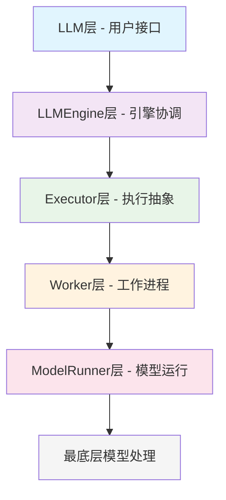
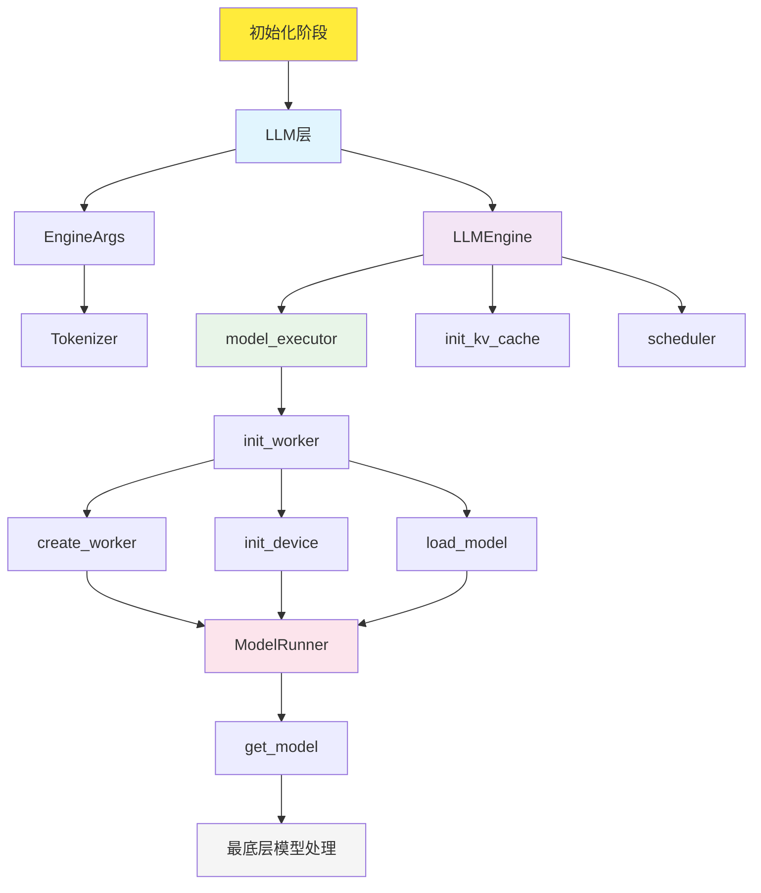
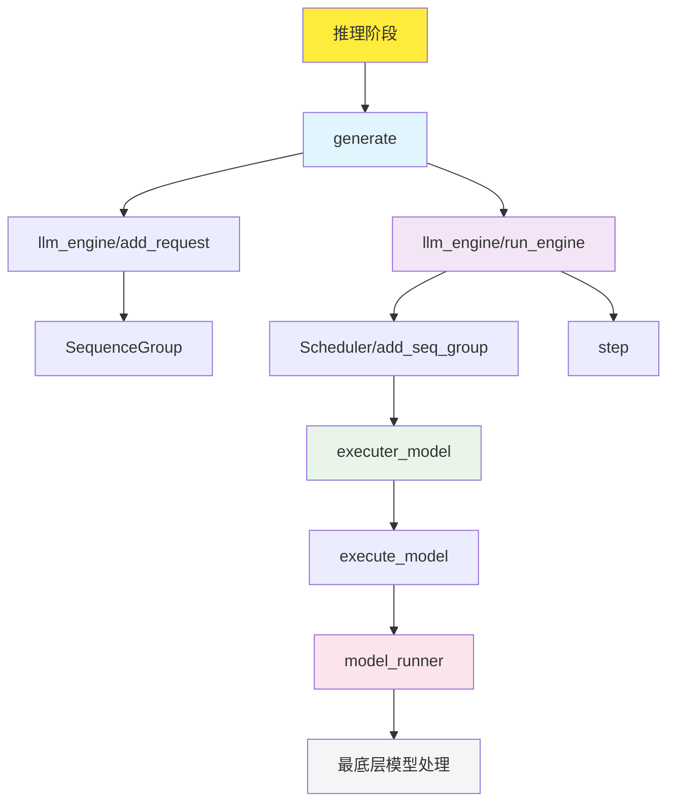
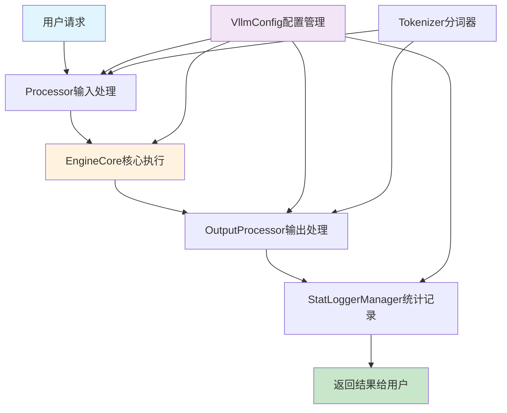

# vLLM：高性能大语言模型推理引擎的工程设计与实现


## 引言

vLLM（Very Large Language Model）是一个专为大语言模型推理优化的高性能引擎，其设计目标是在保证推理质量的前提下，最大化吞吐量并优化内存使用效率。本文将从工程角度深入分析vLLM的设计思路、核心架构以及执行流程，帮助读者理解这个优秀开源项目的技术精髓。

## 1. 整体框架架构原理图

vLLM采用了清晰的分层架构设计，每一层都有明确的职责和接口。让我们首先通过整体架构图来理解系统的全貌：

### 1.1 系统整体架构图


**架构层次说明：**

- **用户接口层 (LLM)**：提供用户友好的API接口，支持多种任务类型
- **引擎协调层 (LLMEngine)**：核心协调者，管理EngineCoreClient和EngineCore
- **调度层 (Scheduler)**：智能调度系统，实现连续批处理和PagedAttention
- **执行层 (Executor)**：分布式执行抽象，支持多进程和Ray分布式
- **工作器层 (Worker)**：具体的工作进程，负责设备管理和模型加载
- **模型运行层 (ModelRunner)**：模型推理执行器，处理实际的模型计算

### 1.2 核心设计理念

#### 1.2.1 以LLM类为入口的用户友好设计

vLLM的设计从用户体验出发，以`LLM`类作为整个系统的统一入口点：

```python
# 简单的使用示例
llm = LLM(model="meta-llama/Llama-2-7b-hf")
outputs = llm.generate(prompts, sampling_params)
```

`LLM`类的设计体现了几个重要的工程原则：

1. **单一职责原则**：LLM类专注于提供高层API，将复杂的引擎管理委托给`LLMEngine`
2. **依赖注入**：通过`EngineArgs`配置对象注入各种参数，实现了配置与实现的解耦
3. **适配器模式**：支持多种任务类型（生成、嵌入、分类、评分等），通过统一接口适配不同的使用场景

#### 1.2.2 分层架构的优势

vLLM的分层架构设计带来了以下优势：

1. **职责分离**：每一层都有明确的职责边界，便于维护和扩展
2. **接口标准化**：层与层之间通过标准接口通信，降低耦合度
3. **可插拔性**：支持不同层次的组件替换和扩展
4. **可测试性**：每层都可以独立测试和验证
5. **可扩展性**：新功能可以在合适的层次添加，不影响其他层次

## 2. 模型初始化阶段

模型初始化阶段是vLLM系统启动的关键环节，它负责设置和加载模型，准备推理环境。让我们通过详细的流程图来理解这个过程：

### 2.1 初始化阶段流程图


### 2.2 初始化阶段详细解析

初始化阶段是vLLM系统启动的关键环节，整个过程可以分为以下几个主要步骤：

#### 2.2.1 用户接口层初始化

**1. 用户创建LLM实例**
```python
llm = LLM(
    model="meta-llama/Llama-2-7b-hf",
    tensor_parallel_size=4,
    gpu_memory_utilization=0.9
)
```

**2. 解析EngineArgs配置**
- 参数验证和类型检查
- 配置聚合和默认值处理
- 兼容性验证

#### 2.2.2 引擎协调层初始化

**1. 创建LLMEngine**
```python
self.llm_engine = LLMEngine.from_engine_args(
    engine_args=engine_args, 
    usage_context=UsageContext.LLM_CLASS
)
```

**2. 初始化核心组件**
- **Tokenizer初始化**：分词器配置和加载
- **EngineCoreClient创建**：多模式执行抽象
- **Processor创建**：输入处理模块
- **OutputProcessor创建**：输出处理模块

#### 2.2.3 核心系统初始化

**1. 创建EngineCore**
```python
self.engine_core = EngineCore(
    vllm_config=vllm_config,
    executor_class=executor_class,
    log_stats=log_stats
)
```

**2. 初始化KV缓存系统**
- 内存分析和配置
- KV缓存块分配
- 预热模型执行

**3. 初始化调度器**
- 智能调度系统设置
- 连续批处理配置
- PagedAttention初始化

#### 2.2.4 执行层初始化

**1. 创建Executor**
```python
self.model_executor = executor_class(vllm_config)
```

**2. 初始化Worker进程**
- 多进程创建和管理
- 进程间通信设置
- 消息队列初始化

#### 2.2.5 模型层初始化

**1. 设备初始化**
- CUDA设备设置
- 分布式环境初始化
- 设备内存管理

**2. 创建ModelRunner**
```python
self.model_runner = GPUModelRunner(
    vllm_config, device
)
```

**3. 加载模型权重**
- 模型实例化
- 权重加载和验证
- CUDA图初始化

#### 2.2.6 初始化完成

系统完成初始化后，所有组件都准备就绪，可以开始处理推理请求。

**初始化关键特性：**
- **延迟加载**：模型和KV缓存按需初始化
- **并行初始化**：多个组件可并行创建
- **错误恢复**：初始化失败时的回滚机制
- **资源管理**：内存和GPU资源的智能分配
- **配置验证**：参数完整性和兼容性检查

**初始化性能指标：**
- 模型加载：3-10秒（取决于模型大小）
- KV缓存初始化：1-3秒
- Worker进程创建：0.5-2秒
- 总初始化时间：5-15秒
- 内存占用：模型大小+缓存空间

## 3. 模型推理阶段

模型推理阶段是vLLM性能优化的核心，它需要将多个不同的prompt高效地组织成batch并执行推理。这个过程涉及复杂的调度、内存管理和并行计算。

### 3.1 推理阶段流程图


### 3.2 推理阶段详细解析

推理阶段描述了从用户调用`generate`开始，到最终得出结果的完整流程：

#### 3.2.1 请求处理阶段

**1. 用户调用generate**
```python
async for output in llm.generate(prompts, sampling_params):
    print(output)
```

**2. AsyncLLM.generate处理**
- 启动output_handler后台循环
- 验证截断参数
- 调用add_request添加请求

**3. add_request处理**
- 创建输出收集器
- 处理n>1的情况（生成多个候选）
- 转换输入为请求格式

**4. EngineCore.add_request_async**
- 验证request_id类型
- 验证池化参数
- 检查KV传输参数

**5. Scheduler.add_request**
- 设置WAITING状态
- 添加到等待队列
- 记录统计信息

#### 3.2.2 调度执行阶段

**1. output_handler后台循环**
- 持续从EngineCore拉取输出
- 处理输出并推送到相应队列
- 异步非阻塞处理

**2. EngineCore.step_async**
- 检查调度器中是否有请求
- 调度请求，创建SchedulerOutput
- 执行模型推理
- 更新调度器状态

**3. Scheduler.schedule**
- 智能调度请求
- 创建批处理
- KV缓存分配
- 抢占机制处理

**4. ModelExecutor.execute_model**
- RPC调用Worker
- 聚合输出结果
- 处理分布式执行

**5. Worker.execute_model**
- 调用ModelRunner
- 处理模型推理
- 返回推理结果

**6. ModelRunner.execute_model**
- 预处理输入数据
- 执行模型前向传播
- 后处理输出

#### 3.2.3 结果处理阶段

**1. 模型推理执行**
- Transformer计算
- 注意力机制
- 输出生成

**2. 后处理输出**
- 采样解码
- 结果生成
- 格式化输出

**3. Scheduler.update_from_output**
- 更新请求状态
- 清理完成请求
- 释放资源

**4. 返回EngineCoreOutputs**
- 推理结果封装
- 状态信息
- 错误处理

**5. OutputProcessor.process_outputs**
- 处理引擎输出
- 推送到队列
- 清理资源

**6. 用户获得结果**
- AsyncGenerator流式输出
- 实时返回生成结果
- 完成推理流程

### 3.3 推理阶段关键特性

**推理阶段关键特性：**
- **异步处理**：完全异步的API设计
- **连续批处理**：动态组织不同长度序列
- **PagedAttention**：高效内存管理
- **推测解码**：并行生成多个token
- **流式输出**：实时返回生成结果

**推理性能指标：**
- 首token延迟：50-200ms
- 生成速度：20-100 tokens/s
- 批处理效率：2-4倍提升
- 内存利用率：80-95%
- 并发处理：支持数百个请求

**技术实现细节：**
- 后台循环：output_handler持续处理
- RPC通信：ZMQ高效进程间通信
- 批处理优化：动态调整batch大小
- CUDA图：减少CPU-GPU同步开销
- 内存管理：智能KV缓存分配

**优化策略：**
- 连续批处理：消除等待时间
- 抢占机制：内存不足时智能抢占
- 流水线并行：重叠计算和通信
- 推测解码：提前生成候选token
- 内存预分配：减少动态分配开销

## 4. 核心组件深度解析

### 4.1 vLLM架构层次深度解析

根据vLLM的整体架构设计，系统可以分为五个主要层次，每个层次都有明确的职责和接口。让我们从顶层到底层逐一分析：

#### 4.1.1 架构层次概览

vLLM采用了清晰的分层架构设计，每一层都有明确的职责边界：



**各层次职责：**
- **LLM层**：用户友好的API接口，参数验证和结果处理
- **LLMEngine层**：引擎协调，包含EngineCoreClient和EngineCore
- **Executor层**：分布式执行抽象，支持多种执行模式
- **Worker层**：具体的工作进程，设备管理和模型加载
- **ModelRunner层**：模型运行器，实际的推理执行
- **最底层**：模型权重和计算内核

#### 4.1.2 系统执行流程：从初始化到推理

根据架构图，vLLM的执行流程可以分为两个主要阶段：**初始化阶段**和**推理阶段**。让我们详细分析这两个阶段的数据流和控制流：

##### 初始化阶段（Initialization Phase）

初始化阶段负责设置和加载模型，准备推理环境：



**初始化阶段的关键步骤：**

1. **LLM层初始化**：
   - 解析用户参数，创建EngineArgs配置对象
   - 初始化Tokenizer分词器

2. **LLMEngine层初始化**：
   - 创建model_executor（实际是EngineCore）
   - 初始化KV缓存系统（init_kv_cache）
   - 设置调度器（scheduler）

3. **Executor层初始化**：
   - 通过init_worker初始化工作进程

4. **Worker层初始化**：
   - create_worker：创建工作进程
   - init_device：初始化GPU设备
   - load_model：加载模型权重

5. **ModelRunner层初始化**：
   - 创建ModelRunner实例
   - 完成设备初始化和模型加载

6. **最底层模型处理**：
   - get_model：获取模型实例
   - 模型准备就绪，可以开始推理

##### 推理阶段（Inference Phase）

推理阶段描述了接收请求、调度、执行模型推理并返回结果的完整流程：



**推理阶段的关键步骤：**

1. **LLM层推理**：
   - generate：用户调用生成接口

2. **LLMEngine层推理**：
   - add_request：将请求添加到引擎
   - run_engine：运行引擎执行推理
   - 请求被封装成SequenceGroup

3. **调度和执行**：
   - Scheduler/add_seq_group：调度器添加序列组
   - step：执行一步推理（EngineCore的核心方法）

4. **Executor层执行**：
   - executer_model：执行器处理模型执行

5. **Worker层执行**：
   - execute_model：实际的模型执行操作

6. **ModelRunner层执行**：
   - model_runner：模型运行器完成推理任务

7. **最底层处理**：
   - 返回推理结果

#### 4.1.3 EngineCore和EngineCoreClient在架构中的位置

根据架构图，我们可以清楚地看到EngineCore和EngineCoreClient在整个系统中的位置：

**EngineCoreClient的位置**：
- 位于LLMEngine层，作为LLMEngine与EngineCore交互的接口
- 封装了与底层执行逻辑的通信细节
- 支持多种执行模式（进程内、多进程、异步多进程）

**EngineCore的位置**：
- 位于LLMEngine层与Executor层之间，作为协调者
- 在初始化阶段：协调init_kv_cache和scheduler的初始化
- 在推理阶段：协调Scheduler和executer_model的工作
- 通过step方法驱动整个推理流程

#### 4.1.4 模块间协作机制



#### 4.1.5 设计优势

1. **模块化设计**：每个模块职责单一，易于维护和扩展
2. **松耦合架构**：模块间通过标准接口通信，降低依赖
3. **可插拔组件**：支持自定义处理器、执行器等组件
4. **统一配置**：通过VllmConfig统一管理所有配置
5. **可观测性**：内置完整的监控和统计功能

### 4.2 LLM层：用户接口的艺术

`LLM`类是整个系统的门面，其设计充分体现了"易用性"和"功能完整性"的平衡：

#### 4.2.1 核心参数详解

LLM类的构造函数提供了丰富的参数配置，涵盖了模型加载、内存管理、并行策略等各个方面：

```python
class LLM:
    def __init__(
        self,
        # 基础模型配置
        model: str,                                    # 模型名称或路径
        tokenizer: Optional[str] = None,               # 分词器路径
        tokenizer_mode: TokenizerMode = "auto",        # 分词器模式
        dtype: ModelDType = "auto",                    # 数据类型
        quantization: Optional[QuantizationMethods] = None,  # 量化方法
        
        # 并行策略配置
        tensor_parallel_size: int = 1,                 # 张量并行大小
        pipeline_parallel_size: int = 1,               # 流水线并行大小
        data_parallel_size: int = 1,                   # 数据并行大小
        
        # 内存管理配置
        gpu_memory_utilization: float = 0.9,           # GPU内存利用率
        swap_space: float = 4,                         # CPU交换空间(GB)
        cpu_offload_gb: float = 0,                     # CPU卸载大小(GB)
        kv_cache_memory_bytes: Optional[int] = None,   # KV缓存内存大小
        
        # 执行控制配置
        enforce_eager: bool = False,                   # 强制eager执行
        seed: Optional[int] = None,                    # 随机种子
        
        # 安全配置
        trust_remote_code: bool = False,               # 信任远程代码
        allowed_local_media_path: str = "",            # 允许的本地媒体路径
        allowed_media_domains: Optional[list[str]] = None,  # 允许的媒体域名
        
        # 高级配置
        hf_token: Optional[Union[bool, str]] = None,   # HuggingFace令牌
        hf_overrides: Optional[HfOverrides] = None,    # HuggingFace配置覆盖
        compilation_config: Optional[Union[int, dict, CompilationConfig]] = None,  # 编译配置
        
        **kwargs: Any,  # 其他EngineArgs参数
    ):
```

#### 4.1.2 参数分类说明

**1. 模型基础配置**
- `model`: 指定要加载的模型，支持HuggingFace模型名称或本地路径
- `tokenizer`: 自定义分词器路径，默认使用模型自带的分词器
- `dtype`: 模型权重和激活的数据类型，支持`float32`、`float16`、`bfloat16`
- `quantization`: 量化方法，支持`awq`、`gptq`、`fp8`等

**2. 并行策略配置**
- `tensor_parallel_size`: 张量并行度，将模型权重分布到多个GPU
- `pipeline_parallel_size`: 流水线并行度，将模型层分布到多个GPU
- `data_parallel_size`: 数据并行度，复制模型到多个GPU处理不同批次

**3. 内存管理配置**
- `gpu_memory_utilization`: GPU内存利用率，控制KV缓存大小
- `swap_space`: CPU交换空间，用于存储被抢占的序列状态
- `cpu_offload_gb`: CPU卸载大小，将模型权重卸载到CPU内存
- `kv_cache_memory_bytes`: 精确控制KV缓存内存大小

**4. 执行控制配置**
- `enforce_eager`: 强制使用eager模式，禁用CUDA图优化
- `seed`: 随机种子，确保结果可重现
- `compilation_config`: 编译优化配置，支持不同级别的优化

**5. 安全与权限配置**
- `trust_remote_code`: 是否信任远程代码执行
- `allowed_local_media_path`: 允许访问的本地媒体文件路径
- `allowed_media_domains`: 允许的多模态输入域名白名单

#### 4.1.3 使用示例

```python
# 基础使用 - 单GPU推理
llm = LLM(
    model="meta-llama/Llama-2-7b-hf",
    dtype="float16",
    gpu_memory_utilization=0.8
)

# 多GPU张量并行
llm = LLM(
    model="meta-llama/Llama-2-70b-hf",
    tensor_parallel_size=4,  # 使用4个GPU进行张量并行
    dtype="bfloat16",
    gpu_memory_utilization=0.9
)

# 量化模型推理
llm = LLM(
    model="meta-llama/Llama-2-7b-hf",
    quantization="awq",  # 使用AWQ量化
    dtype="float16"
)

# 内存优化配置
llm = LLM(
    model="meta-llama/Llama-2-13b-hf",
    gpu_memory_utilization=0.7,
    swap_space=8,  # 8GB CPU交换空间
    cpu_offload_gb=4,  # 4GB CPU卸载
    enforce_eager=True  # 禁用CUDA图以节省内存
)

# 多模态模型配置
llm = LLM(
    model="microsoft/Phi-3-vision-128k-instruct",
    allowed_local_media_path="/path/to/images",
    allowed_media_domains=["example.com"],
    mm_processor_kwargs={"num_crops": 4} # num_crops 参数控制多模态输入的裁剪数量
)
```

#### 4.2.4 多模态任务支持
```python
class LLM:
    def generate(self, prompts, sampling_params=None, **kwargs):
        """文本生成任务"""
        
    def embed(self, prompts, **kwargs):
        """嵌入向量生成"""
        
    def classify(self, prompts, **kwargs):
        """分类任务"""
        
    def score(self, data_1, data_2, **kwargs):
        """相似度评分"""
```

#### 4.2.5 LLM类内部逻辑深度解析

LLM类的设计体现了复杂系统的优雅抽象，其内部逻辑可以分为几个关键阶段：

##### 1. 初始化阶段：系统组装

```python
class LLM:
    def __init__(self, model: str, **kwargs):
        
        # 配置对象构建，将所有参数对象化
        engine_args = EngineArgs(
            model=model,
            tensor_parallel_size=tensor_parallel_size,
            gpu_memory_utilization=gpu_memory_utilization,
            # ... 其他参数
            **kwargs,
        )
        
        # 引擎创建（自动选择V0或V1引擎）
        self.llm_engine = LLMEngine.from_engine_args(
            engine_args=engine_args, 
            usage_context=UsageContext.LLM_CLASS
        )
        
        # 任务支持检测
        self.supported_tasks = self.llm_engine.get_supported_tasks()
        
        # 插件系统初始化
        self.io_processor = get_io_processor(
            self.llm_engine.vllm_config, 
            io_processor_plugin
        )
```

**初始化逻辑的关键特点：**
- **自动引擎选择**：根据配置自动选择V0或V1引擎
- **任务能力检测**：动态检测模型支持的任务类型
- **插件系统集成**：支持IO处理器等扩展插件

##### 2. 请求处理阶段：智能调度

```python
def generate(self, prompts, sampling_params=None, **kwargs):
    # 1. 模型类型验证
    if runner_type != "generate":
        raise ValueError("LLM.generate() is only supported for generative models")
    
    # 2. 默认参数处理
    if sampling_params is None:
        sampling_params = self.get_default_sampling_params()
    
    # 3. 多模态LoRA处理
    lora_request = self._get_modality_specific_lora_reqs(prompts, lora_request)
    
    # 4. 请求验证和添加
    self._validate_and_add_requests(
        prompts=prompts,
        params=sampling_params,
        lora_request=lora_request,
        priority=priority,
    )
    
    # 5. 引擎执行
    outputs = self._run_engine(use_tqdm=use_tqdm)
    return self.engine_class.validate_outputs(outputs, RequestOutput)
```

##### 3. 请求验证和添加：质量控制

```python
class LLM:
    def _validate_and_add_requests(self, prompts, params, **kwargs):
        # ...输入标准化，参数长度验证，多模态数据验证
        
        # 逐个添加请求
        for i, prompt in enumerate(prompts):
            self._add_request(
                prompt,
                params[i] if isinstance(params, Sequence) else params,
                lora_request=lora_request[i] if isinstance(lora_request, Sequence) else lora_request,
                priority=priority[i] if priority else 0,
            )

    def _add_request(
        self,
        prompt: PromptType,
        params: Union[SamplingParams, PoolingParams],
        lora_request: Optional[LoRARequest] = None,
        priority: int = 0) -> None:
        # ... 请求ID生成，参数校验

        self.llm_engine.add_request(
            request_id,
            engine_request,
            params,
            lora_request=lora_request,
            tokenization_kwargs=tokenization_kwargs,
            priority=priority,
            prompt_text=prompt_text,
        )
```

##### 4. 引擎执行阶段：核心推理循环

```python
class LLM:
    def _run_engine(self, use_tqdm=True):
        # 1. 进度条初始化
        if use_tqdm:
            num_requests = self.llm_engine.get_num_unfinished_requests()
            pbar = tqdm(total=num_requests, desc="Processed prompts")
        
        # 2. 主执行循环
        outputs = []
        while self.llm_engine.has_unfinished_requests():
            # 执行一个推理步骤
            step_outputs = self.llm_engine.step() # 可以获取到每个 prompt 的执行情况
            
            # 收集完成的输出
            for output in step_outputs:
                if output.finished:
                    outputs.append(output)
                    # 更新进度条和统计信息
                    if use_tqdm:
                        self._update_progress_bar(pbar, output)
        
        # 3. 结果排序和返回
        return sorted(outputs, key=lambda x: int(x.request_id))
```

#### 4.2.6 EngineArgs：配置管理的核心

`EngineArgs`是vLLM中最重要的配置类，它整合了所有子系统的配置参数，实现了统一的参数管理：

```python
@dataclass
class EngineArgs:
    """Arguments for vLLM engine."""
    # 模型相关配置
    model: str = ModelConfig.model
    tokenizer: Optional[str] = ModelConfig.tokenizer
    dtype: ModelDType = ModelConfig.dtype
    max_model_len: Optional[int] = ModelConfig.max_model_len
    
    # 并行策略配置
    tensor_parallel_size: int = ParallelConfig.tensor_parallel_size
    pipeline_parallel_size: int = ParallelConfig.pipeline_parallel_size
    data_parallel_size: int = ParallelConfig.data_parallel_size
    
    # 内存管理配置
    gpu_memory_utilization: float = CacheConfig.gpu_memory_utilization
    swap_space: float = CacheConfig.swap_space
    cpu_offload_gb: float = CacheConfig.cpu_offload_gb
    
    # 调度器配置
    max_num_seqs: Optional[int] = SchedulerConfig.max_num_seqs
    max_num_batched_tokens: Optional[int] = SchedulerConfig.max_num_batched_tokens
    
    # 量化配置
    quantization: Optional[QuantizationMethods] = ModelConfig.quantization
    
    # LoRA配置
    enable_lora: bool = False
    max_loras: int = LoRAConfig.max_loras
```

`EngineArgs`的设计体现了几个重要的工程原则：

1. **配置聚合**：将分散在各个配置类中的参数统一到一个入口点
2. **类型安全**：使用dataclass和类型注解确保参数类型正确性
3. **默认值管理**：通过`get_field()`函数从各个配置类中获取默认值
4. **向后兼容**：支持参数的渐进式演进和废弃处理

这种设计使得用户可以通过一个统一的接口配置整个vLLM引擎，而不需要了解底层的复杂配置结构。

### 4.3 EngineCoreClient：多模式执行架构的核心

`EngineCoreClient` 是vLLM V1架构中最关键的设计之一，它实现了多种执行模式的统一抽象，为不同的使用场景提供了灵活的解决方案。

#### 4.3.1 设计理念与架构

`EngineCoreClient` 采用了抽象基类设计，通过工厂模式根据不同的配置参数自动选择合适的实现：

```python
class EngineCoreClient(ABC):
    """
    EngineCoreClient: 子类处理不同的推送和拉取方法
    用于asyncio / 多进程的EngineCore
    
    子类:
    * InprocClient: 进程内EngineCore (用于V0风格的LLMEngine)
    * SyncMPClient: ZMQ + 后台进程EngineCore (用于LLM)
    * AsyncMPClient: ZMQ + 后台进程EngineCore w/ asyncio (用于AsyncLLM)
    """
    
    @staticmethod
    def make_client(
        multiprocess_mode: bool,
        asyncio_mode: bool,
        vllm_config: VllmConfig,
        executor_class: type[Executor],
        log_stats: bool,
    ) -> "EngineCoreClient":
        """工厂方法，根据配置自动选择合适的客户端实现"""
        
        if multiprocess_mode and asyncio_mode:
            return EngineCoreClient.make_async_mp_client(
                vllm_config, executor_class, log_stats)
        
        if multiprocess_mode and not asyncio_mode:
            return SyncMPClient(vllm_config, executor_class, log_stats)
        
        return InprocClient(vllm_config, executor_class, log_stats)
```

#### 4.3.2 三种核心实现模式

##### 1. InprocClient：进程内执行模式

`InprocClient` 是最简单的实现，适用于传统的同步推理场景：

```python
class InprocClient(EngineCoreClient):
    """
    InprocClient: 进程内EngineCore客户端
    用于LLMEngine的V0风格add_request()和step()
    EngineCore设置在此进程中（无忙循环）
    
    * 直接将EngineCoreRequest推送到EngineCore
    * 通过步进EngineCore拉取EngineCoreOutputs
    """
    
    def __init__(self, *args, **kwargs):
        self.engine_core = EngineCore(*args, **kwargs)
    
    def get_output(self) -> EngineCoreOutputs:
        outputs, _ = self.engine_core.step_fn()
        return outputs and outputs.get(0) or EngineCoreOutputs()
    
    def add_request(self, request: EngineCoreRequest) -> None:
        req, request_wave = self.engine_core.preprocess_add_request(request)
        self.engine_core.add_request(req, request_wave)
```

**特点：**
- **零延迟通信**：直接方法调用，无网络开销
- **简单调试**：所有代码在同一进程中，便于调试
- **内存共享**：与主进程共享内存空间
- **适用场景**：单机推理、开发测试、小规模部署

##### 2. SyncMPClient：同步多进程模式

`SyncMPClient` 使用ZMQ进行进程间通信，支持多进程并行执行：

```python
class SyncMPClient(MPClient):
    """同步多进程EngineCore客户端"""
    
    def __init__(self, vllm_config: VllmConfig, executor_class: type[Executor],
                 log_stats: bool):
        super().__init__(
            asyncio_mode=False,
            vllm_config=vllm_config,
            executor_class=executor_class,
            log_stats=log_stats,
        )
        
        # 创建输出队列和后台处理线程
        self.outputs_queue = queue.Queue[Union[EngineCoreOutputs, Exception]]()
        self._start_output_processing_thread()
    
    def _start_output_processing_thread(self):
        """启动后台线程处理EngineCore输出"""
        def process_outputs_socket():
            while True:
                frames = out_socket.recv_multipart(copy=False)
                outputs: EngineCoreOutputs = decoder.decode(frames)
                if outputs.utility_output:
                    _process_utility_output(outputs.utility_output, utility_results)
                else:
                    outputs_queue.put_nowait(outputs)
        
        self.output_queue_thread = Thread(
            target=process_outputs_socket,
            name="EngineCoreOutputQueueThread",
            daemon=True
        )
        self.output_queue_thread.start()
    
    def get_output(self) -> EngineCoreOutputs:
        """同步获取输出结果"""
        outputs = self.outputs_queue.get()
        if isinstance(outputs, Exception):
            raise self._format_exception(outputs) from None
        return outputs
```

**特点：**
- **进程隔离**：EngineCore运行在独立进程中，提高稳定性
- **异步处理**：后台线程处理输出，主线程不阻塞
- **高吞吐量**：支持多进程并行，提高整体吞吐量
- **适用场景**：生产环境、高并发服务、多GPU部署

##### 3. AsyncMPClient：异步多进程模式

`AsyncMPClient` 结合了多进程和异步编程的优势：

```python
class AsyncMPClient(MPClient):
    """异步多进程EngineCore客户端"""
    
    def __init__(self, vllm_config: VllmConfig, executor_class: type[Executor],
                 log_stats: bool, client_addresses: Optional[dict[str, str]] = None,
                 client_count: int = 1, client_index: int = 0):
        super().__init__(
            asyncio_mode=True,
            vllm_config=vllm_config,
            executor_class=executor_class,
            log_stats=log_stats,
            client_addresses=client_addresses,
        )
        
        self.outputs_queue = asyncio.Queue[Union[EngineCoreOutputs, Exception]]()
        self._ensure_output_queue_task()
    
    def _ensure_output_queue_task(self):
        """确保输出队列任务正在运行"""
        if self.resources.output_queue_task is not None:
            return
        
        async def process_outputs_socket():
            try:
                while True:
                    frames = await output_socket.recv_multipart(copy=False)
                    outputs: EngineCoreOutputs = decoder.decode(frames)
                    if outputs.utility_output:
                        _process_utility_output(outputs.utility_output, utility_results)
                        continue
                    
                    if outputs.outputs or outputs.scheduler_stats:
                        outputs_queue.put_nowait(outputs)
            except Exception as e:
                outputs_queue.put_nowait(e)
        
        self.resources.output_queue_task = asyncio.create_task(
            process_outputs_socket(), name="EngineCoreOutputQueueTask")
    
    async def get_output_async(self) -> EngineCoreOutputs:
        """异步获取输出结果"""
        outputs = await self.outputs_queue.get()
        if isinstance(outputs, Exception):
            raise self._format_exception(outputs) from None
        return outputs
```

**特点：**
- **异步非阻塞**：完全异步的API，支持高并发
- **事件驱动**：基于asyncio事件循环，资源利用率高
- **流式处理**：支持流式输出和实时响应
- **适用场景**：Web服务、API服务器、实时应用

### 4.4 EngineCore：推理引擎的核心协调者

`EngineCore` 是vLLM V1架构中最核心的组件，它作为调度器和模型执行器之间的协调者，负责整个推理流程的编排和执行。

#### 4.4.1 设计理念与核心职责

EngineCore的设计遵循"协调者模式"，它不直接执行具体的推理任务，而是协调各个子系统的工作：

```python
class EngineCore:
    """Inner loop of vLLM's Engine."""
    
    def __init__(self, vllm_config: VllmConfig, executor_class: type[Executor], 
                 log_stats: bool, executor_fail_callback: Optional[Callable] = None):
        
        # 1. 插件系统初始化
        from vllm.plugins import load_general_plugins
        load_general_plugins()
        
        # 2. 模型执行器初始化
        self.model_executor = executor_class(vllm_config)
        
        # 3. KV缓存初始化
        num_gpu_blocks, num_cpu_blocks, kv_cache_config = \
            self._initialize_kv_caches(vllm_config)
        
        # 4. 调度器初始化
        self.scheduler: SchedulerInterface = Scheduler(
    vllm_config=vllm_config,
            kv_cache_config=kv_cache_config,
            structured_output_manager=self.structured_output_manager,
            include_finished_set=vllm_config.parallel_config.data_parallel_size > 1,
            log_stats=self.log_stats,
        )
        
        # 5. 批处理队列设置（用于流水线并行）
        self.batch_queue_size = self.model_executor.max_concurrent_batches
        if self.batch_queue_size > 1:
            self.batch_queue = deque(maxlen=self.batch_queue_size)
        
        # 6. 选择执行策略
        self.step_fn = (self.step if self.batch_queue is None else 
                       self.step_with_batch_queue)
```

#### 4.4.2 核心组件初始化流程

##### 1. KV缓存系统初始化

EngineCore首先需要初始化KV缓存系统，这是整个推理性能的关键：

```python
def _initialize_kv_caches(self, vllm_config: VllmConfig) -> tuple[int, int, KVCacheConfig]:
    """初始化KV缓存系统"""
    start = time.time()
    
    # 1. 获取模型所需的KV缓存规格
    kv_cache_specs = self.model_executor.get_kv_cache_specs()
    
    # 2. 确定可用GPU内存
    if has_kv_cache:
        if os.environ.get("VLLM_ELASTIC_EP_SCALE_UP_LAUNCH") == "1":
            # 弹性扩展模式：同步KV缓存内存大小
            self.available_gpu_memory_for_kv_cache = \
                ParallelConfig.sync_kv_cache_memory_size(dp_group, -1)
        else:
            # 标准模式：分析模型峰值内存使用
            available_gpu_memory = self.model_executor.determine_available_memory()
            self.available_gpu_memory_for_kv_cache = available_gpu_memory[0]
    
    # 3. 生成KV缓存配置
    kv_cache_configs = get_kv_cache_configs(vllm_config, kv_cache_specs, 
                                           available_gpu_memory)
    scheduler_kv_cache_config = generate_scheduler_kv_cache_config(kv_cache_configs)
    
    # 4. 初始化KV缓存并预热模型
    self.model_executor.initialize_from_config(kv_cache_configs)
    
    elapsed = time.time() - start
    logger.info("init engine (profile, create kv cache, warmup model) took %.2f seconds", elapsed)
    
    return num_gpu_blocks, num_cpu_blocks, scheduler_kv_cache_config
```

**KV缓存初始化关键步骤：**
- **内存分析**：通过模型执行器分析峰值内存使用情况
- **配置生成**：根据可用内存和模型需求生成KV缓存配置
- **预热执行**：通过预热运行确保模型和缓存系统正常工作
- **分布式同步**：在数据并行模式下同步KV缓存配置

##### 2. 调度器系统初始化

调度器是EngineCore的核心组件，负责请求的智能调度：

```python
# 调度器初始化
if isinstance(vllm_config.scheduler_config.scheduler_cls, str):
    Scheduler = resolve_obj_by_qualname(vllm_config.scheduler_config.scheduler_cls)
else:
    Scheduler = vllm_config.scheduler_config.scheduler_cls

# 检查是否支持分块预填充
if len(kv_cache_config.kv_cache_groups) == 0:
    logger.info("Disabling chunked prefill for model without KVCache")
    vllm_config.scheduler_config.chunked_prefill_enabled = False

self.scheduler: SchedulerInterface = Scheduler(
    vllm_config=vllm_config,
    kv_cache_config=kv_cache_config,
    structured_output_manager=self.structured_output_manager,
    include_finished_set=vllm_config.parallel_config.data_parallel_size > 1,
    log_stats=self.log_stats,
)
```

##### 3. 批处理队列系统

对于支持流水线并行的模型，EngineCore会设置批处理队列：

```python
# 批处理队列设置
self.batch_queue_size = self.model_executor.max_concurrent_batches
self.batch_queue: Optional[deque[tuple[Future[ModelRunnerOutput], SchedulerOutput]]] = None

if self.batch_queue_size > 1:
    logger.info("Batch queue is enabled with size %d", self.batch_queue_size)
    self.batch_queue = deque(maxlen=self.batch_queue_size)
```

**批处理队列的作用：**
- **异步调度**：允许异步调度和执行批次
- **流水线优化**：消除流水线并行中的气泡
- **并发控制**：控制最大并发批次数

#### 4.4.3 核心推理循环

EngineCore的核心是推理循环，它协调调度器和模型执行器的工作：

##### 1. 标准推理循环（step）

```python
def step(self) -> tuple[dict[int, EngineCoreOutputs], bool]:
    """调度、执行和生成输出
    
    Returns:
        tuple: (输出字典, 模型是否执行的标志)
    """
    
    # 1. 检查是否有待处理的请求
    if not self.scheduler.has_requests():
        return {}, False
    
    # 2. 调度器选择要执行的请求
    scheduler_output = self.scheduler.schedule()
    
    # 3. 执行模型推理
    model_output = self.execute_model_with_error_logging(
        self.model_executor.execute_model,
        scheduler_output
    )
    
    # 4. 更新调度器状态
    engine_core_outputs = self.scheduler.update_from_output(
        scheduler_output, model_output
    )
    
    return (engine_core_outputs, 
            scheduler_output.total_num_scheduled_tokens > 0)
```

**标准推理循环的关键步骤：**

1. **请求检查**：检查调度器中是否有待处理的请求
2. **智能调度**：调度器根据当前状态选择最优的请求组合
3. **模型执行**：将调度结果传递给模型执行器进行推理
4. **状态更新**：根据模型输出更新调度器状态
5. **结果返回**：返回推理结果和执行状态

##### 2. 批处理队列推理循环（step_with_batch_queue）

对于支持流水线并行的模型，EngineCore使用更复杂的批处理队列循环：

```python
def step_with_batch_queue(self) -> tuple[Optional[dict[int, EngineCoreOutputs]], bool]:
    """使用批处理队列进行调度和执行
    
    执行流程：
    1. 如果批处理队列未满，尝试调度新批次
    2. 如果没有新批次可调度，等待队列中的批次完成
    3. 更新调度器状态
    """
    batch_queue = self.batch_queue
    assert batch_queue is not None
    
    model_executed = False
    
    # 1. 尝试调度新批次（如果队列未满）
    if self.scheduler.has_requests():
        scheduler_output = self.scheduler.schedule()
        future = self.model_executor.execute_model(scheduler_output, non_block=True)
        batch_queue.appendleft((future, scheduler_output))
        
        model_executed = scheduler_output.total_num_scheduled_tokens > 0
        
        # 如果队列未满且最后一个批次未完成，不阻塞
        if model_executed and len(batch_queue) < self.batch_queue_size \
            and not batch_queue[-1][0].done():
            return None, True
    
    # 2. 等待下一个结果可用
    future, scheduler_output = batch_queue.pop()
    model_output = self.execute_model_with_error_logging(
        lambda _: future.result(), scheduler_output
    )
    
    # 3. 更新调度器状态
    engine_core_outputs = self.scheduler.update_from_output(
        scheduler_output, model_output
    )
    
    return engine_core_outputs, model_executed
```

**批处理队列循环的优势：**
- **异步执行**：调度和执行可以并行进行
- **流水线优化**：消除流水线并行中的等待时间
- **资源利用**：最大化GPU和CPU的利用率

### 4.5 Scheduler：智能调度的艺术

调度器是vLLM性能优化的关键组件，实现了多种先进的调度策略：

#### 4.5.1 连续批处理（Continuous Batching）

vLLM使用连续批处理技术，允许不同长度的序列在同一个batch中处理：

```python
def _organize_batch(self, scheduler_output: SchedulerOutput):
    """组织批处理，处理不同长度的序列"""
    
    # 1. 收集所有请求的token
    all_tokens = []
    token_to_request = {}  # token索引到请求ID的映射
    
    for req_data in scheduler_output.scheduled_new_reqs:
        if req_data.prompt_token_ids:
            for i, token_id in enumerate(req_data.prompt_token_ids):
                all_tokens.append(token_id)
                token_to_request[len(all_tokens) - 1] = req_data.req_id
    
    for i, req_id in enumerate(scheduler_output.scheduled_cached_reqs.req_ids):
        num_tokens = scheduler_output.num_scheduled_tokens[req_id]
        for j in range(num_tokens):
            all_tokens.append(0)  # 占位符，实际值在推理时填充
            token_to_request[len(all_tokens) - 1] = req_id
    
    # 2. 创建注意力mask
    attention_mask = self._create_attention_mask(
        scheduler_output, token_to_request)
    
    # 3. 创建位置编码
    positions = self._create_positions(scheduler_output, token_to_request)
    
    return all_tokens, attention_mask, positions, token_to_request
```

#### 4.5.2 PagedAttention优化
- [【vLLM】核心技术PagedAttention，调度原理](https://lijiacai.blog.csdn.net/article/details/139854596?fromshare=blogdetail&sharetype=blogdetail&sharerId=139854596&sharerefer=PC&sharesource=xzpdxz&sharefrom=from_link)

PagedAttention允许高效处理不同长度的序列：

```python
def _create_attention_mask(self, scheduler_output: SchedulerOutput, 
                          token_to_request: dict[int, str]):
    """创建注意力mask，支持PagedAttention"""
    
    batch_size = len(scheduler_output.scheduled_new_reqs) + \
                 len(scheduler_output.scheduled_cached_reqs.req_ids)
    
    # 创建块级别的注意力mask
    attention_mask = torch.zeros(
        (batch_size, self.max_num_tokens), 
        dtype=torch.bool, device=self.device)
    
    # 为每个请求设置有效的token位置
    for i, req_data in enumerate(scheduler_output.scheduled_new_reqs):
        num_tokens = len(req_data.prompt_token_ids) if req_data.prompt_token_ids else 0
        attention_mask[i, :num_tokens] = True
    
    # 处理缓存请求
    cached_start_idx = len(scheduler_output.scheduled_new_reqs)
    for i, req_id in enumerate(scheduler_output.scheduled_cached_reqs.req_ids):
        num_tokens = scheduler_output.num_scheduled_tokens[req_id]
        attention_mask[cached_start_idx + i, :num_tokens] = True
    
    return attention_mask
```

### 4.6 Executor：分布式执行的抽象

执行器层提供了统一的分布式执行抽象，负责管理Worker进程的创建、初始化和协调。

#### 4.6.1 MultiprocExecutor初始化流程

```python
class MultiprocExecutor(Executor):
    def _init_executor(self) -> None:
        """初始化执行器，创建和管理Worker进程"""
        
        # 1. 设置多进程环境
        set_multiprocessing_worker_envs()
        
        # 2. 配置分布式通信
        distributed_init_method = get_distributed_init_method(
            get_loopback_ip(), get_open_port())
        
        # 3. 创建消息队列用于Worker通信
        max_chunk_bytes = envs.VLLM_MQ_MAX_CHUNK_BYTES_MB * 1024 * 1024
        self.rpc_broadcast_mq = MessageQueue(self.world_size,
                                           self.world_size,
                                           max_chunk_bytes=max_chunk_bytes)
        scheduler_output_handle = self.rpc_broadcast_mq.export_handle()
        
        # 4. 创建Worker进程
        context = get_mp_context()
        shared_worker_lock = context.Lock()
        unready_workers: list[UnreadyWorkerProcHandle] = []
        
        for rank in range(self.world_size):
            unready_workers.append(
                WorkerProc.make_worker_process(
                    vllm_config=self.vllm_config,
                    local_rank=rank,
                    rank=rank,
                    distributed_init_method=distributed_init_method,
                    input_shm_handle=scheduler_output_handle,
                    shared_worker_lock=shared_worker_lock,
                ))
        
        # 5. 等待所有Worker准备就绪
        self.workers = WorkerProc.wait_for_ready(unready_workers)
        
        # 6. 确保消息队列准备就绪
        self.rpc_broadcast_mq.wait_until_ready()
        for w in self.workers:
            w.worker_response_mq.wait_until_ready()
        
        # 7. 启动Worker监控
        self.start_worker_monitor()
```

### 4.7 ModelRunner：模型执行的核心

`ModelRunner`负责实际的模型推理执行，它是Worker中最重要的组件之一。

#### 4.7.1 ModelRunner的创建流程

ModelRunner的创建发生在Worker的初始化过程中：

```python
class Worker(WorkerBase):
    def __init__(self, vllm_config: VllmConfig, local_rank: int, rank: int, ...):
        super().__init__(vllm_config=vllm_config, ...)
        
        # 在Worker初始化过程中创建ModelRunner
        # 这发生在init_device()方法中
        self.init_device()
        
    def init_device(self):
        """初始化设备并创建ModelRunner"""
        # 1. 设置CUDA设备
        self.device = torch.device(f"cuda:{self.local_rank}")
        torch.cuda.set_device(self.device)
        
        # 2. 初始化分布式环境
        init_distributed_environment()
        ensure_model_parallel_initialized()
        
        # 3. 创建ModelRunner实例
        self.model_runner: GPUModelRunner = GPUModelRunner(
            self.vllm_config, self.device)
```

#### 4.7.2 GPUModelRunner的初始化

`GPUModelRunner`是ModelRunner的具体实现，它的初始化过程非常复杂：

```python
class GPUModelRunner(LoRAModelRunnerMixin, KVConnectorModelRunnerMixin):
    def __init__(self, vllm_config: VllmConfig, device: torch.device):
        """初始化GPUModelRunner"""
        
        # 1. 保存配置信息
        self.vllm_config = vllm_config
        self.model_config = vllm_config.model_config
        self.cache_config = vllm_config.cache_config
        self.compilation_config = vllm_config.compilation_config
        self.lora_config = vllm_config.lora_config
        self.load_config = vllm_config.load_config
        self.parallel_config = vllm_config.parallel_config
        self.scheduler_config = vllm_config.scheduler_config
        self.speculative_config = vllm_config.speculative_config
        self.observability_config = vllm_config.observability_config
        
        # 2. 设置CPU卸载和批处理不变性
        from vllm.model_executor.models.utils import set_cpu_offload_max_bytes
        set_cpu_offload_max_bytes(int(self.cache_config.cpu_offload_gb * 1024**3))
        from vllm.model_executor.layers.batch_invariant import init_batch_invariance
        init_batch_invariance()
        
        # 3. 设置设备和数据类型
        self.device = device
        self.pin_memory = is_pin_memory_available()
        self.dtype = self.model_config.dtype
        if cache_config.cache_dtype == "auto":
            self.kv_cache_dtype = self.dtype
        else:
            self.kv_cache_dtype = STR_DTYPE_TO_TORCH_DTYPE[cache_config.cache_dtype]
        
        # 4. 设置模型相关参数
        self.is_pooling_model = (model_config.runner_type == 'pooling')
        self.enable_prompt_embeds = model_config.enable_prompt_embeds
        self.is_multimodal_raw_input_only_model = model_config.is_multimodal_raw_input_only_model
        self.max_model_len = model_config.max_model_len
        self.max_num_tokens = scheduler_config.max_num_batched_tokens
        self.max_num_reqs = scheduler_config.max_num_seqs
        
        # 5. 设置注意力相关参数
        self.num_query_heads = model_config.get_num_attention_heads(parallel_config)
        self.hidden_size = model_config.get_hidden_size()
        self.attention_chunk_size = model_config.attention_chunk_size
        self.use_alibi = check_use_alibi(model_config)
        self.cascade_attn_enabled = not self.model_config.disable_cascade_attn
        
        # 6. 设置多模态支持
        self.mm_registry = MULTIMODAL_REGISTRY
        self.uses_mrope = model_config.uses_mrope
        self.supports_mm_inputs = self.mm_registry.supports_multimodal_inputs(model_config)
        
        # 7. 设置编码器-解码器模型参数
        if self.model_config.is_encoder_decoder:
            self.max_encoder_len = scheduler_config.max_num_encoder_input_tokens
        else:
            self.max_encoder_len = 0
        
        # 8. 初始化采样器
        self.sampler = Sampler(logprobs_mode=self.model_config.logprobs_mode)
        
        # 9. 初始化专家并行负载均衡器状态
        self.eplb_state: Optional[EplbState] = None
        
        # 10. 初始化延迟加载的组件
        self.kv_caches: list[torch.Tensor] = []
        self.attn_groups: list[list[AttentionGroup]] = []
        # self.model: nn.Module  # 在load_model()中设置
        # self.kv_cache_config: KVCacheConfig  # 在initialize_kv_cache中初始化
```

## 5. 总结


## 关键类和方法说明

### 阶段1: 引擎初始化
- `LLM.__init__()` - 入口点
- `EngineCoreClient.make_client()` - 创建客户端
- `launch_core_engines()` - 启动后台引擎进程
- `MultiprocExecutor._init_executor()` - 创建多进程执行器
- `WorkerProc.make_worker_process()` - 创建 Worker 进程
- `Worker.init_device()` - 初始化 GPU 设备

### 阶段2: 模型加载
- `worker.load_model()` - 触发模型加载
- `ModelRegistry.resolve_model_cls()` - 解析模型类
- `_LazyRegisteredModel.load_model_cls()` - 懒加载模型类
- `initialize_model()` - 实例化模型
- `determine_available_memory()` - 内存分析
- `initialize_kv_cache()` - 初始化 KV Cache
- `compile_or_warm_up_model()` - 预热和 CUDA Graph

### 阶段3: 请求发送
- `llm.generate()` - 用户 API
- `engine_core_client.add_request()` - 添加请求
- `MsgpackEncoder.encode()` - 序列化
- `input_socket.send_multipart()` - ZMQ 发送

### 阶段4: 后台推理
- `run_busy_loop()` - 主循环
- `_process_input_queue()` - 处理输入队列
- `input_queue.get()` - 获取请求
- `scheduler.schedule()` - 调度
- `_prepare_inputs()` - 准备输入张量
- `model.forward()` - GPU 推理
- `sampler.sample()` - 采样生成 token
- `scheduler.update_from_output()` - 更新状态
- `output_queue.put()` - 输出结果

### 阶段5: 返回结果
- `output_socket.send_multipart()` - ZMQ 发送结果
- `outputs_queue.put()` - 前端队列
- `engine_core_client.get_output()` - 获取输出
- `output_processor.process_outputs()` - 处理输出
- `tokenizer.decode()` - 解码为文本
- 返回 `CompletionOutput`

vLLM不仅是一个高性能的推理引擎，更是现代AI系统工程的典范。它展示了如何通过精心的架构设计、创新的算法思想和工程最佳实践，构建一个既高效又易用的复杂系统。对于AI工程师而言，深入理解vLLM的设计思路和实现细节，将有助于在自己的项目中应用这些宝贵的经验和技术。

---

*本文基于vLLM开源项目的代码分析，旨在从工程角度解析其设计思路和实现细节。随着项目的持续发展，部分实现细节可能会有所变化，建议读者结合最新的源代码进行学习。*
