# 昇思MindSpore异构并行运行时技术解析

> 针对大模型训推场景中的Host Bound问题，昇思MindSpore通过异构并行、异步下发、三级流水三大技术实现性能提升30%

---

## 核心问题：Host Bound

### 问题定义

在AI框架的传统KBK（Kernel By Kernel）执行模式下，每个算子的调度流程包括：

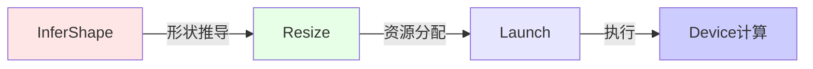

**性能瓶颈**：Host侧算子调度时间远大于Device侧算子执行时间，导致Device出现大量idle气泡。

### 典型案例分析

以BERT模型推理为例（Batch=1, SeqLen=128）：

**实测数据**：
| 算子类型 | Host调度耗时 | Device执行耗时 | Device空闲率 |
|---------|-------------|---------------|-------------|
| LayerNorm | 45μs | 10μs | 78% |
| MatMul | 48μs | 12μs | 75% |
| Add | 35μs | 5μs | 86% |
| Reshape | 38μs | 2μs | 95% |

**Host Bound高发场景**：
1. **小算子密集型**：Element-wise（Add、Mul）、Reshape等算子占比超过50%
2. **大模型推理**：Batch Size=1，序列长度小于512
3. **动态Shape**：每次InferShape、Resize开销显著

### Host Bound问题动画演示


**动画说明**：
- 红色区域：Host调度阶段，Device空闲等待
- 绿色区域：Device执行阶段，Host空闲等待
- 红色时间线：显示当前执行到哪个阶段
- 关键问题：Host和Device从不同时工作，Device利用率仅17.4%

---

## 解决方案架构

### 整体技术栈

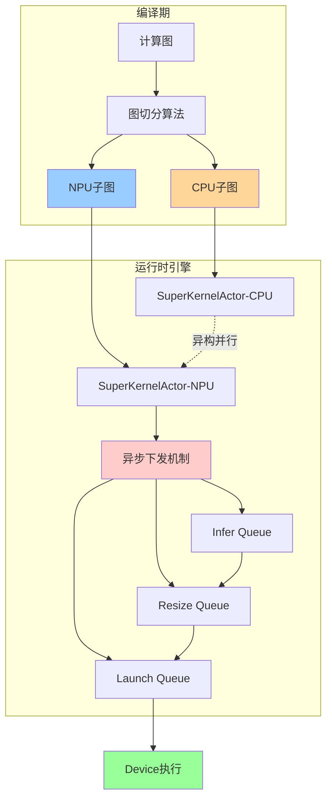

---

## 技术一：异构并行（Heterogeneous Parallelism）

### 子图切分策略

**编译期分析**：
- CPU算子标签：动态Shape算子（Unique、DynamicShape）、NPU不支持算子、轻量级算子
- NPU算子标签：计算密集型算子（MatMul、Conv2D、Attention）

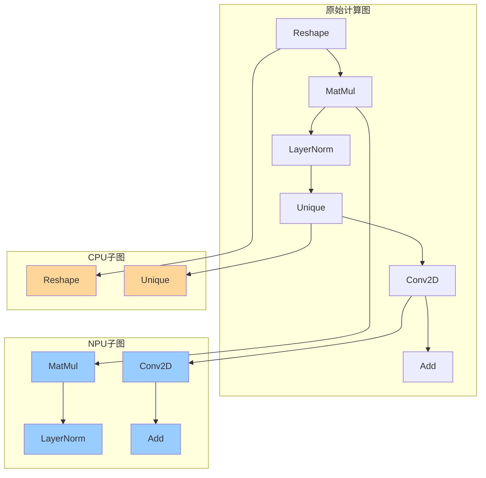

### 运行时并发执行

**SuperKernelActor机制**：

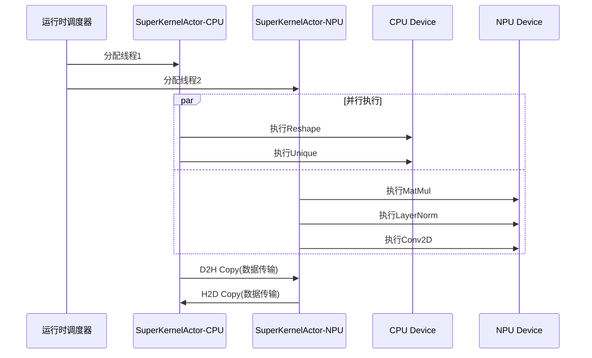

**实际案例：GPT-2推理**

```python
# 伪代码示意
子图划分结果：
CPU子图：[DynamicShape, Reshape, Unique, NonZero]  # 4个算子
NPU子图：[MatMul×12, LayerNorm×12, Softmax×12]    # 36个算子

执行时序：
T=0ms:    CPU子图开始 || NPU子图开始
T=2ms:    CPU子图完成 || NPU子图持续执行
T=8ms:    NPU子图完成

总耗时：8ms (串行需要10ms)
性能提升：20%
```

### 异构并行动画演示


**动画说明**：
- 橙色：CPU子图（轻量级算子）
- 蓝色：NPU子图（计算密集型算子）
- 关键优势：CPU和NPU并行执行，CPU工作2ms的同时NPU工作8ms，总耗时由10ms降为8ms

---

## 技术二：异步下发（Asynchronous Dispatch）

### 同步模式 vs 异步模式

**同步模式瓶颈**：

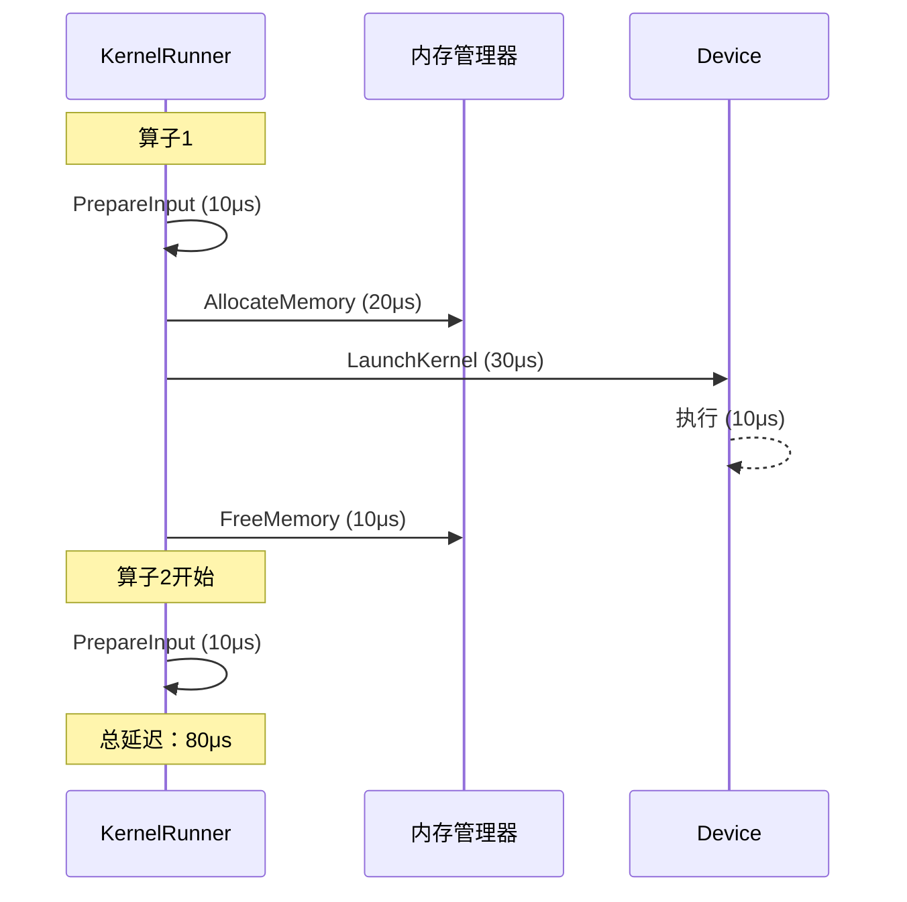

**异步模式优化**：

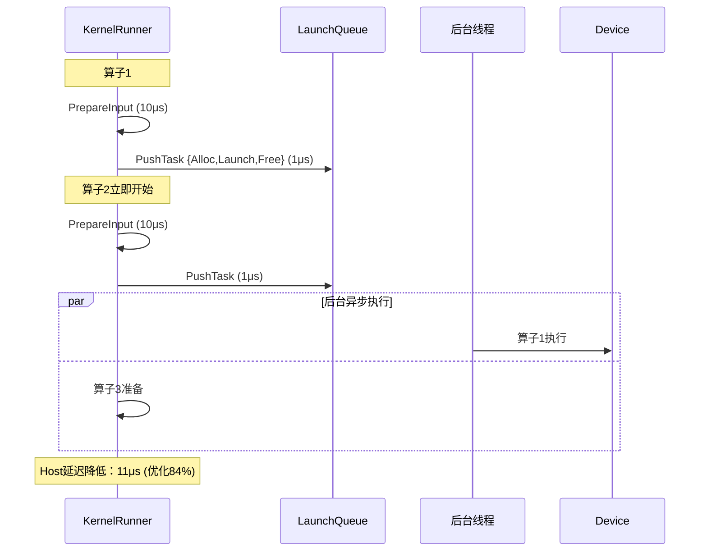

### 内存安全机制

**关键约束**：内存申请和释放必须在同一线程完成，否则会破坏内存复用策略。

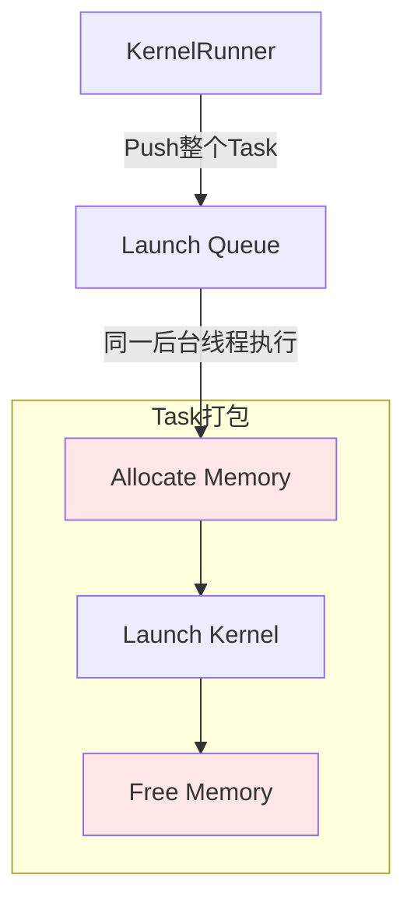

**实际效果（ResNet50推理）**：

| 指标 | 同步模式 | 异步模式 | 优化幅度 |
|------|---------|---------|---------|
| 单算子Host耗时 | 68μs | 12μs | -82% |
| 100算子总耗时 | 6.8ms | 1.2ms | -82% |
| Device利用率 | 35% | 88% | +2.5x |

### 异步下发动画演示


**动画说明**：
- 左侧：同步模式，KernelRunner必须完成所有4个步骤（70μs）
- 右侧：异步模式，KernelRunner只做PrepareInput和PushTask（11μs），其余工作由后台线程异步处理
- 关键优势：KernelRunner快速返回，不阻塞后续算子调度，Host和Device并行工作

---

## 技术三：三级流水（3-Stage Pipeline）

### 流水线架构

将动态Shape算子调度分解为三个独立阶段，形成流水线：

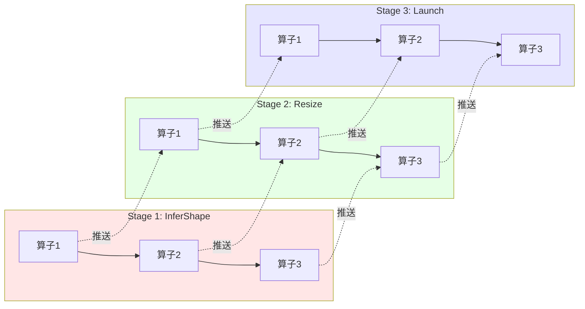

### 流水线执行时序

### 三级流水动画演示


**动画说明**：
- 上方：传统串行模式，必须等前一个算子完成所有阶段
- 下方：三级流水模式，三个算子的不同阶段并行执行
- 红色：InferQueue，绿色：ResizeQueue，蓝色：LaunchQueue
- 关键优势：流水线并行，时间从180μs降至80μs

**性能对比**：
- 串行模式：180μs
- 流水模式：80μs
- **性能提升：55.6%**

### 依赖处理机制

#### 1. 值依赖（Value Dependency）

**场景**：Reshape算子的输出Shape依赖前序算子的输出值

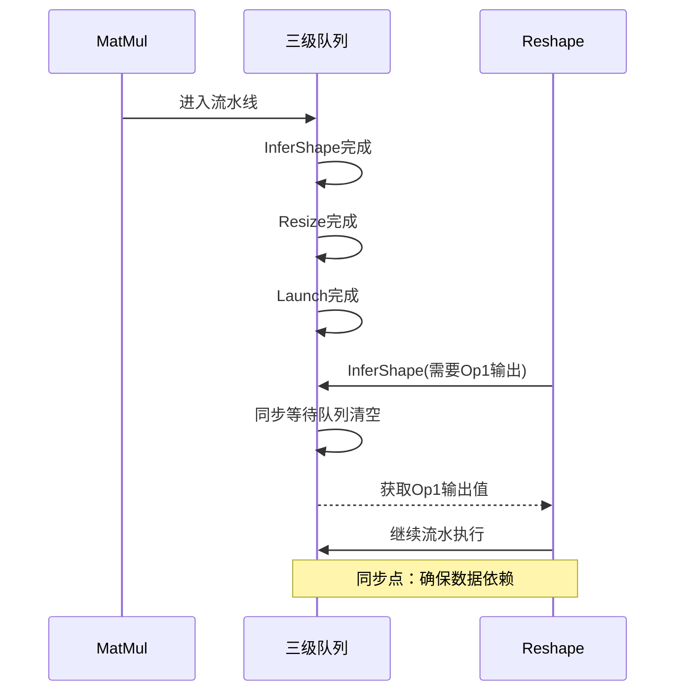

**代码逻辑**：

```cpp
// 伪代码
void ReshapeKernel::InferShape() {
    if (需要从输入Tensor读取Shape值) {
        // 同步三个队列
        InferQueue.Wait();
        ResizeQueue.Wait();
        LaunchQueue.Wait();
        
        // 从Device获取Shape值到Host
        auto shape_value = GetValueFromDevice(input_tensor);
        
        // 更新输出Shape
        output_shape = shape_value;
    }
    
    // 推送到Resize队列
    ResizeQueue.Push(ResizeTask);
}
```

#### 2. 计算依赖（Compute Dependency）

**场景**：Unique算子必须执行完才能确定输出Shape

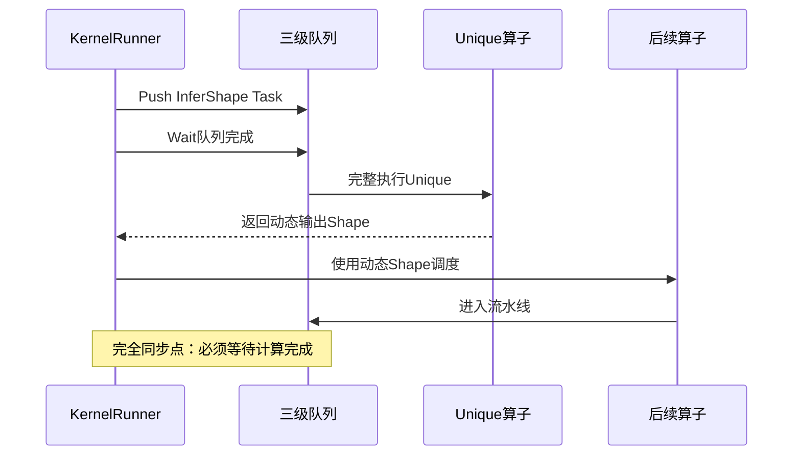

**实际算子示例**：

| 算子类型 | 依赖类型 | 处理策略 |
|---------|---------|---------|
| Reshape | 值依赖 | InferShape时同步 |
| Unique | 计算依赖 | KernelRunner完全等待 |
| DynamicStitch | 值依赖 | InferShape时同步 |
| NonZero | 计算依赖 | KernelRunner完全等待 |

---

## 三大技术协同架构

### 完整工作流程

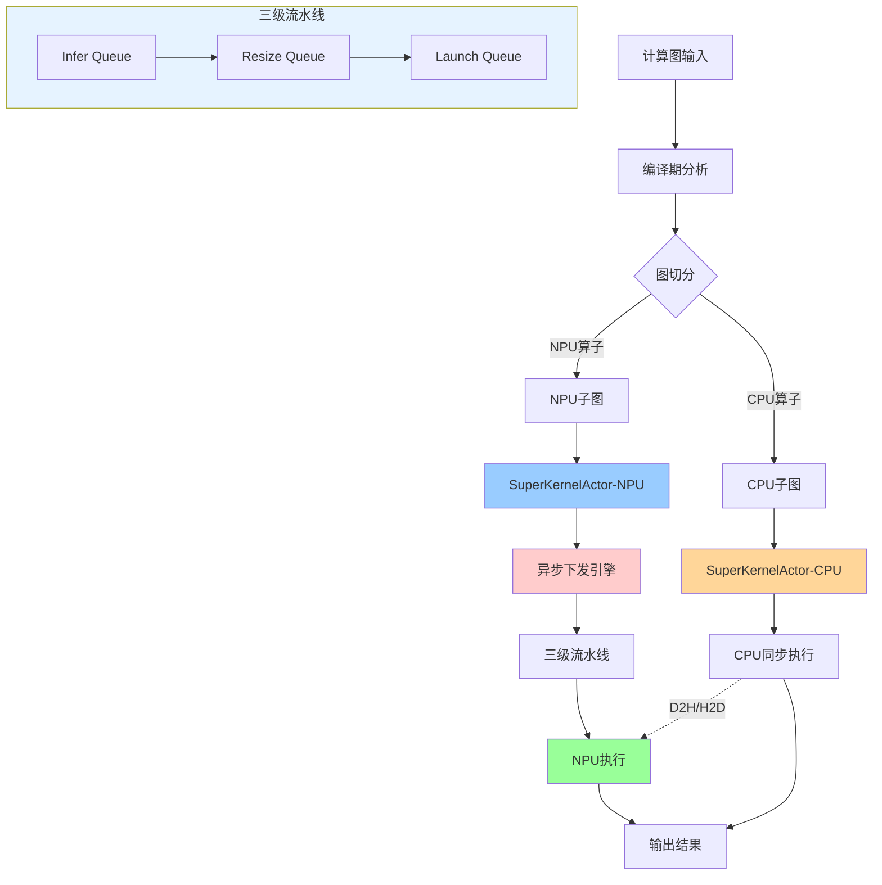

### 技术协同示例：BERT Inference

**模型配置**：
- 12层Transformer
- Batch=1, SeqLen=128
- 总算子数：456个

**执行分解（三大技术协同）**：

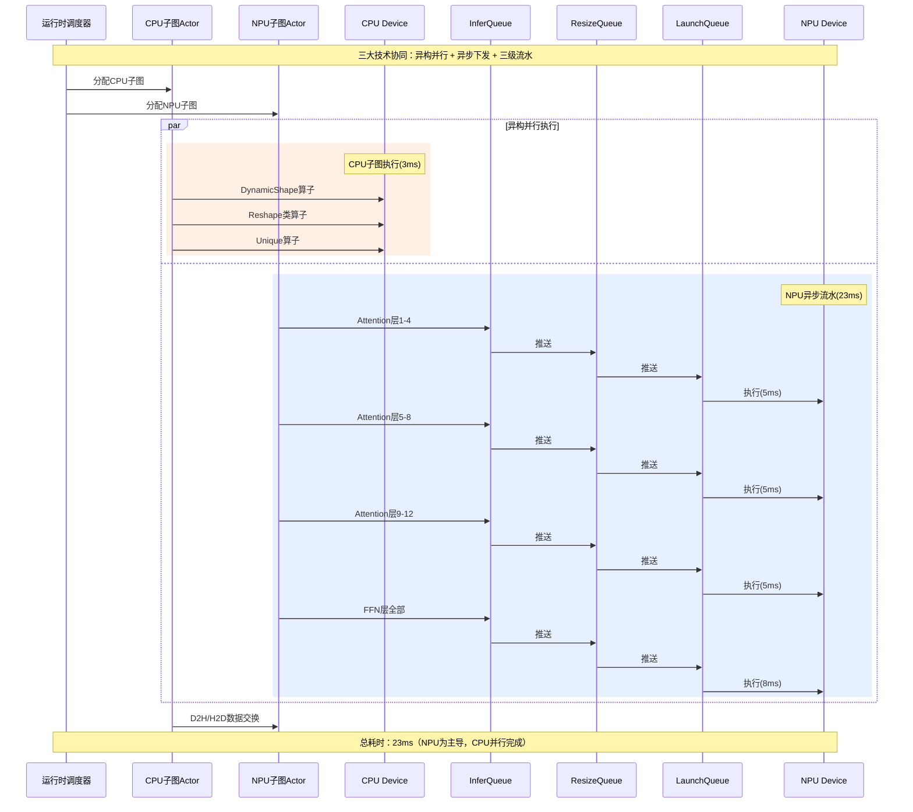

**性能数据**：

| 维度 | 基线(KBK) | 异构并行 | 异步下发 | 三级流水 | 全部启用 |
|------|----------|---------|---------|---------|---------|
| 延迟(ms) | 45.2 | 38.6 | 36.1 | 34.8 | 31.5 |
| 优化率 | - | 14.6% | 20.1% | 23.0% | **30.3%** |
| NPU利用率 | 32% | 48% | 72% | 78% | **92%** |

### 三大技术协同动画演示


**动画说明**：
- 左侧（橙色区域）：CPU子图通过异构并行独立执行
- 右侧（蓝色区域）：NPU子图通过异步下发和三级流水高效执行
- 移动的小球：展示任务在三级队列（Infer→Resize→Launch）中的流动
- 底部进度条：展示性能从45.2ms优化到31.5ms，提升30.3%

---

## 适用场景分析

### 高效场景

**大模型推理（Batch=1）**
```
场景：在线对话、实时翻译
瓶颈：Host调度时间占比超过60%
优化效果：延迟降低25-35%
```

**动态Shape网络**
```
场景：NLP变长输入、目标检测
瓶颈：InferShape、Resize开销大
优化效果：性能提升30-40%
```

**小算子密集型**
```
场景：轻量级CNN、MobileNet
瓶颈：Element-wise算子调度开销
优化效果：吞吐提升20-30%
```

### 非目标场景

**大Batch训练**
```
场景：Batch=256，图像分类训练
现状：Device计算时间远大于Host调度时间
优化效果：小于5%
```

**纯计算密集型**
```
场景：大矩阵乘法、卷积为主
现状：NPU利用率已超过90%
优化效果：基本无提升
```

---

## 技术总结

### 技术创新点

1. **编译运行时协同**：编译期子图切分 + 运行时并发调度
2. **多级异步解耦**：框架逻辑与算子执行完全解耦
3. **流水线并行**：三级队列实现指令级并行
4. **依赖精准控制**：值依赖与计算依赖分别处理

### 未来展望

- **自适应调度**：运行时动态调整CPU/NPU子图划分
- **多设备扩展**：支持CPU+NPU+GPU三方异构
- **图优化融合**：与算子融合、内存优化深度结合

---

## 参考文献

- 昇思MindSpore官方文档
- 昇思AI框架峰会2025技术分享
- 异构计算系统设计白皮书

---

*本文基于昇思MindSpore在Host Bound场景下的性能优化实践，展示了异构并行运行时的设计思路与实现效果*
